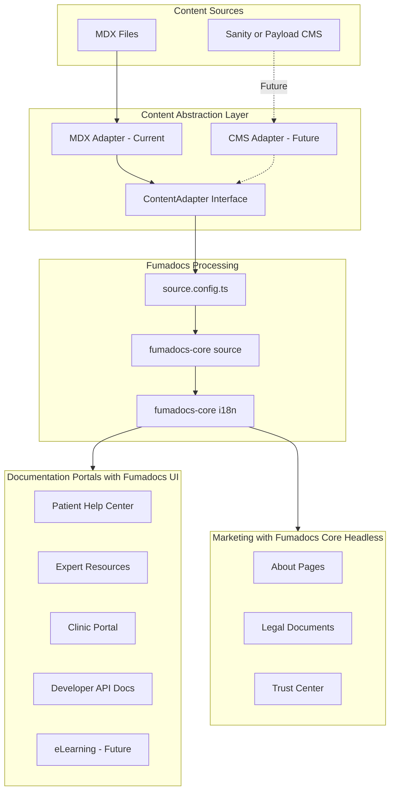

# Fumadocs Multi-Persona Documentation Platform

## Executive Summary

Transform Eleva Care's content architecture from fragmented MDX imports to a centralized, persona-based documentation system using Fumadocs. This enables:

- **6 User Portals**: Patient, Expert, Clinic, Developer, Teacher, Student (future)
- **4 Languages**: English, Spanish, Portuguese, Brazilian Portuguese
- **Hybrid Rendering**: Fumadocs UI for documentation, Fumadocs Core (headless) for marketing
- **CMS-Ready**: Abstraction layer for future Sanity/PayloadCMS migration

---

## Current State Analysis

### Content Inventory (48+ MDX files)

| Category | Directories | Files per Locale | Total |

|----------|-------------|------------------|-------|

| Marketing | about, become-expert, for-organizations, evidence-based-care, history | 5 | 20 |

| Legal | privacy, terms, cookie, payment-policies, expert-agreement | 5 | 20 |

| Trust | dpa, security | 2 | 8 |

| Docs | support (placeholder) | 0 | 0 |

### Current Limitations

- Manual dynamic imports per page (`await import('@/content/about/${locale}.mdx')`)
- Duplicated locale handling across 10+ page files
- No unified content API or search
- No Table of Contents generation
- Difficult to scale for multiple personas

### User Personas Identified (from `_docs/`)

| Persona | Role | Documentation Needs |

|---------|------|---------------------|

| **Patient** | End user booking appointments | Help center, FAQ, billing, reviews |

| **Expert (Community)** | Healthcare professional (basic) | Profile setup, services, calendar, earnings |

| **Expert (Top)** | Premium healthcare professional | Advanced analytics, branding, group sessions |

| **Clinic/Organization** | B2B multi-expert management | Team management, revenue model, branding |

| **Developer** | API integration partners | REST API, webhooks, authentication |

| **Teacher/Lecturer** | Course creators (future) | LMS, course management, webinars |

| **Student** | eLearning participants (future) | Course access, progress tracking |

---

## Architecture Overview



---

## Content Structure

### Proposed Directory Organization

```
src/content/
├── docs/                          # Fumadocs UI - Documentation Portals
│   ├── patient/                   # Patient Help Center
│   │   ├── en/
│   │   │   ├── meta.json          # Navigation structure
│   │   │   ├── index.mdx          # Getting started
│   │   │   ├── booking.mdx        # How to book
│   │   │   ├── payments.mdx       # Payment methods
│   │   │   ├── reviews.mdx        # Rating experts
│   │   │   └── faq.mdx            # FAQ
│   │   ├── es/
│   │   ├── pt/
│   │   └── pt-BR/
│   │
│   ├── expert/                    # Expert Resources
│   │   ├── en/
│   │   │   ├── meta.json
│   │   │   ├── index.mdx          # Expert overview
│   │   │   ├── getting-started/
│   │   │   │   ├── meta.json
│   │   │   │   ├── profile.mdx
│   │   │   │   ├── services.mdx
│   │   │   │   └── availability.mdx
│   │   │   ├── earnings/
│   │   │   │   ├── meta.json
│   │   │   │   ├── payouts.mdx
│   │   │   │   └── pricing.mdx
│   │   │   └── top-expert/
│   │   │       ├── meta.json
│   │   │       ├── requirements.mdx
│   │   │       └── benefits.mdx
│   │   └── ... (other locales)
│   │
│   ├── clinic/                    # Clinic Portal (B2B)
│   │   └── en/
│   │       ├── meta.json
│   │       ├── index.mdx
│   │       ├── team-management.mdx
│   │       ├── revenue-model.mdx
│   │       └── branding.mdx
│   │
│   └── developer/                 # API Documentation
│       └── en/
│           ├── meta.json
│           ├── index.mdx
│           ├── authentication.mdx
│           ├── webhooks.mdx
│           └── api-reference/
│               ├── meta.json
│               ├── bookings.mdx
│               ├── users.mdx
│               └── payments.mdx
│
├── marketing/                     # Fumadocs Core - Marketing Pages
│   ├── en/
│   │   ├── about.mdx
│   │   ├── become-expert.mdx
│   │   ├── for-organizations.mdx
│   │   ├── evidence-based-care.mdx
│   │   └── history.mdx
│   ├── es/
│   ├── pt/
│   └── pt-BR/
│
├── legal/                         # Legal Documents
│   ├── en/
│   │   ├── privacy.mdx
│   │   ├── terms.mdx
│   │   ├── cookie.mdx
│   │   ├── payment-policies.mdx
│   │   └── expert-agreement.mdx
│   └── ... (other locales)
│
└── trust/                         # Trust Center
    ├── en/
    │   ├── dpa.mdx
    │   └── security.mdx
    └── ... (other locales)
```

---

## Implementation Details

### 1. Content Abstraction Layer (CMS-Ready)

This interface allows future migration to Sanity or PayloadCMS without changing routes:

```typescript
// lib/content/adapter.ts
export interface ContentAdapter {
  getPage(slug: string[], locale: string): Promise<Page | null>;
  getPages(locale: string): Promise<Page[]>;
  generateParams(): Promise<{ slug: string[]; lang: string }[]>;
}

// lib/content/mdx-adapter.ts - Current implementation
export class MDXAdapter implements ContentAdapter {
  constructor(private source: ReturnType<typeof loader>) {}
  
  async getPage(slug: string[], locale: string) {
    return this.source.getPage(slug, locale);
  }
}

// lib/content/sanity-adapter.ts - Future implementation
export class SanityAdapter implements ContentAdapter {
  // Fetch from Sanity CMS instead of MDX files
}
```

### 2. Fumadocs Configuration

```typescript
// source.config.ts
import { defineDocs, defineCollections, frontmatterSchema } from 'fumadocs-mdx/config';
import { z } from 'zod';

// Documentation collections (one per persona)
export const { docs: patientDocs, meta: patientMeta } = defineDocs({
  dir: 'src/content/docs/patient',
});

export const { docs: expertDocs, meta: expertMeta } = defineDocs({
  dir: 'src/content/docs/expert',
});

export const { docs: clinicDocs, meta: clinicMeta } = defineDocs({
  dir: 'src/content/docs/clinic',
});

export const { docs: developerDocs, meta: developerMeta } = defineDocs({
  dir: 'src/content/docs/developer',
});

// Marketing collection (headless - uses your existing Eleva components)
export const marketing = defineCollections({
  type: 'doc',
  dir: 'src/content/marketing',
  schema: frontmatterSchema.extend({
    og: z.object({
      title: z.string(),
      description: z.string(),
      siteName: z.string().optional(),
    }).optional(),
  }),
});

// Legal collection
export const legal = defineCollections({
  type: 'doc',
  dir: 'src/content/legal',
  schema: frontmatterSchema.extend({
    effectiveDate: z.string().optional(),
  }),
});

// Trust collection
export const trust = defineCollections({
  type: 'doc',
  dir: 'src/content/trust',
  schema: frontmatterSchema.extend({
    lastUpdated: z.string().optional(),
  }),
});
```

### 3. i18n Configuration

```typescript
// lib/fumadocs-i18n.ts
import { defineI18n } from 'fumadocs-core/i18n';

export const i18n = defineI18n({
  defaultLanguage: 'en',
  languages: ['en', 'es', 'pt', 'pt-BR'],
  hideLocale: 'default-locale',
});

// UI translations for Fumadocs components
export const translations = {
  en: { 
    displayName: 'English', 
    search: 'Search documentation...',
    toc: 'On this page',
    editPage: 'Edit this page',
  },
  es: { 
    displayName: 'Español', 
    search: 'Buscar documentación...',
    toc: 'En esta página',
    editPage: 'Editar esta página',
  },
  pt: { 
    displayName: 'Português', 
    search: 'Pesquisar documentação...',
    toc: 'Nesta página',
    editPage: 'Editar esta página',
  },
  'pt-BR': { 
    displayName: 'Português (Brasil)', 
    search: 'Pesquisar documentação...',
    toc: 'Nesta página',
    editPage: 'Editar esta página',
  },
};
```

### 4. Source Loaders

```typescript
// lib/source.ts
import { loader } from 'fumadocs-core/source';
import { 
  patientDocs, expertDocs, clinicDocs, developerDocs,
  marketing, legal, trust 
} from 'fumadocs-mdx:collections/server';
import { i18n } from './fumadocs-i18n';

// Documentation portals (Fumadocs UI)
export const patientSource = loader({
  baseUrl: '/docs/patient',
  source: patientDocs.toFumadocsSource(),
  i18n,
});

export const expertSource = loader({
  baseUrl: '/docs/expert',
  source: expertDocs.toFumadocsSource(),
  i18n,
});

export const clinicSource = loader({
  baseUrl: '/docs/clinic',
  source: clinicDocs.toFumadocsSource(),
  i18n,
});

export const developerSource = loader({
  baseUrl: '/docs/developer',
  source: developerDocs.toFumadocsSource(),
  i18n,
});

// Marketing pages (Fumadocs Core - headless)
export const marketingSource = loader({
  baseUrl: '/',
  source: marketing.toFumadocsSource(),
  i18n,
});

export const legalSource = loader({
  baseUrl: '/legal',
  source: legal.toFumadocsSource(),
  i18n,
});

export const trustSource = loader({
  baseUrl: '/trust',
  source: trust.toFumadocsSource(),
  i18n,
});
```

### 5. Route Structure

```
src/app/
├── (docs)/                        # Documentation route group
│   ├── [lang]/
│   │   └── docs/
│   │       ├── patient/
│   │       │   └── [[...slug]]/
│   │       │       └── page.tsx   # Fumadocs UI
│   │       ├── expert/
│   │       │   └── [[...slug]]/
│   │       │       └── page.tsx
│   │       ├── clinic/
│   │       │   └── [[...slug]]/
│   │       │       └── page.tsx
│   │       └── developer/
│   │           └── [[...slug]]/
│   │               └── page.tsx
│   └── layout.tsx                 # RootProvider + PersonaSwitcher
│
└── (marketing)/                   # Existing marketing routes
    └── [locale]/
        ├── about/page.tsx         # Uses marketingSource (headless)
        ├── legal/[document]/page.tsx
        └── trust/[document]/page.tsx
```

---

## Key Benefits

| Feature | Before | After |

|---------|--------|-------|

| Content API | Manual dynamic imports | Unified `source.getPage()` |

| Search | None | Built-in Orama (free) or Algolia |

| TOC | Manual | Automatic `page.data.toc` |

| i18n | Duplicated logic per page | Centralized `defineI18n` |

| Type Safety | Partial metadata | Full Zod schema validation |

| Static Params | Manual per page | `source.generateParams()` |

| Navigation | Manual sidebar | Automatic from `meta.json` |

| CMS Migration | Complete rewrite | Swap adapter only |

---

## Migration Strategy

### Phase 1: Foundation (Week 1)

- Install Fumadocs packages
- Create `source.config.ts` and i18n configuration
- Update `next.config.ts` with Fumadocs MDX plugin
- Create content abstraction layer interface

### Phase 2: Documentation Portals (Week 2-3)

- Build Patient Help Center (priority)
- Build Expert Resources portal
- Implement persona switcher component
- Add Orama search integration

### Phase 3: Marketing Migration (Week 4)

- Migrate marketing pages to use `marketingSource`
- Migrate legal and trust pages
- Preserve existing Eleva Care styling via mdx-components.tsx

### Phase 4: Additional Portals (Week 5+)

- Build Clinic documentation portal
- Build Developer API documentation
- Prepare Teacher/Student portals (future eLearning)

---

## CMS Migration Path (Future)

When ready to migrate to Sanity or PayloadCMS:

1. **Create new adapter**: Implement `SanityAdapter` or `PayloadAdapter`
2. **Update source loaders**: Point to CMS adapter instead of MDX
3. **Keep routes unchanged**: Same URLs, different data source
4. **Gradual migration**: Migrate one collection at a time
```typescript
// Future: lib/source.ts with CMS
import { SanityAdapter } from './content/sanity-adapter';

export const patientSource = new SanityAdapter({
  dataset: 'production',
  collection: 'patient-docs',
  i18n,
});
```


---

## Files to Create/Modify

### New Files

| File | Purpose |

|------|---------|

| `source.config.ts` | Fumadocs collection definitions |

| `src/lib/source.ts` | Source loaders for each persona |

| `src/lib/fumadocs-i18n.ts` | i18n configuration with 4 locales |

| `src/lib/content/adapter.ts` | Content abstraction interface |

| `src/app/(docs)/layout.tsx` | Docs layout with RootProvider |

| `src/app/(docs)/[lang]/docs/[persona]/[[...slug]]/page.tsx` | Docs pages |

| `src/components/docs/PersonaSwitcher.tsx` | Portal navigation component |

### Modified Files

| File | Changes |

|------|---------|

| `next.config.ts` | Add Fumadocs MDX plugin |

| `package.json` | Add fumadocs-core, fumadocs-ui, fumadocs-mdx |

| `src/content/` | Reorganize to new structure |

---

## Compatibility Notes

- **next-intl**: Continues to handle UI translations (`src/messages/`)
- **Fumadocs i18n**: Handles content translations (`src/content/`)
- **mdx-components.tsx**: Preserved for marketing pages styling
- **Existing routes**: Non-breaking, migrate incrementally