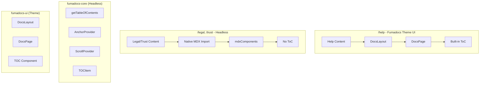

# Fumadocs ToC for Legal/Trust Pages

## Current Architecture



## Research Findings

### 1. Headless ToC is Available

Fumadocs-core exports headless ToC components that work independently of the theme UI:

```typescript
// Extract ToC from markdown content
import { getTableOfContents } from 'fumadocs-core/content/toc';

// Headless ToC components
import * as Base from 'fumadocs-core/toc';
// Base.AnchorProvider, Base.ScrollProvider, Base.TOCItem
```

### 2. Multiple Themes Supported

Fumadocs UI supports different CSS themes:

- `fumadocs-ui/css/neutral.css` (default)
- `fumadocs-ui/css/black.css` 
- `fumadocs-ui/css/shadcn.css` (integrates with shadcn colors)

### 3. Multiple Loaders Allowed

You can create separate content sources with different configurations.

---

## Three Implementation Options

### Option A: Headless ToC Component (Recommended)

**Best for: Lightweight, custom styling, minimal changes**

Create a custom ToC component using fumadocs-core headless primitives. No CSS from fumadocs-ui needed.

**Changes Required:**

- Create `src/components/legal/TableOfContents.tsx` - headless ToC using fumadocs-core
- Update legal/trust page components to extract ToC and pass to component
- Add ToC to layout alongside content

**Pros:**

- Zero fumadocs-ui CSS in marketing pages
- Full control over styling (uses your existing Tailwind classes)
- Works with current native MDX import approach
- Locales already work (using next-intl)

**Cons:**

- Need to build and maintain ToC component
- Manual extraction of headings from MDX

---

### Option B: Use DocsPage Without DocsLayout

**Best for: Quick implementation with built-in ToC**

Use only the `DocsPage` component from fumadocs-ui (which includes ToC) without the full `DocsLayout`.

**Changes Required:**

- Import fumadocs-ui CSS in legal/trust sections
- Wrap content with `DocsPage` component
- Extract ToC using `getTableOfContents`

**Pros:**

- Get ToC component out of the box
- Less custom code

**Cons:**

- Need to import fumadocs-ui CSS (potential style conflicts)
- Mixed approaches between help and legal sections

---

### Option C: Full Fumadocs for Legal/Trust

**Best for: Unified documentation experience**

Move legal/trust content to Fumadocs MDX collections with a different theme.

**Changes Required:**

- Restructure content to use fumadocs-mdx collections
- Create new source loaders for legal/trust
- Use `DocsLayout` with different CSS theme
- Update routing to use Fumadocs patterns

**Pros:**

- Full feature parity with help center (ToC, search, etc.)
- Consistent Fumadocs patterns
- Easy to scale

**Cons:**

- Major restructuring of legal/trust content
- Need to manage two Fumadocs themes
- More complex i18n setup (need to mirror help center approach)

---

## Locale Management

For **Option A** (Headless): No changes needed - legal/trust already use next-intl with `[locale]` route segments.

For **Option B/C**: Would need to mirror the help center's approach:

- Use `FUMADOCS_LOCALE` cookie pattern
- Update proxy.ts to handle `/legal` and `/trust` routes similar to `/help`

---

## Recommendation

**Option A (Headless ToC)** is recommended because:

1. **Minimal changes**: Keep current content structure and routing
2. **No CSS conflicts**: Legal/trust pages stay visually distinct from help
3. **Locales work**: next-intl already handles i18n for these routes
4. **Brand alignment**: ToC can use your existing Eleva Care design system

The headless approach lets you add ToC functionality without adopting the full Fumadocs theme UI, keeping legal documents with their own clean, minimal aesthetic.

---

## Implementation Summary (Option A)

| Task | Files | Effort |

|------|-------|--------|

| Create headless ToC component | `src/components/legal/TableOfContents.tsx` | Medium |

| Create ToC extraction utility | `src/lib/toc.ts` | Small |

| Update legal layout | `src/app/(marketing)/[locale]/legal/layout.tsx` | Small |

| Update trust layout | `src/app/(marketing)/[locale]/trust/layout.tsx` | Small |

| Update legal page component | `src/app/(marketing)/[locale]/legal/[document]/page.tsx` | Medium |

| Update trust page component | `src/app/(marketing)/[locale]/trust/[document]/page.tsx` | Medium |