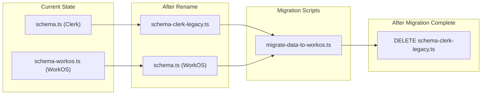

# Schema Renaming & Audit Logging Consolidation

Finalize the Clerk to WorkOS migration by renaming schema files, consolidating audit logging, and preserving the legacy schema for data migration scripts.

## Key Change: Keep Legacy Schema for Migration Scripts

The old Clerk schema (`schema.ts`) will be **renamed to `schema-clerk-legacy.ts`** (not deleted) to support creating data migration scripts. These scripts need to read from old tables and write to new tables.



## Tables Requiring Data Migration

7 tables have `clerkUserId` columns that need mapping to `workosUserId`:

| Table | Old Column | New Column | Notes |

|-------|-----------|------------|-------|

| Events | `clerkUserId` | `workosUserId` | Expert's events |

| Schedules | `clerkUserId` | `workosUserId` | Expert availability |

| Meetings | `clerkUserId` | `workosUserId` | Booked appointments |

| Profiles | `clerkUserId` | `workosUserId` | Public expert profiles |

| Users | `clerkUserId` | `workosUserId` | Core user table |

| BlockedDates | `clerk_user_id` | `workos_user_id` | Expert blocked dates |

| SlotReservations | `clerk_user_id` | `workos_user_id` | Temporary slot holds |

## Implementation Details

### Phase 1: Schema Renaming

```bash
# Step 1: RENAME old Clerk schema (keep for migration scripts)
mv drizzle/schema.ts drizzle/schema-clerk-legacy.ts

# Step 2: Rename WorkOS schema to standard name
mv drizzle/schema-workos.ts drizzle/schema.ts

# Step 3: Update db.ts import
# Change: import * as schema from './schema-workos';
# To:     import * as schema from './schema';
```

### Phase 2: Update 81 Import Paths

All files importing from `@/drizzle/schema-workos` will be updated to `@/drizzle/schema`:

```typescript
// Before
import { UsersTable, EventsTable, AuditLogsTable, type AuditEventAction } from '@/drizzle/schema-workos';

// After
import { UsersTable, EventsTable, AuditLogsTable, type AuditEventAction } from '@/drizzle/schema';
```

### Phase 3: Audit Consolidation (NO BACKWARD COMPATIBILITY)

**COMPLETELY REPLACE** `src/lib/utils/server/audit.ts` with the new unified API:

```typescript
// src/lib/utils/server/audit.ts (FINAL VERSION - NO FALLBACKS)
'use server';

import { AuditLogsTable, type AuditEventAction, type AuditResourceType } from '@/drizzle/schema';
import { getOrgScopedDb } from '@/lib/integrations/neon/rls-client';
import { withAuth } from '@workos-inc/authkit-nextjs';
import { headers } from 'next/headers';

/**
 * Log audit event with automatic context extraction
 * 
 * Compliance: HIPAA, GDPR, SOC2
 * - Append-only logs (immutable)
 * - RLS ensures org-scoped access
 * - Automatic user/IP/userAgent capture
 */
export async function logAuditEvent(
  action: AuditEventAction,
  resourceType: AuditResourceType,
  resourceId: string,
  changes?: { oldValues?: Record<string, unknown>; newValues?: Record<string, unknown> },
  metadata?: Record<string, unknown>,
): Promise<void> {
  // Implementation from audit-workos.ts (cleaned up)
}

// Export other functions: getAuditLogs, exportAuditLogs, getResourceAuditTrail, getUserAuditLogs, generateComplianceReport
```

### Phase 4: Update Callers (Type Migration Required)

6 files use the deprecated audit API with OLD types. They must be updated to use NEW types:

| File | Old Call | New Call |

|------|----------|----------|

| `payment.ts` | `logAuditEvent(userId, 'MEETING_PAYMENT_FAILED', ...)` | `logAuditEvent('PAYMENT_FAILED', 'payment', ...)` |

| `meetings.ts` | `logAuditEvent(userId, 'MEETING_CREATED', ...)` | `logAuditEvent('APPOINTMENT_CREATED', 'appointment', ...)` |

| `events.ts` | `logAuditEvent(userId, 'EVENT_CREATED', ...)` | `logAuditEvent('PROFILE_UPDATED', 'profile', ...)` |

| `schedule.ts` | `logAuditEvent(userId, 'SCHEDULE_UPDATED', ...)` | `logAuditEvent('PROFILE_UPDATED', 'profile', ...)` |

| `expert-profile.ts` | `logAuditEvent(userId, 'PROFILE_PUBLISHED', ...)` | `logAuditEvent('PROFILE_UPDATED', 'profile', ...)` |

| `records/route.ts` | Already updated | Already updated |

**Type Mapping (Old -> New):**

| Old Type (DELETE) | New Type (USE) |

|-------------------|----------------|

| `CREATE_MEDICAL_RECORD` | `MEDICAL_RECORD_CREATED` |

| `READ_MEDICAL_RECORDS_FOR_MEETING` | `MEDICAL_RECORD_VIEWED` |

| `UPDATE_MEDICAL_RECORD` | `MEDICAL_RECORD_UPDATED` |

| `MEETING_PAYMENT_FAILED` | `PAYMENT_FAILED` |

| `EVENT_CREATED` | `PROFILE_UPDATED` (events are part of profile) |

| `MEETING_CREATED` | `APPOINTMENT_CREATED` |

| `MEETING_CANCELLED` | `APPOINTMENT_CANCELLED` |

| `SCHEDULE_UPDATED` | `PROFILE_UPDATED` |

| `PROFILE_PUBLISHED` | `PROFILE_UPDATED` |

### Phase 5: DELETE Legacy Audit Files

```bash
# Delete legacy audit files - NO BACKWARD COMPATIBILITY
rm drizzle/auditDb.ts
rm drizzle/auditSchema.ts
rm src/types/audit.ts
rm src/lib/utils/server/audit-workos.ts
```

### Phase 6: Delete Deprecated Audit Tests

The deprecated audit tests reference the old audit system and should be removed:

```bash
# Delete deprecated audit tests
rm tests/deprecated/audit-error-handling.test.ts
rm tests/deprecated/audit-non-blocking.test.ts
```

These tests were for the old separate audit database approach.

### Phase 7: Verification - Build & Test

**CRITICAL**: Verify the migration is complete and working:

```bash
# 1. TypeScript compilation check
bun run build

# Expected: ✅ Compiled successfully
# If errors: Fix import paths or type issues before proceeding

# 2. Run all unit/integration tests (243 tests)
bun test

# Expected output:
# ✅ Server Actions: 32 tests passing
# ✅ API Routes: 28 tests passing
# ✅ Components: 24 tests passing
# ✅ Integration: 89 tests passing
# ✅ Libraries: 70 tests passing
# Total: 243 tests passing

# 3. Run E2E tests (optional but recommended)
bun test:e2e
```

**Test files that may need updates after migration:**

| Test File | May Need Update |

|-----------|----------------|

| `tests/server/actions/meetings.test.ts` | If it imports from old schema |

| `tests/server/actions/events.test.ts` | If it imports from old schema |

| `tests/server/actions/expert-profile.test.ts` | If it uses old audit API |

| `tests/mocks/` | Update any schema-workos imports |

| `tests/__mocks__/` | Update any audit-related mocks |

### Phase 8: Document Migration Script (DEFERRED)

> **STATUS: DEFERRED** - Do not create script yet.

>

> **Prerequisites before creating migration script:**

> 1. Complete RBAC setup (roles and permissions in WorkOS Dashboard)

> 2. Finalize org-level design

> 3. Complete full WorkOS migration

>

> **Current Status:** RBAC setup in progress - see `_docs/_WorkOS RABAC implemenation/`

#### Future Migration Script Requirements

When ready, create `scripts/utilities/migrate-data-to-workos.ts`:

```typescript
/**
 * Data Migration Script: Clerk -> WorkOS (FUTURE)
 * 
 * DO NOT CREATE YET - Document for future implementation.
 * 
 * Prerequisites:
 *   - RBAC roles/permissions configured in WorkOS Dashboard
 *   - Org-level design finalized
 *   - Full WorkOS integration complete
 * 
 * This script will migrate user data from the old Clerk schema to the new WorkOS schema.
 * 
 * Usage (future):
 *   bun tsx scripts/utilities/migrate-data-to-workos.ts [--dry-run]
 */

// Migration logic (future):
// 1. Read users from legacy tables (using schema-clerk-legacy.ts)
// 2. Map clerkUserId -> workosUserId (need mapping table or lookup)
// 3. Write to new tables (using schema.ts)
// 4. Verify data integrity
```

#### Why Keep `schema-clerk-legacy.ts`

The legacy Clerk schema is preserved for this future migration script:

- Provides type definitions for reading old data
- Documents old table structures for reference
- Enables gradual migration with data integrity checks

Following the pattern in `scripts/migrate-roles-to-workos.ts` when ready.

### Phase 9: Clean Remaining Clerk References

64 files still reference "clerk" or "Clerk". Specific cleanup actions:

#### DELETE - Dead Code

```bash
# Clerk cache keys utility - NOT USED anywhere (only in README)
rm src/lib/cache/clerk-cache-keys.ts
```

#### UPDATE - Service Health Check

Replace `checkClerk()` with `checkWorkOS()` in `src/lib/utils/server/service-health.ts`:

```typescript
// Before: Calls Clerk API with CLERK_SECRET_KEY
export async function checkClerk(): Promise<ServiceHealthResult> { ... }

// After: Calls WorkOS API with WORKOS_API_KEY
export async function checkWorkOS(): Promise<ServiceHealthResult> {
  // Use WorkOS user management API health check
  const response = await fetch('https://api.workos.com/user_management/users?limit=1', {
    headers: {
      Authorization: `Bearer ${ENV_CONFIG.WORKOS_API_KEY}`,
    },
  });
  // ...
}
```

Also update `checkAllServices()` to use `checkWorkOS()` instead of `checkClerk()`.

#### UPDATE - Privacy Policy MDX Files (4 files)

Change "Clerk" to "WorkOS" in data processor list:

| File | Change |

|------|--------|

| `src/content/privacy/en.mdx` | "Stripe, Clerk, Vercel..." -> "Stripe, WorkOS, Vercel..." |

| `src/content/privacy/es.mdx` | Same |

| `src/content/privacy/pt.mdx` | Same |

| `src/content/privacy/pt-BR.mdx` | Same |

#### UPDATE - Documentation

| File | Change |

|------|--------|

| `src/lib/README.md` | Remove `clerk-cache-keys.ts` from cache section |

#### LATER - Database Column Rename (Separate Migration)

The `expertClerkUserId` column in PaymentTransfersTable should be renamed to `expertWorkosUserId` via a database migration. This can be done as a separate task after the main consolidation.

### Phase 10: Delete Legacy Schema (AFTER Migration Complete)

**ONLY after data migration is verified successful:**

```bash
rm drizzle/schema-clerk-legacy.ts
```

### Phase 11: Remove Environment Variable

```bash
# No longer needed - audit logs are in main database
AUDITLOG_DATABASE_URL=...  # REMOVE from all environments
```

## Files Summary

| Action | File | When |

|--------|------|------|

| **RENAME** | `schema.ts` -> `schema-clerk-legacy.ts` | Phase 1 |

| **RENAME** | `schema-workos.ts` -> `schema.ts` | Phase 1 |

| **UPDATE** | `drizzle/db.ts` | Phase 1 |

| **UPDATE** | 81 files (imports) | Phase 2 |

| **REPLACE** | `audit.ts` (no backward compat) | Phase 3 |

| **UPDATE** | 6 audit callers | Phase 4 |

| **DELETE** | `auditDb.ts`, `auditSchema.ts`, `types/audit.ts`, `audit-workos.ts` | Phase 5 |

| **DELETE** | `tests/deprecated/audit-*.test.ts` | Phase 6 |

| **VERIFY** | `bun run build` | Phase 7 |

| **VERIFY** | `bun test` (243 tests) | Phase 7 |

| **DOCUMENT** | Migration script requirements (DEFERRED until RBAC + org-level complete) | Phase 8 |

| **DELETE** | `src/lib/cache/clerk-cache-keys.ts` (dead code) | Phase 9 |

| **UPDATE** | `src/lib/utils/server/service-health.ts` (checkClerk -> checkWorkOS) | Phase 9 |

| **UPDATE** | `src/content/privacy/*.mdx` (4 files: Clerk -> WorkOS) | Phase 9 |

| **UPDATE** | `src/lib/README.md` | Phase 9 |

| **REVIEW** | Remaining Clerk refs in docs/comments | Phase 9 |

| **DELETE** | `schema-clerk-legacy.ts` | Phase 10 (after migration) |

| **UPDATE** | `drizzle/README.md` | Phase 11 |

## Audit Logging Best Practices (HIPAA/GDPR/SOC2)

The consolidated audit system follows these compliance requirements:

1. **Immutability**: Append-only logs (no UPDATE/DELETE)
2. **Access Control**: RLS ensures org-scoped queries
3. **Data Minimization**: Only store necessary fields
4. **Retention**: Configurable retention policies
5. **Encryption**: Data at rest via Neon, in transit via TLS
6. **Context**: Automatic IP, user-agent, timestamp capture
7. **Performance**: Async logging (non-blocking)

## Pre-Flight Checklist

Before starting:

- [ ] Backup database
- [ ] Verify no production code imports from `drizzle/schema.ts` directly
- [ ] Verify audit-workos.ts tests pass
- [ ] Note: Build will fail until all 81 imports are updated

## Post-Migration Verification

- [ ] All 81 files compile with new import path
- [ ] `bun run build` completes successfully
- [ ] `bun test` passes all 243 tests
- [ ] All 6 audit callers work with new API
- [ ] No references to deleted files remain
- [ ] Audit logs are being created in main database
- [ ] RLS correctly scopes audit queries
- [ ] No `AUDITLOG_DATABASE_URL` errors in logs
- [ ] Migration script tested in staging
- [ ] Data migrated successfully (all 7 tables)
- [ ] Legacy schema deleted after verification