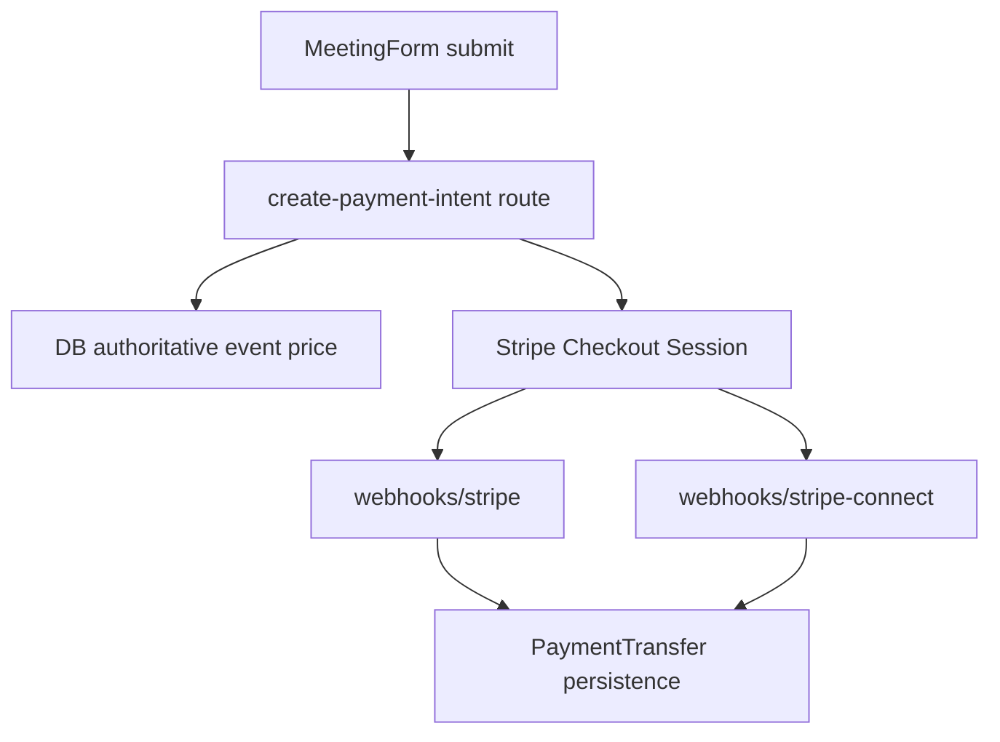

# Stripe Marketplace Deep Audit and Remediation Plan

## Scope audited

- Frontend flow: `[components/features/forms/MeetingForm.tsx](components/features/forms/MeetingForm.tsx)`
- Backend checkout creation: `[app/api/create-payment-intent/route.ts](app/api/create-payment-intent/route.ts)`
- Connect APIs: `[app/api/stripe/connect/route.ts](app/api/stripe/connect/route.ts)`, `[app/api/stripe/connect/create/route.ts](app/api/stripe/connect/create/route.ts)`
- Webhooks: `[app/api/webhooks/stripe/route.ts](app/api/webhooks/stripe/route.ts)`, `[app/api/webhooks/stripe-connect/route.ts](app/api/webhooks/stripe-connect/route.ts)`
- Pack checkout parity: `[app/api/create-pack-checkout/route.ts](app/api/create-pack-checkout/route.ts)`
- Free booking path parity: direct meeting creation path in MeetingForm (`price === 0`) and downstream create-meeting behavior/guards.

## Key findings (from code + Context7 Stripe docs)

- `src/components/features/forms/MeetingForm.tsx` does not exist; only one canonical file exists in `components/...`.
- Marketplace model is destination charges with `payment_intent_data.application_fee_amount` + `transfer_data.destination`, which is a valid Stripe Connect pattern.
- High-risk issue: meeting price is accepted from request body and used for charge/fee computation; authoritative event price is fetched but not enforced.
- High-risk issue: `account.application.deauthorized` handling appears to match the wrong identifier (`data.object.id` vs connected account id semantics).
- Consistency risk: promo codes and tax can change final paid amount while fee is fixed from pre-checkout input (`application_fee_amount`), potentially drifting from intended 85/15 business rule.
- Reliability risk: overlapping webhook event handling across `/webhooks/stripe` and `/webhooks/stripe-connect` for account/payout events can cause duplicate processing.
- UX risk: in `MeetingForm`, `submitMeeting` paid path moves to step 3 without hard redirect while `handleNextStep` performs redirect, creating a split path.
- Coverage gap in current plan: free-event flow was not explicitly tracked as a first-class audit lane (validation parity, duplicate submission protection, and user-state transitions).

## Paid vs free event flow coverage

- Paid flow (`price > 0`): form validation -> checkout session creation -> Stripe redirect -> webhook-driven completion and transfer/accounting.
- Free flow (`price === 0`): form validation -> direct meeting creation -> success redirect without Stripe checkout/webhook mediation.
- Audit objective: ensure both flows share equivalent guarantees for idempotency, reservation conflict prevention, form validation, and deterministic success/failure UX.

## Target architecture and flow

## Remediation strategy

- Enforce server-side authoritative pricing and fee basis before session creation.
- Normalize business rule for 85/15 under discounts/tax and implement consistently for meetings and packs.
- Consolidate webhook ownership and idempotency boundaries per event family.
- Align paid frontend flow so every successful paid transition redirects through one trusted redirect path.
- Explicitly harden free-event flow path in `MeetingForm` so direct create-meeting has the same anti-duplicate and state-consistency protections as paid flow.
- Harden Connect lifecycle handling (`deauthorized`, onboarding/charges-enabled checks) and metadata/account cross-checks.
- Add focused tests around amount tampering, webhook duplicate delivery, checkout redirect behavior, and free-flow meeting creation reliability.

## Stripe best-practice alignment (Context7)

- Keep destination charges with application fee for marketplace split (supported and recommended for this use case).
- Verify webhook signatures on raw body and process events idempotently.
- Treat event/webhook handlers as at-least-once delivery and dedupe by Stripe event IDs / domain keys.
- Keep fee calculations deterministic and based on authoritative server-side amounts, not client input.
