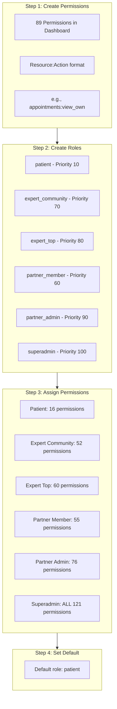
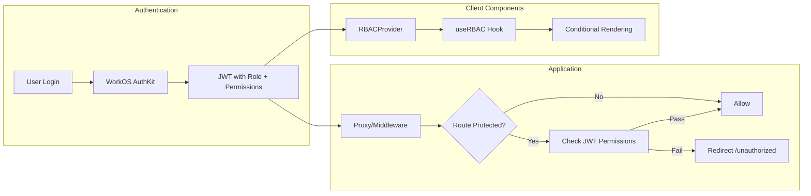

# WorkOS Implementation Status Review and Next Steps

## Current Implementation Status

Based on analysis of the documentation and codebase, here is the complete status:

### Phase 1: Code Implementation - COMPLETE

| Component | Status | Files |

|-----------|--------|-------|

| TypeScript Types | Done | [`src/types/workos-rbac.ts`](src/types/workos-rbac.ts) - 6 roles, 89+ permissions |

| Server RBAC Utilities | Done | [`src/lib/integrations/workos/rbac.ts`](src/lib/integrations/workos/rbac.ts) - JWT-based, zero DB queries |

| Client RBAC Provider | Done | [`src/components/providers/RBACProvider.tsx`](src/components/providers/RBACProvider.tsx) |

| Proxy/Middleware | Done | [`src/proxy.ts`](src/proxy.ts) - Permission-protected routes |

| API Endpoint | Done | [`src/app/api/user/rbac/route.ts`](src/app/api/user/rbac/route.ts) |

| WorkOS Vault | Done | Encryption migration complete |

| RequireRole Component | Done | [`src/components/rbac/RequireRole.tsx`](src/components/rbac/RequireRole.tsx) |

### Phase 2: WorkOS Dashboard Configuration - IN PROGRESS (Your current task)

According to [`_docs/workos-setup-checklist.txt`](_docs/workos-setup-checklist.txt), you need to configure:



### Phase 3: Testing and Verification - NOT STARTED

### Phase 4: Role Migration - NOT STARTED

### Phase 5: Stripe Entitlements - FUTURE (Q1 2026)

---

## Next Steps

### Immediate (Complete Dashboard Setup)

1. **Continue creating permissions in WorkOS Dashboard**

   - Follow the exact slugs from [`_docs/workos-setup-checklist.txt`](_docs/workos-setup-checklist.txt)
   - Use `resource:action` format (e.g., `appointments:view_own`)

2. **Create the 6 roles with correct priorities**

   - patient (10), partner_member (60), expert_community (70), expert_top (80), partner_admin (90), superadmin (100)

3. **Set default role to `patient`**

### After Dashboard Setup

4. **Verify JWT includes role and permissions**
   ```typescript
   // Test with: GET /api/user/rbac
   // Should return: { role: 'patient', permissions: [...] }
   ```

5. **Test permission-protected routes**

   - `/admin/*` requires superadmin
   - `/dashboard/expert/*` requires expert roles
   - `/booking/*` requires expert roles

### Migration Script (When Ready)

6. **Run migration for existing users**

   - Script location: [`scripts/migrate-roles-to-workos.ts`](scripts/migrate-roles-to-workos.ts) (to be created)
   - Maps existing `users.role` to WorkOS organization membership roles

---

## Architecture Summary



---

## Key Files Reference

| Purpose | File |

|---------|------|

| Role/Permission definitions | `src/types/workos-rbac.ts` |

| Server-side checks | `src/lib/integrations/workos/rbac.ts` |

| Client-side hooks | `src/components/providers/RBACProvider.tsx` |

| Route protection | `src/proxy.ts` |

| Dashboard setup guide | `_docs/workos-setup-checklist.txt` |

| Full RBAC documentation | `_docs/_WorkOS RABAC implemenation/` |

---

## Questions Before Proceeding

1. How far along are you in the WorkOS Dashboard configuration? (How many of the 89 permissions have been created?)
2. Have you verified JWT claims include `role` and `permissions` after login?
3. Do you have existing users in production that need role migration?