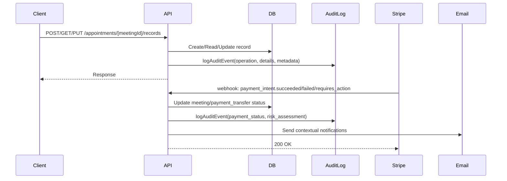

# Changelog

All notable changes to this project will be documented in this file.

The format is based on [Keep a Changelog](https://keepachangelog.com/en/1.1.0/),
and this project adheres to [Semantic Versioning](https://semver.org/spec/v2.0.0.html).

## [Unreleased]

### Technical Improvements & Roadmap

- **Extended Proactive Payment Monitoring**:

  - SEPA Direct Debit: mandate expiration vs meeting time detection
  - Klarna: payment deadline vs meeting time validation
  - Bank transfers: processing time vs meeting urgency assessment
  - Regional payment methods: time-sensitive voucher monitoring
  - Unified framework for payment method edge case detection

- **Comprehensive Audit Logging Expansion**:

  - Profile updates and role changes tracking
  - Admin actions and system modifications logging
  - User synchronization events with detailed metadata
  - File upload operations with security validation
  - Event order changes and chronological tracking
  - Cron job database modifications monitoring

- **Enhanced Security & Compliance**:

  - Patient/Guest secure API for medical records access
  - File upload security review with server-side validation
  - Encryption key management policy documentation
  - Security headers implementation in middleware/Next.js
  - Data minimization strategies across all endpoints

- **Platform & Integration Improvements**:
  - Stripe Connect payout delay initialization corrections
  - Google Calendar event cancellation automation
  - Console log management and structured logging
  - Cron job simplification and reliability improvements

## [0.3.0] - 2025-01-31

### Added

- **Comprehensive Audit Logging System**:

  - Implemented critical audit logging for medical record CRUD and read operations
  - Added structured audit trails for sensitive data access and modifications
  - Enhanced logging for payment operations and status changes
  - **Security-sensitive error logging**: Automatic detection and auditing of unauthorized access attempts, permission errors, and encryption failures
  - **Multibanco voucher expiry tracking**: Audit logging for payment timing edge cases where vouchers expire after meeting start time

- **Enhanced Payment Processing & Notifications**:

  - Added email notifications to guests upon successful async payment completion
  - Implemented comprehensive payment failure handling with audit logs
  - Added logging for Multibanco voucher expiry detection when after meeting start time
  - Enhanced guest and expert notifications for payment failures
  - **Payment intent requires_action handling**: New webhook handler for async payment methods with comprehensive logging
  - **Timezone-aware email formatting**: Proper date/time formatting in notification emails using user's locale

- **Database Schema Improvements**:

  - Updated PaymentTransferTable.status to use PostgreSQL enum for type safety
  - Implemented `payment_transfer_status_enum` with values: 'PENDING', 'APPROVED', 'READY', 'COMPLETED', 'FAILED', 'REFUNDED', 'DISPUTED'
  - Added proper default value ('PENDING') for payment transfer status
  - **Complete schema reset**: Removed all legacy migration files and snapshots for fresh schema foundation

- **API Design & Metadata Standardization**:
  - **Unified meeting metadata structure**: Consolidated all meeting data into single `meetingData` object for consistency
  - **Enhanced Stripe metadata strategy**: Streamlined payment intent and checkout session metadata with clear separation of concerns
  - **Improved date formatting**: Consistent locale-aware date formatting with ISO fallback for reliability

### Fixed

- **Critical Stripe Integration Issues**:

  - Fixed bug in meeting status updates for async payments (e.g., Multibanco)
  - Resolved payment status synchronization issues between Stripe and database
  - Fixed payment failure handling to properly update meeting status
  - Corrected async payment flow for delayed payment methods
  - **Optional chaining implementation**: Cleaner null safety handling in payment processors

- **Database Migration Issues**:

  - Fixed faulty auto-generated migration for payment transfer status enum
  - Properly implemented enum conversion with correct `USING` clause
  - Restored payment transfer data after migration fixes (7 records successfully restored)
  - Resolved PostgreSQL casting errors during schema updates

- **Code Quality & Maintainability**:
  - **Reduced metadata duplication**: Eliminated redundant data between payment intent and checkout session metadata
  - **Consistent data sources**: Unified URL construction to use single metadata source
  - **Security-sensitive error handling**: Comprehensive error logging with proper classification and audit trails

### Changed

- **Stripe Integration Architecture**:

  - Standardized Stripe metadata strategy for improved clarity and robustness
  - Enhanced error handling and logging throughout payment processing
  - Improved payment flow consistency across different payment methods
  - Better separation of concerns in payment status management
  - **Webhook reliability**: Enhanced retry logic and error recovery mechanisms

- **System Reliability & Monitoring**:

  - Enhanced audit trail coverage for sensitive operations
  - Improved error reporting and debugging capabilities
  - Better handling of edge cases in payment processing
  - More robust async payment status tracking
  - **Proactive issue detection**: Automated monitoring for payment timing conflicts and system anomalies

- **API Response & Error Handling**:
  - **Graceful degradation**: Audit logging failures don't break main operations
  - **Enhanced error context**: Detailed error information with IP tracking and user agent logging
  - **Fallback mechanisms**: Robust handling when optional services (email, notifications) fail

### Technical

- **Database Schema & Migrations**:

  - Created `payment_transfer_status_enum` PostgreSQL enum type
  - Applied manual migration fix for enum conversion with proper `USING` clause:
    ```sql
    CREATE TYPE "public"."payment_transfer_status_enum" AS ENUM('PENDING', 'APPROVED', 'READY', 'COMPLETED', 'FAILED', 'REFUNDED', 'DISPUTED');
    ALTER TABLE "payment_transfers" ALTER COLUMN "status" SET DATA TYPE payment_transfer_status_enum USING "status"::text::payment_transfer_status_enum;
    ALTER TABLE "payment_transfers" ALTER COLUMN "status" SET DEFAULT 'PENDING';
    ```
  - Successfully restored 7 payment transfer records with correct enum status values
  - **Schema foundation reset**: Complete removal of legacy migration scripts for clean slate approach

- **Audit System Implementation**:

  - Enhanced audit logging for medical record operations (create, read, update, delete)
  - Improved audit trail structure and data retention
  - Added comprehensive logging for payment and meeting status changes
  - **Multi-level audit actions**: Differentiated security-sensitive vs. general error logging
  - **Context-rich logging**: IP address, user agent, and request metadata capture

- **Payment Processing Enhancements**:

  - Improved Stripe webhook handling for async payment methods
  - Enhanced payment failure detection and recovery mechanisms
  - Better integration between Stripe events and application state
  - **Edge case detection**: Multibanco voucher expiry validation with risk assessment
  - **Metadata parsing**: Robust JSON metadata handling with validation and error recovery

- **API Architecture Improvements**:
  - **Single source of truth**: Unified meeting metadata structure across all payment flows
  - **Consistent data formatting**: Standardized date/time handling with locale awareness
  - **Error classification**: Intelligent categorization of security-sensitive vs. operational errors
  - **Request lifecycle tracking**: End-to-end logging from API request to webhook completion

### Security

- **Audit Trail Implementation**:

  - Added comprehensive logging for sensitive medical record operations
  - Enhanced tracking of data access patterns
  - Improved security monitoring capabilities
  - **Unauthorized access detection**: Automatic flagging and logging of permission violations
  - **Encryption operation monitoring**: Tracking of encryption/decryption failures for security analysis
  - **Risk-based logging**: High-risk payment scenarios flagged for manual review

- **Data Protection Enhancements**:
  - **Request source tracking**: IP address and user agent logging for all sensitive operations
  - **Error context preservation**: Detailed error information while maintaining security boundaries
  - **Audit event categorization**: Clear distinction between security incidents and operational issues

### Workflow Integration

**Complete Payment & Audit Flow**:



### Outstanding High-Priority Recommendations

**Identified during audit but not yet implemented:**

- **Complete Audit Logging**: Extend to profile updates, role changes, admin actions, user sync, file uploads, event order changes, cron job database changes
- **Patient/Guest Access to Medical Records**: Implement secure API for patient data access
- **File Upload Security**: Review 'public' access permissions, add server-side validation
- **Encryption Key Management**: Document key management policy and ensure strong encryption
- **Security Headers**: Add explicit security headers to middleware/Next.js configuration
- **Stripe Connect Payout Delay**: Correct initialization discrepancy in payout delay logic
- **Additional Improvements**: Data minimization, cron job simplification, console log management, Google Calendar event cancellation

## [0.2.0] - 2025-05-27

### Added

- **Comprehensive Blocked Dates Management System**:

  - Full blocked dates functionality allowing users to add, edit, and remove unavailable dates
  - Optional notes support for blocked dates with timezone awareness
  - Hover-based edit/delete actions with smooth animations and tooltips
  - Integration with both private schedule management and public booking pages
  - Calendar integration that prevents bookings on blocked dates
  - Proper timezone conversion preventing date display issues

- **Advanced Scheduling Settings & Configuration**:

  - Customizable buffer times for before and after events (0-120 minutes)
  - Minimum notice period settings (1 hour to 2 weeks)
  - Time slot interval configuration (5 minutes to 2 hours in 5-minute increments)
  - Booking window settings (1 week to 1 year)
  - Visual feedback showing total meeting duration including buffers
  - Comprehensive tooltips and contextual help text for all settings

- **Enhanced Form Experience & User Interface**:

  - Floating save buttons that appear only when forms are dirty
  - Loading states with spinners for all async operations
  - Success/error toast notifications for comprehensive user feedback
  - Auto-save functionality with unsaved changes protection
  - Enhanced accessibility with proper tooltips and ARIA labels
  - Dedicated timezone selector component with improved UX

- **Unified Design System & Typography**:

  - Consistent button hierarchy across all dashboard forms:
    - Primary actions: `rounded-full` (Save, Update, Submit) - Deep Teal
    - Secondary actions: `rounded-md` (Add, Create) - Sage Green border
    - Tertiary actions: `rounded` (Cancel, form inputs) - Gray border
    - Icon actions: `rounded-full` (Edit, Delete) - Ghost style with color-coded hovers
  - Improved typography using new font families (Lora serif, DM Sans, IBM Plex Mono)
  - Section headers now use serif font with improved visual hierarchy
  - Monospace font for time displays and technical information

- **Calendar Navigation & Layout Improvements**:
  - Fixed calendar navigation positioning using component-specific styling
  - Proper arrow placement at top corners without affecting base calendar component
  - Clean, minimal tab design without background colors or rounded corners
  - Enhanced tab states with color transitions and border indicators
  - Improved sidebar navigation with hierarchical calendar settings

### Changed

- **Layout & Spacing Enhancements**:

  - Cleaner schedule layout with better visual separation using a three-column grid
  - Improved spacing and alignment in form sections with consistent padding
  - Enhanced mobile responsiveness for all components
  - Better grid layouts for complex forms with proper breakpoints

- **User Experience Improvements**:

  - Smoother transitions and animations throughout the application
  - More intuitive hover states and interactive elements
  - Better error handling and user feedback mechanisms
  - Improved form validation with clear, actionable error messages
  - Enhanced availability inputs with better visual feedback

- **Typography & Accessibility**:
  - Consistent text sizing and spacing across all forms
  - Better color contrast and readability improvements
  - Enhanced accessibility with proper semantic HTML and ARIA labels
  - Improved keyboard navigation support

### Fixed

- **Timezone & Date Handling Issues**:

  - Resolved date display problems caused by timezone conversion
  - Fixed blocked dates showing incorrect dates (e.g., "Jun 01" instead of "Jun 02")
  - Proper timezone handling in both server actions and client components
  - Consistent date formatting across all components and contexts

- **Calendar Integration & Navigation**:

  - Fixed navigation arrows positioning in blocked dates calendar
  - Resolved layout issues when the calendar was used in different contexts
  - Proper disabled state handling for blocked and unavailable dates
  - Calendar navigation and disabled state inconsistencies resolved

- **Form State Management & Validation**:
  - Fixed false toast notifications when opening dialogs
  - Resolved form validation issues with async operations
  - Better handling of form state persistence across navigation
  - Improved error handling throughout scheduling and notification components

### Technical

- **Database Schema & Migrations**:

  - Added `scheduling_settings` table with columns for buffer times, notice periods, intervals, and booking windows
  - Added `blocked_dates` table with timezone support and optional notes
  - Applied database migrations for new booking window, timezone, and scheduling columns
  - Updated schema snapshots and migration metadata

- **Server Actions & API Routes**:

  - Enhanced `getBlockedDates` and `getBlockedDatesForUser` functions with timezone handling
  - New `server/schedulingSettings.ts` service for user scheduling settings management
  - New `server/actions/blocked-dates.ts` module for blocked dates CRUD operations
  - New `app/api/scheduling-settings/route.ts` API endpoint for GET/PATCH operations
  - Improved error handling and timezone parameter passing throughout server actions

- **Component Architecture & Performance**:

  - **New Components**:
    - `components/molecules/blocked-dates.tsx`: Complete blocked dates management with calendar integration
    - `components/molecules/timezone-select/index.tsx`: Grouped, searchable timezone selector with tooltips
    - `components/atoms/scroll-area.tsx`: Custom scroll area wrapping Radix UI primitives
    - `components/organisms/forms/SchedulingSettingsForm.tsx`: Comprehensive scheduling settings form
  - **Enhanced Components**:
    - `components/organisms/forms/ScheduleForm.tsx`: Major upgrade with blocked dates, improved availability UI, and floating save button
    - `components/organisms/forms/MeetingForm.tsx`: Added buffer time and blocked dates support with duration display
    - `components/organisms/BookingLayout.tsx`: Integrated blocked dates logic and calendar disable functionality
    - `components/organisms/sidebar/AppSidebar.tsx`: Enhanced with hierarchical calendar sub-items
  - Extracted reusable components for better maintainability
  - Improved prop interfaces and TypeScript definitions
  - Better separation of concerns between UI and business logic
  - Optimized re-renders with proper memoization

- **Business Logic & Scheduling Engine**:

  - Enhanced `lib/getValidTimesFromSchedule.ts` with dynamic scheduling settings integration
  - Improved conflict detection and availability logic with buffer time consideration
  - Dynamic time slot interval calculation based on user preferences
  - Advanced booking window and minimum notice period enforcement

- **Configuration & Constants**:

  - New `lib/constants/scheduling.ts` with default scheduling settings and exported constants
  - Updated `tailwind.config.ts` with new font families and forms plugin
  - Enhanced `lib/formatters.ts` with improved timezone offset handling and error fallbacks

- **Dependencies & Build System**:
  - Updated Tailwind configuration for enhanced styling and form support
  - Added Tailwind forms plugin for better form styling
  - Enhanced date handling libraries integration
  - Improved form validation and state management libraries
  - Updated various UI components for better consistency

### Removed

- **Legacy Components & Pages**:
  - Removed `temp_backup/[username]/*` legacy profile and booking pages
  - Cleaned up outdated payment processing and success page implementations
  - Replaced legacy booking flow with a new comprehensive scheduling system

### Database Migrations

- **0001_scheduling_settings**: Added scheduling_settings table with user preferences
- **0002_blocked_dates**: Added blocked_dates table with timezone and notes support
- **0003_booking_window_updates**: Enhanced booking window calculations and constraints
- **0004_timezone_columns**: Added timezone support across scheduling tables

### API Changes

- **New Endpoints**:

  - `GET /api/scheduling-settings`: Retrieve user scheduling preferences
  - `PATCH /api/scheduling-settings`: Update user scheduling settings with validation

- **Enhanced Server Actions**:
  - `addBlockedDates`: Create blocked dates with timezone awareness
  - `removeBlockedDate`: Delete specific blocked dates
  - `getBlockedDates`: Retrieve user's blocked dates
  - `getBlockedDatesForUser`: Public endpoint for booking calendar integration

### Documentation

- **Comprehensive Design Guidelines**:

  - Added dashboard forms design guide with complete implementation examples
  - Created design system rules for consistent form development
  - Documented button hierarchy, typography system, and layout patterns
  - Implementation checklist for developers
  - Accessibility guidelines and best practices

- **Technical Documentation**:
  - Enhanced scheduling features documentation
  - Component usage guides and examples
  - Form state management patterns
  - Timezone handling best practices

### Chores

- **Build & Development**:

  - Updated dependencies for enhanced functionality
  - Improved build processes and type checking
  - Enhanced development tooling and linting rules

- **Code Quality**:
  - Consistent code formatting and organization
  - Improved TypeScript types and interfaces
  - Better error handling patterns throughout the codebase

---

## [0.1.0] - Previous Release

### Added

- Initial scheduling settings with basic buffer time management
- Basic booking form functionality
- Calendar integration with Google Calendar
- User authentication with Clerk
- Payment processing with Stripe
- Email notifications with Resend
- Database integration with Neon and Drizzle ORM

<!-- Version comparison links -->

[Unreleased]: https://github.com/rodrigo-barona/eleva-care-app/compare/v0.3.0...HEAD
[0.3.0]: https://github.com/rodrigo-barona/eleva-care-app/compare/v0.2.0...v0.3.0
[0.2.0]: https://github.com/rodrigo-barona/eleva-care-app/compare/v0.1.0...v0.2.0
[0.1.0]: https://github.com/rodrigo-barona/eleva-care-app/releases/tag/v0.1.0
