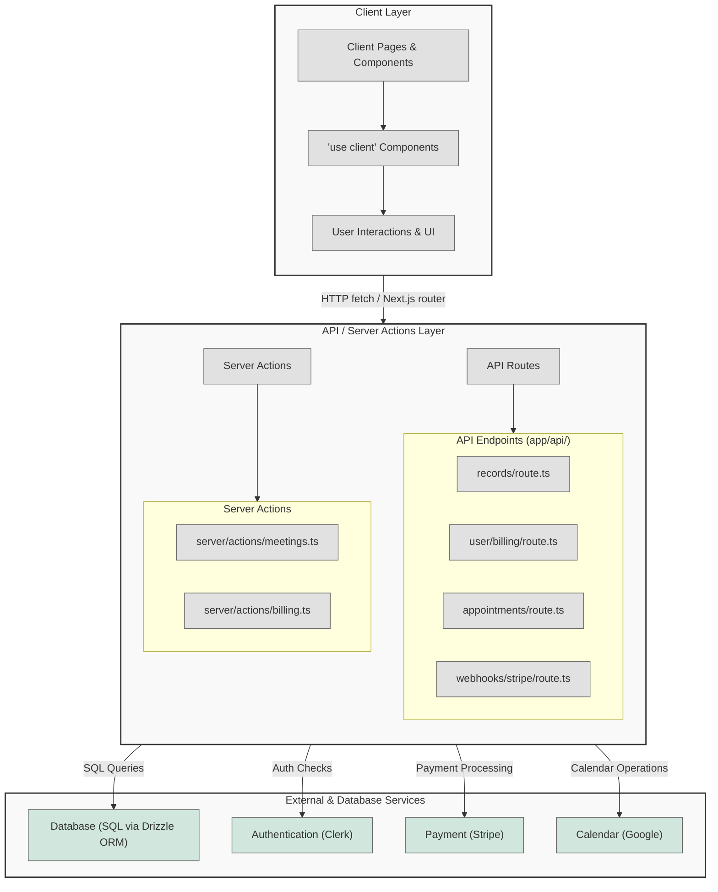

# Eleva: Empowering Women's Healthcare

Welcome to Eleva, a modern scheduling and appointment management platform designed exclusively for women's health professionals and their clients. Eleva streamlines the booking process and payment handling, ensuring that experts and clients share a seamless experience—from appointment scheduling to secure payouts. Hosted at [https://eleva.care](https://eleva.care), Eleva is transforming women's healthcare with state‑of‑the‑art technology and compassionate service.

## Overview

Eleva combines a robust tech stack with an intuitive user interface:

- **Framework:** Next.js 14 (App Router) for dynamic and responsive pages.
- **Authentication:** Clerk ensures secure sign‑in for both experts and clients.
- **Database:** PostgreSQL with Drizzle ORM for flexible and scalable data management.
- **Styling:** Tailwind CSS and shadcn/ui provide beautiful, responsive design.
- **Payments:** Stripe Connect processes payments securely and handles payouts (with Eleva retaining a 15% fee).
- **Calendar Integration:** Google Calendar sync keeps your schedule up‑to‑date.
- **Form Handling & Validation:** React Hook Form combined with Zod.
- **Date Management:** date-fns simplifies date and time manipulation.

## Key Features

### Appointment Scheduling

- **Easy Booking:** Experts create and manage different appointment types (e.g. "30min Consultation", "Postpartum Checkup") with descriptions, durations, and custom pricing.
- **Availability Management:** Define and update weekly availability with flexible time slots.
- **Seamless Flow:** Clients follow personalized booking links, select slots (with automatic timezone conversion), and instantly receive calendar invites.

### Payments & Payouts

- **Stripe Integration:** Process payments securely using Stripe Connect. When a payment is made, the expert’s Connect account (included in the payment metadata) ensures that funds are transferred after deducting Eleva's 15% service fee.
- **Webhook Automation:** Upon a successful checkout session, Stripe webhooks update payment statuses and trigger necessary transfers automatically.

### User Experience & Notifications

- **Responsive Design:** Enjoy a consistent and mobile-friendly interface built with Tailwind CSS and shadcn/ui.
- **Email Notifications:** Automatic updates keep clients and experts notified of new bookings, cancellations, and reminders.
- **Calendar Sync:** Integrate appointments with Google Calendar for hassle‑free schedule management.

### Expert Profiles & Services

- **Expert Setup:** Specialists configure their profiles to showcase their qualifications, services, and availability.
- **Detailed Descriptions:** Services include Pelvic Health, Pregnancy & Postpartum Care, and more—detailed on each expert’s profile.
- **Team & Community:** Dedicated team members, like Patricia Mota, Cristine Homsi Jorge, Alexandre Delgado, and others, guide our mission.

### Additional Resources

- **Podcast & Insights:** Listen to expert-led podcasts discussing cutting‑edge research and practical health tips.
- **Newsletter:** Subscribe to “Femme Focus” for monthly health insights, empowering stories, and expert advice delivered straight to your inbox.

## How It Works

1. **User Authentication:**  
   Secure sign‑in via Clerk ensures that both experts and clients are authenticated before accessing their dashboards.

2. **Expert Setup:**  
   Experts set up their profiles, configure available appointment types, and connect their Stripe account for receiving direct payouts.

3. **Booking Process:**  
   Clients use personalized links to view available slots, book appointments, and get instant calendar invites.

4. **Payment Handling:**  
   During checkout, the created payment intent includes metadata (such as the event ID and expertConnectAccountId), ensuring that Stripe webhooks can update payment statuses and trigger scheduled payout transfers.

5. **Calendar Integration:**  
   Booked appointments are automatically synced with Google Calendar, guaranteeing that schedules always remain current.

## Architecture Overview

### 1. Client Layer (UI Components)

- **Client Components**:  
  These components are marked with `"use client"` and run in the user's browser. They include pages and components such as:

  - Appointment booking pages (e.g., `app/(private)/appointments/page.tsx`)
  - Account billing pages (e.g., `app/(private)/account/billing/page.tsx`)
  - Presentation components (e.g., buttons, forms, dashboards)

- **Responsibilities**:
  - Handling user interactions and rendering the user interface.
  - Making HTTP (fetch) requests to the API endpoints on the server.
  - Displaying data returned by the server while not directly accessing sensitive business logic or SQL code.

---

### 2. Server Layer & API Endpoints

- **API Routes & Server Actions**:  
  These are located under the `app/api/` directory (and in `server/actions/`). They do not include a `"use client"` directive, meaning they run exclusively on the server.

  - **SQL Queries**: All database operations are performed using DrizzleORM (e.g., `findFirst`, `findMany`, `insert`, `update`), protecting against SQL injection.
  - **Authentication**: User authentication is handled with Clerk (using functions like `auth()` and `currentUser()`), ensuring that only authorized users can access sensitive operations.
  - **Payment & Calendar Integrations**: The server communicates with Stripe for payment processing and with Google Calendar for appointment scheduling.

- **Key API Endpoints / Server Action Files**:
  - `/api/webhooks/stripe/route.ts` and `/api/webhooks/stripe-connect/route.ts`: Manage Stripe webhooks and update user/meeting records.
  - `/api/user/billing/route.ts`: Handles billing data tied to the authenticated user.
  - `/api/records/route.ts`: Manages the creation and decryption of appointment records.
  - `/api/appointments/route.ts` and `/api/appointments/[meetingId]/records/route.ts`: Create and retrieve appointments and meeting records.
  - Server actions for meetings and billing (e.g., `server/actions/meetings.ts`, `server/actions/billing.ts`).

---

### 3. External Integrations

- **Database (SQL) Integration**:  
  The application uses DrizzleORM to safely construct SQL queries on the server. All database interactions occur exclusively in API routes and server actions, ensuring that raw SQL code is never exposed to the client.

- **Authentication**:  
  Clerk is used to authenticate users. Both server-side authentication (with functions like `auth()` and `currentUser()`) and client-side authentication components (e.g., `SignInButton`, `UserButton`) are employed to ensure secure access to data.

- **Payment Processing**:  
  The Stripe API is integrated to handle payment intents and connect account setups. Sensitive operations related to payment creation occur in secure server-side API endpoints.

- **Calendar Integration**:  
  Google Calendar is integrated on the server to manage calendar events for meeting bookings, ensuring that calendar tokens and related data are kept secure.

- **Record Encryption**:  
  Meeting records and notes are encrypted using AES-256-GCM before being stored in the database. Only server-side endpoints decrypt this data for secure processing.

---

## Data Flow Diagram

Below is a placeholder for a Mermaid diagram that represents the architecture and data flow of the application. You can modify the diagram as needed.



## Detailed Workflows

### Booking Appointment Workflow

1. **Client Interaction**:

   - A user interacts with appointment booking components, for example through the booking form on `app/(public)/[username]/[eventSlug]/page.tsx`.
   - The form collects data such as appointment date, guest email, name, and other meeting preferences.

2. **Server Processing**:

   - The client sends a request to an API endpoint (e.g., `/api/appointments/route.ts`).
   - The server validates the booking details, performs SQL queries to check for duplicates or conflicts, and verifies available time slots by integrating with Google Calendar.
   - A new meeting record is created in the database via a secure insertion query.

3. **Client Response**:
   - The server returns a confirmation response which the client then displays to the user.

---

### Payment Intent Creation Workflow

1. **Payment UI Interaction**:

   - Clients interact with the `PaymentStep` component within `components/organisms/forms/PaymentStep.tsx` to provide payment details.
   - Stripe Elements are used to securely capture payment information.

2. **Server Payment Processing**:

   - The payment request is sent to an endpoint (e.g., `/api/create-payment-intent/route.ts`).
   - The server validates the payment information, creates a payment intent via Stripe, assigns metadata to track the booking, and returns the `clientSecret` to the client.

3. **Confirmation and Redirect**:
   - Upon successful payment, the client component updates the UI or redirects the user to a success page.

---

### Record Management Workflow

1. **Record Entry**:

   - Experts use the `RecordEditor` component (`components/organisms/RecordEditor.tsx`) to input notes and related metadata during or after meetings.

2. **Server-Side Encryption & Storage**:

   - The record data is sent to `/api/appointments/[meetingId]/records/route.ts`.
   - The server encrypts the record content using AES-256-GCM and stores it in the database.
   - Record versions are managed through update operations for maintaining history.

3. **Retrieval and Display**:
   - When records are requested (e.g., via `/api/records/route.ts`), the server decrypts the data and returns the results to the client for display.

---

### Authentication Flow

1. **User Authentication**:

   - Clerk manages user authentication. Client-side components include sign in/out buttons and user buttons for account management.
   - Server endpoints verify user tokens using Clerk’s `auth()` and `currentUser()` functions to ensure all server-side operations are performed securely.

2. **Server-Side Authorization**:
   - Every API endpoint begins with an authentication check, blocking unauthorized access to sensitive SQL queries and data.

---

## Conclusion

The Eleva.are application follows a secure architecture by isolating sensitive SQL operations, authentication, and payment processing within server-side API endpoints and actions. The client components are kept lean, handling only user interactions and UI rendering. Sensitive data is never directly accessed on the client, minimizing the risk of accidentally leaking customer data.

Feel free to enhance or update the Mermaid diagram section as your architecture evolves.

## Getting Started

### Prerequisites

- [Node.js](https://nodejs.org/) and [pnpm](https://pnpm.io/) installed.
- A PostgreSQL database set up.
- Valid credentials for Stripe, Clerk, and Google Calendar APIs.

### Installation

1. **Clone the repository:**

   ```bash
   git clone <repository-url>
   cd <repository-folder>
   ```

2. **Install dependencies:**

   ```bash
   pnpm install
   ```

3. **Configure Environment Variables:**  
   Create a `.env` file at the root of the project and add variables like:

   ```env
   # Clerk Authentication
   NEXT_PUBLIC_CLERK_PUBLISHABLE_KEY=
   CLERK_SECRET_KEY=

   # Database
   DATABASE_URL=
   AUDIT_DATABASE_URL=

   # Stripe
   STRIPE_SECRET_KEY=
   STRIPE_WEBHOOK_SECRET=

   # Google Calendar
   GOOGLE_CLIENT_ID=
   GOOGLE_CLIENT_SECRET=

   # General Config
   NEXT_PUBLIC_BASE_URL=https://eleva.care
   ```

4. **Run the development server:**

   ```bash
   pnpm dev
   ```

5. **Open in Browser:**  
   Visit [http://localhost:3000](http://localhost:3000) to explore Eleva.

## Project Structure

```
├── app/                    # Next.js App Router pages
│   ├── (private)/         # Protected routes (authenticated pages)
│   └── (public)/          # Public routes (landing pages, etc.)
├── components/             # Reusable React components
│   ├── atoms/             # Small, reusable UI components
│   ├── forms/             # Form components for input handling
│   └── ui/                # UI components from shadcn/ui
├── drizzle/                # Database schema definitions and migrations
├── lib/                    # Utility functions and third-party integrations (e.g., Stripe)
├── schema/                 # Zod validation schemas and relations
└── server/                # Server-side logic, API routes, and webhooks
```

## Contributing

We welcome contributions! If you’d like to improve Eleva or add new features, please:

1. Fork the repository.
2. Create your feature branch.
3. Make your changes.
4. Submit a pull request for review.

For major changes, please open an issue first to discuss what you would like to change.

## License

This project is licensed under the MIT License. See the [LICENSE](LICENSE) file for details.

## Additional Information

Eleva is dedicated to transforming women's healthcare by harnessing innovative scheduling, secure payment processing, and expert-led consultations. Our platform aims to empower women by providing them easy access to top-rated healthcare professionals and comprehensive resources.

For localization and additional context, key terms and translations (such as “Services”, “Approach”, “Mission”, and “Team”) can be referenced from our localization files (e.g., `public/locales/en.js`).

Thank you for exploring Eleva. Visit [https://eleva.care](https://eleva.care) to learn more and join us on our mission to empower women's health.

## Eleva architecture with Next.js, Clerk, Neon DB, and Google OAuth

```mermaid
graph TD
  %% Frontend
  A[Next.js App]

  %% Authentication & User Management
  B[Clerk]

  %% Database
  C[Neon DB<br/>(Drizzle ORM)]

  %% External Services
  D[Google OAuth]

  %% Connections
  A -- "User Authentication\nand Session Management" --> B
  A -- "Data Queries/Mutations" --> C
  A -- "Calendar Integration\n(Token & Events)" --> D
  B -- "Provides Auth Data" --> A
  D -- "Token Refresh & Calendar Access" --> A

  %% Optional: Show background process or refresh flow
  subgraph "Background Processes"
    E[Token Refresh Service]
  end
  A -- "Triggers Refresh" --> E
  E -- "Updates Calendar Tokens" --> D
```

## Eleva Auth Google Verification Video Script

Below is a sample script for a video demonstration to verify the Google Auth integration for Eleva. You can adjust the language to your audience and include your branding.

─────────────────────────────

Title: "Verifying Google Authentication for Eleva Care"

[INTRO – 0:00 to 0:20]
• (Narrator on camera or voice-over with Eleva branding slide)
"Hello, and welcome to this demonstration of our Google Authentication integration for Eleva Care. In this video, I'll show you how our login flow works using Google OAuth, how we handle tokens, and what measures are in place for a seamless user experience."

[OVERVIEW – 0:20 to 0:45]
• (Overlay visual: diagram of Eleva architecture with Next.js, Clerk, Neon DB, and Google OAuth)
"Eleva Care uses a modern tech stack: Next.js for the front end, Clerk for authentication, and Neon as our database with Drizzle ORM. We integrate Google Auth so that our experts can easily add events to their calendars. Today, I'll guide you through the Google sign-in process – from clicking the sign-in button to successfully verifying and refreshing tokens when needed."

[DEMO PART 1: Setting the Stage – 0:45 to 1:30]
• (Screen capture: Show the Eleva login page)
"Let’s start at the login page. Notice our ‘Sign In with Google’ button, enabled via Clerk. I'll click the button.
• (Screen capture: Transition to Google OAuth consent screen)
Here you see the Google OAuth consent screen. Even though we’re in development mode using an unverified app, you can see the permissions our app requests. In a production environment, with a verified app, these prompts are streamlined."

[DEMO PART 2: Successful Login – 1:30 to 2:00]
• (Screen capture: Successfully logging in)
"After granting permissions, you’re redirected back to Eleva Care as an authenticated expert. Clerk stores the access token along with a refresh token, so our application can maintain access to your Google Calendar even if you’re inactive for a while."

[DEMO PART 3: Token Management and Refresh – 2:00 to 2:40]
• (Overlay visual or narration with code snippet reference: show checkAndRefreshToken function in tokenUtils.ts)
"Our integration includes robust token management. Google access tokens expire within an hour, but our implementation – using Clerk’s OAuth support – triggers a background mechanism to refresh tokens when necessary. This ensures that if you haven’t logged in for a while, your calendar connection doesn’t break."
• (Show a diagram or animation explaining the refresh process)
"In cases where the refresh token process fails, the app will prompt you to sign in again, ensuring that the proper scopes and tokens are maintained."

[DISCUSSION: Potential Issues & Best Practices – 2:40 to 3:10]
• (Narrator on camera or voice-over slides)
"In our testing, we discovered that on the free tier and with an unverified Google OAuth app, tokens might expire more rapidly. In production, it's important to verify your Google OAuth app in the Google Developer Console. Additionally, you may implement periodic background checks to auto-refresh tokens for experts who haven't logged in for extended periods."
• (Screen capture: Show the relevant settings in Clerk dashboard and Google Developer Console, if possible)

[WRAP-UP – 3:10 to 3:30]
• (Narrator or visual closing slide)
"That concludes our demonstration of the Google Auth integration for Eleva Care. We’ve shown the login flow, token refresh mechanism, and steps to maintain calendar connectivity. If you have any questions or feedback, please reach out. Thank you for watching!"

─────────────────────────────

This script covers:
• A clear introduction and context of Eleva's integration.
• A walkthrough of the Google sign-in process.
• Explanation of token management and refresh processes.
• Discussion of potential issues and best practices.

Feel free to adjust timings, add your branding or additional visuals, and rehearse to ensure a professional and comprehensive video presentation.
