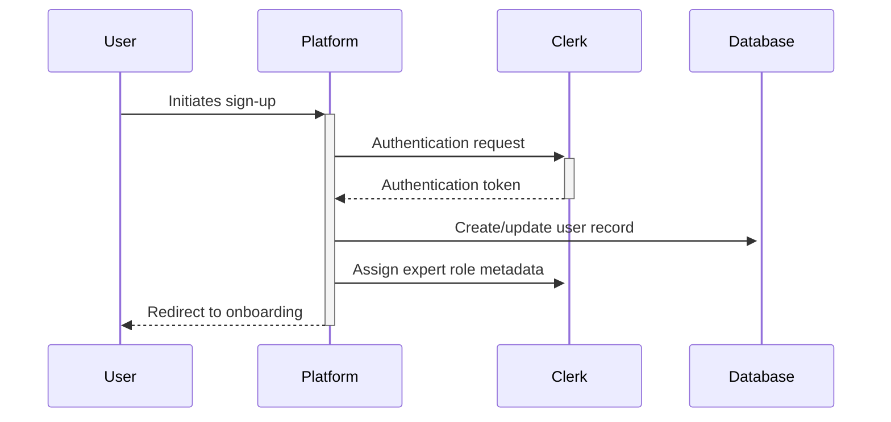
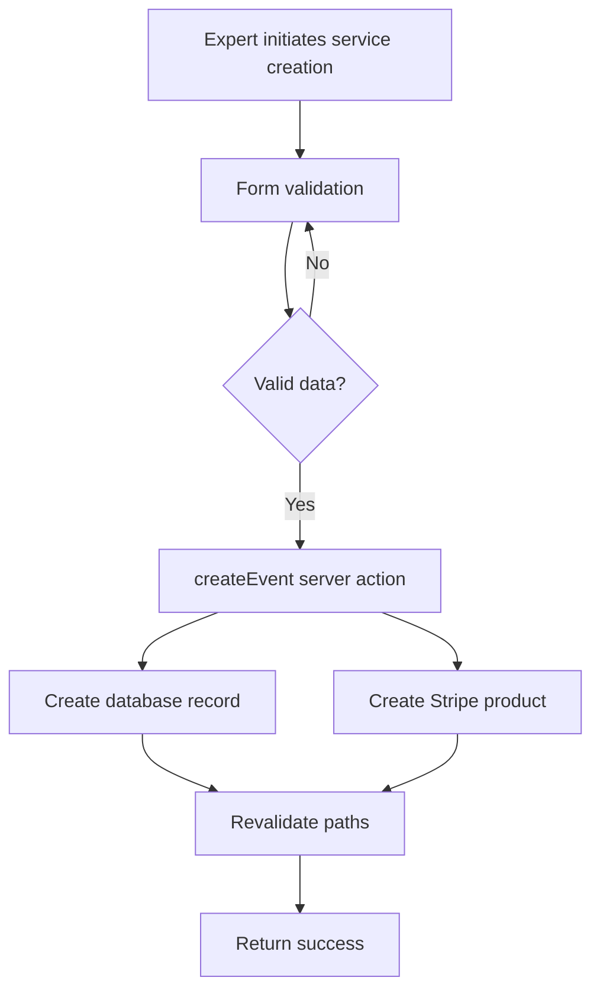

# Expert User Guide: Deep Dive Analysis

## Overview

This comprehensive guide provides a detailed analysis of the expert user journey within the Eleva Care platform. Expert users are healthcare professionals specializing in pregnancy, postpartum, menopause, and sexual health who use the platform to offer their services to clients. This document explores the technical implementation, user experience considerations, and functional requirements that shape the expert's interaction with the platform.

## 1. Account Creation and Onboarding

### 1.1 Authentication Flow Analysis

The expert onboarding process begins with authentication, built on Clerk's infrastructure:



**Technical Implementation:**

- The platform uses Clerk for authentication, which manages user sessions and identity verification
- Upon successful authentication, a database record is created in the `users` table
- User metadata in Clerk stores role information, with experts assigned either `community_expert` or `top_expert` roles
- OAuth integration allows authentication via Google, Apple, or email

**Security Considerations:**

- Multi-factor authentication is available but not required for experts
- Email verification is mandatory before an expert account is activated
- Session management includes automatic timeouts after periods of inactivity

### 1.2 Expert Role Assignment

The role assignment process follows a specific workflow with admin oversight:

1. **Initial Application**: Users indicate their intent to become experts during signup
2. **Automatic Role Assignment**: System assigns the `community_expert` role upon approval
3. **Admin Elevation**: Administrators can upgrade experts to `top_expert` status
4. **Role Persistence**: Role information is stored in both Clerk metadata and the database

**Implementation Details:**

- The `user_roles` table maintains a record of all role assignments
- Role changes trigger events that update permissions and UI elements
- Admin interface provides tools for role management, including history of changes

## 2. Expert Profile Configuration

### 2.1 Profile Creation Process

The expert profile creation process is a critical step that determines visibility and bookability:

**Required Profile Elements:**

- Name and credentials
- Professional headshot
- Biography (200-1000 characters)
- Areas of specialization (linked to predefined categories)
- Relevant certifications
- Years of experience
- Languages spoken
- Location information

**Technical Implementation:**

- Profile data is stored in the `profiles` table, linked to the user record
- Images are stored as blobs with CDN delivery
- Form validation uses Zod schemas for both client and server validation
- Profile changes trigger revalidation of public-facing pages

**Deep Dive: Profile Update Action**

The `updateProfile` server action handles profile modifications:

```typescript
export async function updateProfile(formData: FormData) {
  // Authentication verification
  const { userId } = await auth();
  if (!userId) {
    return { success: false, message: 'Not authenticated' };
  }

  // Role verification
  const isExpert = (await hasRole('community_expert')) || (await hasRole('top_expert'));
  if (!isExpert) {
    return { success: false, message: 'Not authorized' };
  }

  // Data validation with Zod
  const validationResult = profileSchema.safeParse(Object.fromEntries(formData));
  if (!validationResult.success) {
    return {
      success: false,
      message: 'Invalid profile data',
      errors: validationResult.error.format(),
    };
  }

  // Database operation
  try {
    await db
      .update(ProfileTable)
      .set(validationResult.data)
      .where(eq(ProfileTable.clerkUserId, userId));

    // Revalidate paths where profile appears
    revalidatePath('/experts');
    revalidatePath(`/experts/${username}`);

    return { success: true, message: 'Profile updated successfully' };
  } catch (error) {
    console.error('Profile update error:', error);
    return { success: false, message: 'Database error occurred' };
  }
}
```

### 2.2 Profile Publication Workflow

Profile publication is a gated process requiring completion of all setup steps:

**Publication Prerequisites:**

1. Complete profile information
2. Availability schedule configuration
3. At least one service/event created
4. Identity verification completion
5. Stripe Connect account setup

**Implementation Analysis:**

- The `ExpertSetupChecklist` component tracks completion status
- The `toggleProfilePublication` server action enforces prerequisites before allowing publication
- Publication status is stored in the `published` field of the `profiles` table
- Toast notifications provide user feedback upon completion

**User Experience Considerations:**

- Progress indicators show completion percentage
- Guided workflows direct experts to incomplete steps
- Clear error messages explain publication blockers
- Unpublishing is always permitted regardless of completion status

## 3. Availability Management

### 3.1 Schedule Configuration System

The availability management system allows experts to define when they can provide services:

**Schedule Components:**

- Weekly recurring time slots
- Date-specific availability overrides
- Vacation/unavailable periods
- Buffer times between appointments

**Technical Implementation:**

- Schedules are stored in the `schedules` table
- Individual time slots are in the `availabilities` table
- Date parsing uses Day.js for timezone consistency
- Conflicts are automatically detected and prevented

**Database Schema Analysis:**

```
Table: schedules
- id: UUID (PK)
- expertId: UUID (FK -> users.id)
- timezone: String
- minimumNotice: Integer (hours)
- startDate: Date
- endDate: Date (optional)
- createdAt: Timestamp
- updatedAt: Timestamp

Table: availabilities
- id: UUID (PK)
- scheduleId: UUID (FK -> schedules.id)
- dayOfWeek: Integer (0-6)
- startTime: Time
- endTime: Time
- isRecurring: Boolean
- specificDate: Date (optional)
```

### 3.2 Calendar Integration

The platform synchronizes with external calendars to prevent double-booking:

**Integration Points:**

- Google Calendar two-way sync
- iCal feed export
- Manual availability import

**Implementation Details:**

- OAuth connections store refresh tokens securely
- Background jobs update availability every 15 minutes
- Conflict resolution prioritizes external calendar events
- Webhooks capture real-time calendar changes when possible

## 4. Service Management

### 4.1 Service Creation System

Experts define their services (called "events" in the codebase) through a structured interface:

**Service Attributes:**

- Title and description
- Duration options
- Pricing tiers
- Category assignment
- Preparation instructions
- Follow-up information
- Virtual/in-person settings

**Technical Implementation:**

- Services are stored in the `events` table
- Pricing is synchronized with Stripe products
- Rich text descriptions use Prosemirror
- Images are optimized and stored in blob storage

**Service Creation Process Flow:**



### 4.2 Pricing and Payment Configuration

Services require specific payment configuration:

**Pricing Structure:**

- Flat-rate pricing per service
- Optional tiered pricing based on duration
- Package discounts for multiple sessions
- Currency settings based on expert location

**Implementation Analysis:**

- Stripe Products API creates corresponding products
- Price points are stored both locally and in Stripe
- Price changes trigger updates to both systems
- Tax calculations based on expert and client locations

## 5. Identity Verification

### 5.1 Verification Process

The platform implements a thorough identity verification flow:

**Verification Steps:**

1. Document upload (ID, certifications)
2. Selfie verification
3. Professional credentials check
4. Background screening (jurisdiction-dependent)

**Technical Implementation:**

- Stripe Identity integration handles document verification
- Admin review tool for credential evaluation
- Verification status stored in both Clerk metadata and database
- Encrypted storage for sensitive documents

### 5.2 Compliance and Security

Verification meets specific compliance requirements:

**Regulatory Considerations:**

- HIPAA compliance for healthcare professionals
- Jurisdiction-specific licensing requirements
- Data retention policies for verification documents
- Privacy controls for expert information

## 6. Appointment Management

### 6.1 Booking Flow Analysis

When clients book experts, a specific sequence occurs:

**Booking Sequence:**

1. Client selects service and time slot
2. System validates availability in real-time
3. Payment is collected via Stripe
4. Expert receives notification
5. Calendar events are created
6. Confirmation emails are sent

**Implementation Details:**

- Real-time availability checks prevent double bookings
- Transactions ensure booking and payment consistency
- Webhooks from Stripe confirm successful payments
- Meeting links are generated for virtual appointments

### 6.2 Appointment Actions

Experts have specific actions available for appointments:

**Available Actions:**

- Accept/reject booking requests (if enabled)
- Reschedule appointments
- Cancel with optional refund
- Send pre-appointment reminders
- Provide post-appointment follow-up
- Access client information and notes

**Technical Implementation:**

- Action permissions check expert ownership
- Database transactions maintain data integrity
- Notification triggers for client updates
- Audit logging for all appointment modifications

## 7. Payment Processing

### 7.1 Stripe Connect Integration

The payment system leverages Stripe Connect for expert payouts:

**Integration Components:**

- Express onboarding flow
- Custom account dashboard
- Automated payout scheduling
- Fee calculation and distribution

**Technical Details:**

- Stripe Connect accounts linked to expert profiles
- Platform fees configured as percentage or flat fee
- Tax forms collection and reporting
- Refund handling with expert account impact

### 7.2 Payout Analysis

The payout system follows specific rules:

**Payout Structure:**

- Configurable payout schedule (daily, weekly, monthly)
- Minimum payout thresholds
- Hold periods for dispute protection
- Fee transparency in reporting

**Implementation Considerations:**

- Webhook handling for payment status updates
- Balance calculations account for pending and available funds
- Currency conversion for international experts
- Reporting tools for financial reconciliation

## 8. Analytics and Insights

### 8.1 Expert Dashboard Analytics

Experts receive performance metrics:

**Available Metrics:**

- Booking conversion rates
- Revenue trends
- Client satisfaction scores
- Profile view statistics
- Comparison to platform averages

**Technical Implementation:**

- Event tracking captures user interactions
- Aggregation jobs run daily
- Data visualization with chart.js
- Personalized benchmarking algorithms

### 8.2 Growth Opportunities

The platform provides growth tools:

**Growth Features:**

- Suggested profile improvements
- Pricing optimization recommendations
- Availability adjustment suggestions
- Client retention analytics
- Marketing tools and resources

## 9. Troubleshooting Common Issues

### 9.1 Profile Publication Problems

**Common Issues and Solutions:**

- Incomplete steps preventing publication
- Image upload failures
- Bio length or formatting problems
- Category selection limitations

### 9.2 Schedule Synchronization Issues

**Common Problems:**

- Calendar permission revocation
- Timezone inconsistencies
- Recurring event conflicts
- Buffer time misconfiguration

### 9.3 Payment Setup Challenges

**Frequent Issues:**

- Stripe account verification failures
- Banking information rejections
- Tax identification errors
- Payout method limitations

## 10. Advanced Expert Features

### 10.1 Custom Branding

**Branding Capabilities:**

- Profile color theme selection
- Custom welcome messages
- Service presentation customization
- Personalized email templates

### 10.2 Client Management Tools

**Available Tools:**

- Client notes and history
- Follow-up scheduling
- Custom intake forms
- Client grouping and tagging

## 11. Technical Reference

### 11.1 Expert Role Permissions

| Permission         | Community Expert | Top Expert    |
| ------------------ | ---------------- | ------------- |
| Create profile     | ✓                | ✓             |
| Create services    | ✓ (up to 5)      | ✓ (unlimited) |
| Featured placement | ✗                | ✓             |
| Custom branding    | ✗                | ✓             |
| Client analytics   | Basic            | Advanced      |
| Platform fee       | 15%              | 10%           |
| Approval required  | Yes              | No            |

### 11.2 Profile Schema Reference

```typescript
const profileSchema = z.object({
  displayName: z.string().min(2).max(50),
  title: z.string().max(100).optional(),
  bio: z.string().min(100).max(1000),
  yearsOfExperience: z.number().int().min(0).max(70).optional(),
  profileImage: z.string().url().optional(),
  languages: z.array(z.string()).optional(),
  categories: z.array(z.string().uuid()).min(1),
  location: z
    .object({
      country: z.string().optional(),
      city: z.string().optional(),
      state: z.string().optional(),
    })
    .optional(),
  socialLinks: z
    .array(
      z.object({
        platform: z.enum(['instagram', 'twitter', 'linkedin', 'website']),
        url: z.string().url(),
      }),
    )
    .optional(),
});
```

## 12. Release Notes and Updates

### 12.1 Recent Platform Enhancements

**Version 2.4 Updates:**

- Enhanced scheduling interface with drag-and-drop
- Improved profile analytics dashboard
- New client communication tools
- Faster payout processing
- Mobile app beta access

### 12.2 Upcoming Features

**Planned Enhancements:**

- Group session support
- Subscription-based service options
- Enhanced document sharing
- Client chat functionality
- API access for enterprise experts

## Conclusion

This deep dive analysis of the expert user journey provides a comprehensive understanding of the technical implementation, user experience considerations, and functional capabilities of the Eleva Care platform from the expert's perspective. By understanding these systems, experts can maximize their effectiveness on the platform while administrators and developers can better support the expert experience.
