# Enhanced Payout Processing System

## 🎯 **Overview**

The Enhanced Payout Processing system implements a **two-phase approach** for creating Stripe payouts to expert Connect accounts, ensuring **legal compliance** and **comprehensive verification** using both database tracking and direct Stripe fallback checks.

## 🏗️ **Architecture**

### **Phase 1: Database-Driven Processing** (Primary Method)

- Processes completed transfers tracked in the local database
- Ensures 24-hour post-appointment complaint window
- Maintains detailed audit trail with real appointment data

### **Phase 2: Stripe Fallback Verification** (Legal Compliance Safety Net)

- Directly checks all Connect accounts for overdue balances
- Ensures compliance with legal holding period requirements
- Creates payouts for any missed or untracked funds

## 📋 **Requirements & Legal Compliance**

### **Legal Holding Periods**

- **Payment Aging**: 7+ days since payment received (legal requirement)
- **Appointment Window**: 24+ hours since appointment completion (dispute protection)
- **Maximum Hold**: 14 days maximum balance retention (legal compliance)

### **Stripe Connect Best Practices**

- Manual payout schedule enforcement
- Balance verification before payout creation
- Comprehensive metadata for audit trails
- Proper error handling and categorization

## 🔄 **Processing Flow**

```mermaid
graph TD
    A[Cron Triggered Daily 6 AM] --> B[Phase 1: Database Processing]
    B --> C[Find COMPLETED Transfers]
    C --> D[Check 24h Post-Appointment]
    D --> E[Create Database Payouts]
    E --> F[Update Transfer Records]
    F --> G[Send Novu Notifications]

    G --> H[Phase 2: Stripe Verification]
    H --> I[Get All Connect Accounts]
    I --> J[Check for Manual Payout Schedule]
    J --> K[Verify Balance > €10 Threshold]
    K --> L[Create Compliance Payouts]
    L --> M[Send Verification Notifications]

    M --> N[Combined Results & Reporting]
```



## 🚀 **API Endpoint**

### **Endpoint**: `/api/cron/process-pending-payouts`

- **Method**: GET or POST
- **Authentication**: QStash verified requests
- **Schedule**: Daily at 6:00 AM UTC
- **Timeout**: 5 minutes (300 seconds)

### **Response Format**

```json
{
  "success": true,
  "summary": {
    "total": 5,
    "successful": 4,
    "failed": 1,
    "totalAmountPaidOut": 25000,
    "databasePayouts": 3,
    "stripeVerificationPayouts": 1,
    "details": [...]
  },
  "enhancedProcessing": {
    "databasePhase": {
      "eligibleTransfers": 10,
      "processedTransfers": 3,
      "successfulPayouts": 3
    },
    "stripeVerificationPhase": {
      "checkedAccounts": 15,
      "overduePayouts": 1
    }
  },
  "timestamp": "2025-01-13T06:00:00.000Z"
}
```

## 📊 **Monitoring & Logging**

### **Key Metrics**

- **Database Payouts**: Number of payouts created from tracked transfers
- **Stripe Verification Payouts**: Number of compliance payouts created
- **Total Amount**: Sum of all payouts in cents
- **Processing Time**: Duration of each phase
- **Error Rate**: Failed vs successful payout attempts

### **Log Patterns**

```bash
# Phase 1 Processing
📊 PHASE 1: Processing database-tracked completed transfers...
✅ Transfer 123 eligible for payout: appointment ended 36h ago
💰 Successfully created payout po_xyz for €50.00 to expert user_abc

# Phase 2 Verification
🔍 PHASE 2: Stripe fallback verification for legal compliance...
🚨 Found overdue balance in account acct_xyz: €25.50 EUR
✅ Created compliance payout po_def for €25.50 to account acct_xyz

# Summary
📊 Enhanced Payout Processing Summary:
  - Database payouts: 3 successful
  - Stripe verification: 1 compliance payout
  - Total amount: €125.50 EUR
```

## 🛠️ **Configuration**

### **Environment Variables**

```bash
# Required for enhanced processing
STRIPE_SECRET_KEY=sk_...
CRON_API_KEY=your_api_key
QSTASH_TOKEN=your_token

# Optional fallback settings
ENABLE_CRON_FALLBACK=true
NODE_ENV=production
```

### **Constants** (Configurable in code)

```typescript
const MINIMUM_PAYOUT_DELAY_DAYS = 7; // Legal holding period
const APPOINTMENT_COMPLAINT_WINDOW_HOURS = 24; // Post-appointment window
const MAXIMUM_BALANCE_HOLD_DAYS = 14; // Maximum retention period
```

## 🔒 **Security & Authentication**

### **Multi-Layer Authentication**

1. **QStash Signature Verification** (Primary)
2. **API Key Authentication** (Fallback)
3. **Upstash Headers Validation** (Secondary)
4. **User Agent Verification** (Production)

### **Data Protection**

- All sensitive data encrypted in transit
- Stripe account access via secure headers
- Audit trail for all payout operations
- PII handling per GDPR requirements

## 📈 **Performance Optimization**

### **Parallel Processing**

- Database queries optimized with proper indexes
- Concurrent Stripe API calls with rate limiting
- Promise.allSettled for fault tolerance
- Efficient filtering to avoid unnecessary API calls

### **Error Handling**

- Graceful degradation if one phase fails
- Individual error tracking per transfer/account
- Retry logic for transient failures
- Comprehensive error categorization

## 🧪 **Testing & Validation**

### **Manual Testing**

```bash
# Test the enhanced cron manually
curl -X GET "https://eleva.care/api/cron/process-pending-payouts" \
  -H "x-qstash-request: true" \
  -H "user-agent: Upstash-QStash"
```

### **Expected Scenarios**

1. **No Transfers**: Both phases return 0 results
2. **Database Only**: Phase 1 processes transfers, Phase 2 finds no overdue balances
3. **Stripe Fallback**: Phase 1 empty, Phase 2 creates compliance payouts
4. **Mixed Processing**: Both phases create payouts

## 🚨 **Troubleshooting**

### **Common Issues**

| Issue                      | Cause                              | Solution                         |
| -------------------------- | ---------------------------------- | -------------------------------- |
| 0 transfers found          | No completed transfers in database | Check transfer creation pipeline |
| No Connect accounts        | Missing stripeConnectAccountId     | Verify expert onboarding         |
| Balance verification fails | Account not set to manual payouts  | Check Stripe account settings    |
| Payout creation fails      | Insufficient balance or bank setup | Review Stripe Connect setup      |

### **Debug Commands**

```bash
# Check for completed transfers
curl "https://eleva.care/api/admin/payment-transfers?status=COMPLETED"

# Verify Connect account balances
stripe balance retrieve --stripe-account acct_xyz

# Test manual payout creation
stripe payouts create --amount 1000 --currency eur --stripe-account acct_xyz
```

## 🔮 **Future Enhancements**

### **Planned Features**

- [ ] **Intelligent Scheduling**: Dynamic payout timing based on account preferences
- [ ] **Multi-Currency Support**: Enhanced currency conversion and regional compliance
- [ ] **Advanced Analytics**: Detailed reporting dashboard for payout metrics
- [ ] **Webhook Integration**: Real-time payout status updates
- [ ] **Machine Learning**: Predictive analysis for optimal payout timing

### **Scalability Considerations**

- Horizontal scaling with queue-based processing
- Database sharding for large expert networks
- Cached balance checks to reduce Stripe API calls
- Regional processing for international compliance

---

## 📚 **Related Documentation**

- [Stripe Connect Integration](./02-stripe-integration.md)
- [QStash Cron Jobs](../../../03-infrastructure/scheduling/01-qstash-jobs.md)
- [Novu Notifications](../notifications/01-novu-integration.md)
- [Legal Compliance Guide](./04-legal-compliance.md)

---

**Last Updated**: January 2025  
**Version**: 2.0 (Enhanced Processing)  
**Status**: ✅ Production Ready
