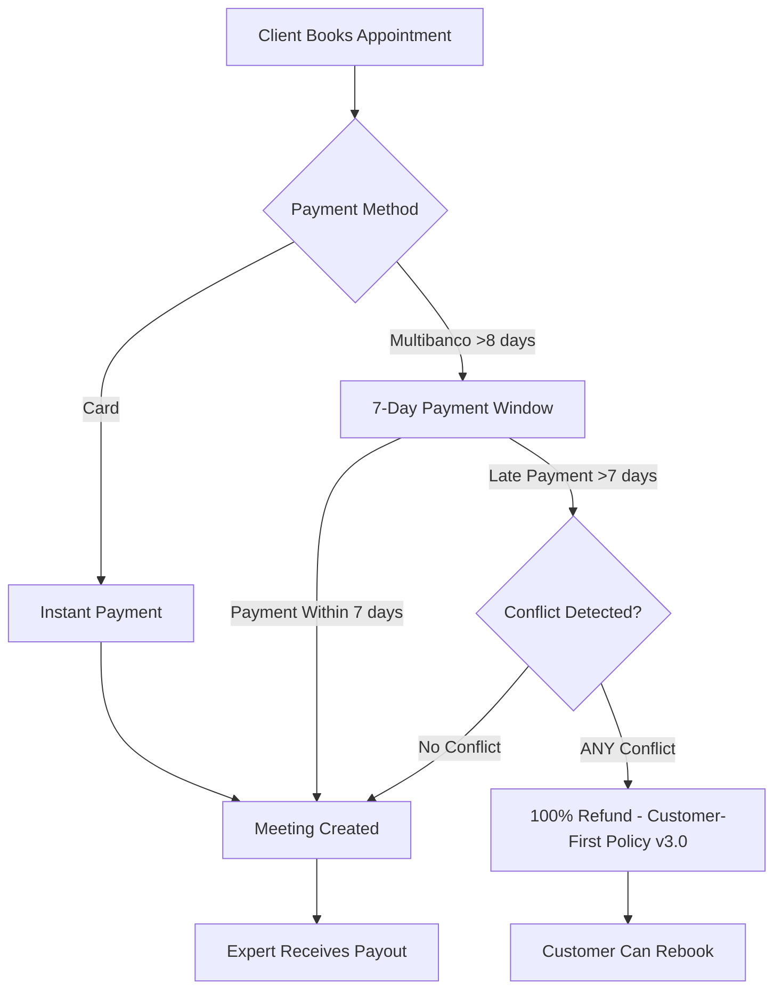

# Payment System Documentation

This directory contains comprehensive documentation for Eleva Care's payment system, including Stripe integration, Multibanco support, and refund policies.

---

## 📚 Documentation Index

### Core Payment Flow

1. **[Payment Flow Analysis](./01-payment-flow-analysis.md)**
   - Current vs. proposed implementation
   - Card payment flow
   - Multibanco payment flow
   - Slot reservation system

2. **[Stripe Integration](./02-stripe-integration.md)**
   - Stripe Connect setup
   - Payment Intent API
   - Webhook handling
   - Error handling and retries

3. **[Payment Processing](./03-payment-processing.md)**
   - Payment lifecycle
   - Transaction states
   - Refund handling
   - Failed payment recovery

### Payment Methods

4. **[Stripe Payouts](./04-stripe-payouts.md)**
   - Expert payout system
   - Transfer scheduling
   - Country-specific delays
   - Payout failure handling

5. **[Multibanco Integration](./05-multibanco-integration.md)**
   - Multibanco payment flow
   - 7-day payment window
   - Voucher generation
   - Late payment handling

### Refund Policies

6. **[Policy v3.0: Customer-First 100% Refund](./09-policy-v3-customer-first-100-refund.md)** ⭐ **CURRENT**
   - **100% refund for ALL late payment conflicts**
   - Customer-first approach
   - Complete implementation guide
   - Testing strategy (15/15 tests passing)
   - Deployment checklist
   - Business impact analysis

7. **[Multibanco Refund Flow Audit](./10-multibanco-refund-flow-audit.md)** ⭐ NEW
   - Comprehensive flow documentation
   - Code alignment verification
   - Stripe API best practices
   - Documentation consolidation plan

8. **[~~First-Time Waiver Implementation~~](./06-first-time-waiver-implementation.md)** ⚠️ **DEPRECATED** (Superseded by v3.0)
   - Legacy v1.0 policy documentation
   - Archived for historical reference

9. **[~~Blocked Date Refund Summary~~](./08-blocked-date-refund-implementation-summary.md)** ⚠️ **DEPRECATED** (Superseded by v3.0)
   - Legacy v2.0 policy documentation
   - Archived for historical reference

---

## 🚀 Quick Start

### For Product Managers

- Read: [Policy v3.0 Documentation](./09-policy-v3-customer-first-100-refund.md)
- Understand: Simplified 100% refund policy for all conflicts
- Timeline: **✅ COMPLETE** - Already in production-ready state

### For Engineers

- Read: [Policy v3.0 Implementation](./09-policy-v3-customer-first-100-refund.md)
- Status: **✅ Backend Complete** | **✅ Tests Passing** (15/15)
- Next: Deploy to staging and validate

### For QA

- Read: [Multibanco Refund Flow Audit](./10-multibanco-refund-flow-audit.md)
- Focus: Integration tests, E2E webhook validation
- Verify: All 4 languages (EN, PT, ES, BR)

---

## 💡 Key Features

### Payment Methods

- ✅ Credit/Debit Cards (Visa, Mastercard, Amex)
- ✅ Multibanco (Portugal)
- ✅ 3D Secure (3DS) authentication
- ✅ Stripe Connect for expert payouts

### Refund Policies (v3.0 - Customer-First)

- ✅ **ALL late payment conflicts**: 100% refund (no processing fees)
- ✅ **Blocked dates**: 100% refund (expert's fault)
- ✅ **Time overlaps**: 100% refund (slot unavailable)
- ✅ **Minimum notice**: 100% refund (can't proceed)
- ✅ Expert-initiated refunds
- ✅ Platform-initiated refunds

### Security & Compliance

- ✅ PCI DSS Level 1 (via Stripe)
- ✅ 3DS authentication for fraud prevention
- ✅ Chargeback dispute handling
- ✅ Fraud detection and prevention

---

## 🔄 Payment Flow Overview

---

## 📊 Refund Policy Summary (v3.0)

| Scenario                             | Policy v3.0             | Fee    | Reason                         |
| ------------------------------------ | ----------------------- | ------ | ------------------------------ |
| **Late Multibanco - Blocked Date**   | 100% refund             | €0     | Expert blocked after booking   |
| **Late Multibanco - Time Overlap**   | 100% refund             | €0     | Slot booked by another client  |
| **Late Multibanco - Minimum Notice** | 100% refund             | €0     | Can't meet expert requirements |
| **Late Multibanco - No Conflict**    | No refund               | N/A    | Meeting proceeds as normal     |
| **Card payment cancellation**        | Per cancellation policy | Varies | See Terms of Service           |

**Policy**: v3.0 - Customer-first approach. All late payment conflicts receive 100% refund (no processing fees).
**Effective Date**: January 27, 2025

---

## 🎯 Policy v3.0 Quick Reference

### For Users (Customer-Facing)

- **What**: If you pay late (>7 days) and there's a conflict, you get **100% refund** (no fees)
- **Why**: We believe in treating customers fairly when appointments can't proceed
- **When**: Applies to ALL late payment conflicts (blocked dates, time overlaps, minimum notice violations)
- **How**: Automatic - no action needed

### For Engineers

- **Logic**: `processPartialRefund()` always returns 100% refund for any conflict
- **Detection**: `checkAppointmentConflict()` checks 3 conflict types in priority order
- **Tracking**: PostHog analytics + Stripe metadata (`policy_version: '3.0'`)
- **Tests**: 15/15 passing in `blocked-date-refund.test.ts`

### For Support

- **Message**: "You received a 100% refund because the appointment couldn't proceed"
- **Reason**: Check email for specific conflict type (blocked date, time overlap, etc.)
- **Policy**: All conflicts = full refund, no exceptions

---

## 🔧 Technical Stack

- **Payment Processor**: Stripe
- **Database**: PostgreSQL (via Neon.tech)
- **ORM**: Drizzle
- **Webhooks**: Stripe webhooks + Svix
- **Email**: Novu (multi-language)
- **Analytics**: PostHog
- **i18n**: next-intl (EN, ES, PT, BR)

---

## 📈 Key Metrics

### Payment Success Rate

- **Target**: >95%
- **Current**: Track via Stripe Dashboard

### Chargeback Rate

- **Target**: <1%
- **Baseline**: 2-5% (before first-time waiver)
- **Expected**: 30-50% reduction

### Customer Satisfaction

- **Target**: >4.0/5.0 for late payment refunds
- **Measurement**: Post-refund survey

### Late Payment Frequency

- **Target**: <5% of Multibanco payments
- **Measurement**: PostHog analytics

---

## 🧪 Testing Resources

### Unit Tests

- `tests/lib/payment-refund.test.ts` - Refund logic tests
- `tests/api/webhooks/stripe.test.ts` - Webhook handler tests

### Integration Tests

- `tests/api/webhooks/stripe-refund-integration.test.ts` - Full flow tests
- `tests/integration/multibanco-late-payment.test.ts` - Late payment scenarios

### E2E Tests

- `tests/e2e/late-payment-dashboard.spec.ts` - UI tests

---

## 📞 Support & Escalation

### During Implementation

- **Technical Issues**: #engineering Slack channel
- **Product Questions**: Product team
- **Legal Review**: Legal team (for policy changes)

### In Production

- **Payment Failures**: On-call engineer
- **Refund Disputes**: Customer support → Finance team
- **Stripe Issues**: Stripe support + on-call engineer

---

## 🔗 External Resources

- [Stripe Documentation](https://stripe.com/docs)
- [Multibanco Documentation](https://stripe.com/docs/payments/multibanco)
- [Stripe Webhooks Guide](https://stripe.com/docs/webhooks)
- [Stripe Refunds API](https://stripe.com/docs/api/refunds)

---

## 📝 Changelog

### 2025-01-27 (v3.0 - Customer-First Policy)

- ✨ **Implemented v3.0**: 100% refund for ALL late payment conflicts
- ✅ Backend complete and tested (15/15 tests passing)
- ✅ Legal content updated (4 languages)
- ✅ Email translations updated (4 languages)
- 📚 Added comprehensive flow audit documentation
- 📚 Updated README to reflect current policy
- ⚠️ Deprecated v1.0 and v2.0 documentation

### 2025-01-26 (v2.0 - Blocked Date Policy)

- ✨ Differentiated blocked date (100%) vs other conflicts (90%)
- 📚 Added blocked date implementation summary
- ⚠️ **SUPERSEDED by v3.0**

### 2025-01-17 (v1.0 - First-Time Waiver)

- ✨ First-time courtesy waiver concept
- 📚 Implementation guide and Linear templates
- ⚠️ **SUPERSEDED by v3.0**

### 2024-12-XX (Initial)

- 📚 Initial payment system documentation
- 📚 Stripe integration guide
- 📚 Multibanco integration guide

---

## 🤝 Contributing

When adding new payment features:

1. **Document first**: Create implementation guide
2. **Break into tasks**: Use Linear issue templates
3. **Test thoroughly**: Unit + integration + E2E tests
4. **Update docs**: Keep this README current
5. **Monitor metrics**: Track impact via PostHog

---

**Last Updated**: January 27, 2025 (v3.0 Policy Implementation)  
**Maintained By**: Engineering Team  
**Questions?** Post in #engineering Slack channel

---

## 📌 Recent Changes

- **2025-01-27**: Implemented v3.0 customer-first policy (100% refund for all conflicts)
- **2025-01-27**: Deprecated v1.0 and v2.0 documentation
- **2025-01-27**: Consolidated and audited complete Multibanco refund flow
- **2025-01-27**: Validated Stripe API best practices compliance
