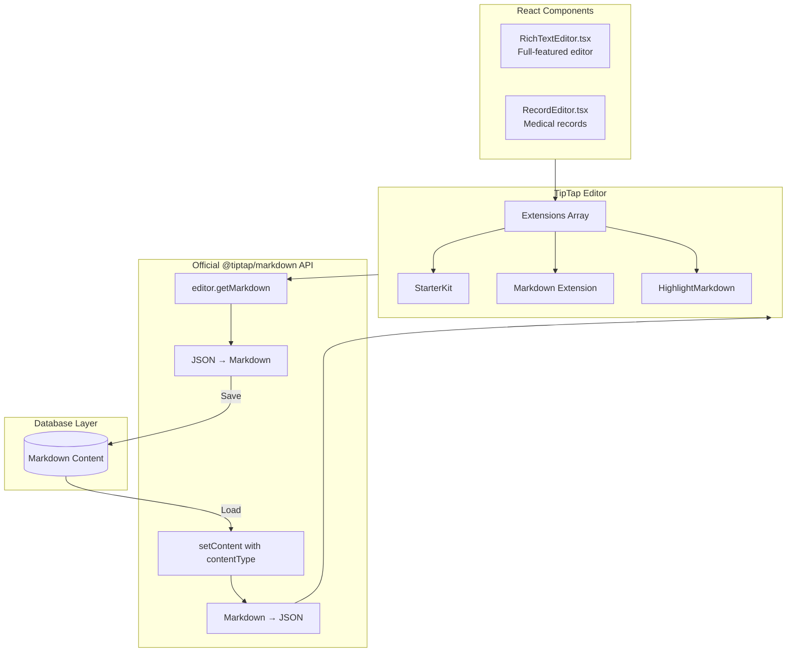
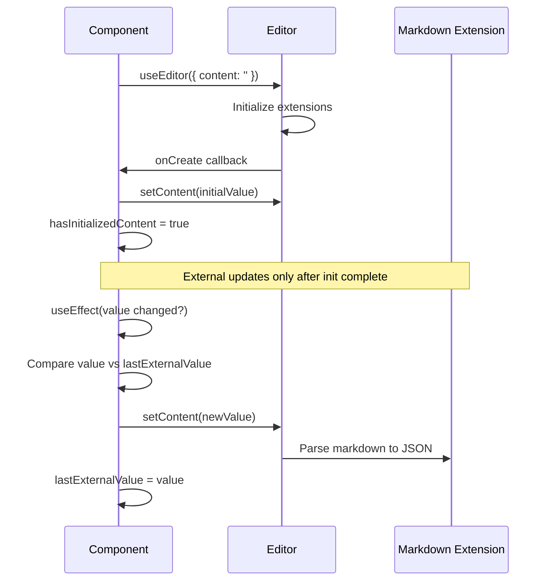

# TipTap Markdown Implementation

**For:** Frontend Developers working with rich text editors  
**Status:** ✅ Complete  
**Last Updated:** December 2025

---

## Overview

Eleva Care uses [TipTap](https://tiptap.dev/) as its rich text editor foundation, with the official `@tiptap/markdown` extension for bidirectional Markdown support. This enables:

- **Markdown Storage**: All rich text content is stored as Markdown in the database
- **Rich Editing**: Users edit with a WYSIWYG interface with toolbar buttons
- **Highlight Syntax**: Custom `==text==` markdown syntax for highlighted text
- **Reliable Sync**: Cursor position preserved during autosave operations

---

## Architecture



---

## Key Files

| File | Purpose |
|------|---------|
| `src/components/shared/rich-text/RichTextEditor.tsx` | Full-featured rich text editor with images, tables, colors |
| `src/components/features/appointments/RecordEditor.tsx` | Simplified editor for medical records with highlight support |
| `src/components/shared/rich-text/extensions/highlight-markdown.ts` | Custom Highlight extension with `==text==` markdown syntax |
| `src/components/shared/rich-text/types.ts` | Re-exported types from `@tiptap/core` |

---

## Package Dependencies

```json
{
  "@tiptap/core": "^3.13.0",
  "@tiptap/pm": "^3.13.0",
  "@tiptap/markdown": "^3.13.0",
  "@tiptap/react": "^3.13.0",
  "@tiptap/starter-kit": "^3.13.0",
  "@tiptap/extension-highlight": "^3.13.0"
}
```

> **Note:** We use the official `@tiptap/markdown` package, not the community `tiptap-markdown` package.

---

## Implementation Details

### 1. Markdown Extension Setup

The `@tiptap/markdown` extension is configured in both editors:

```typescript
import { Markdown } from '@tiptap/markdown';

const extensions = [
  StarterKit.configure({
    heading: { levels: [1, 2, 3] },
  }),
  Markdown.configure({
    markedOptions: {
      gfm: true,      // GitHub Flavored Markdown
      breaks: false,  // Don't convert \n to <br>
    },
  }),
  // ... other extensions
];
```

### 2. Getting/Setting Content

The `@tiptap/markdown` extension adds methods to the editor instance:

```typescript
// Get current content as Markdown string
const markdown = editor.getMarkdown();

// Set content (automatically detects markdown)
editor.commands.setContent(markdownString, { emitUpdate: false });
```

### 3. HighlightMarkdown Extension

Following the [official TipTap guide](https://tiptap.dev/docs/editor/markdown/guides/create-a-highlight-mark), we created a custom Highlight extension with markdown support:

```typescript
import {
  Mark,
  MarkdownLexerConfiguration,
  MarkdownParseHelpers,
  MarkdownRendererHelpers,
  MarkdownToken,
  mergeAttributes,
} from '@tiptap/core';

export const HighlightMarkdown = Mark.create({
  name: 'highlight',

  // HTML rendering
  parseHTML() {
    return [{ tag: 'mark' }];
  },
  renderHTML({ HTMLAttributes }) {
    return ['mark', mergeAttributes(this.options.HTMLAttributes, HTMLAttributes), 0];
  },

  // Markdown tokenizer: recognizes ==text==
  markdownTokenizer: {
    name: 'highlight',
    level: 'inline',
    start: (src: string) => src.indexOf('=='),
    tokenize: (src, _tokens, lexer) => {
      const match = /^==([^=]+)==/.exec(src);
      if (!match) return undefined;
      return {
        type: 'highlight',
        raw: match[0],
        text: match[1],
        tokens: lexer.inlineTokens(match[1]),
      };
    },
  },

  // Parse markdown token to TipTap JSON
  parseMarkdown: (token, helpers) => {
    const content = helpers.parseInline(token.tokens || []);
    return helpers.applyMark('highlight', content);
  },

  // Render TipTap node back to Markdown
  renderMarkdown: (node, helpers) => {
    const content = helpers.renderChildren(node.content || []);
    return `==${content}==`;
  },
});
```

---

## Initialization Pattern

The editors use a reliable initialization pattern to prevent race conditions:

```typescript
const editor = useEditor({
  extensions,
  content: '', // Start empty
  immediatelyRender: false,
  
  // Initialize content after extensions are ready
  onCreate: ({ editor }) => {
    if (initialValueRef.current) {
      editor.commands.setContent(initialValueRef.current, { emitUpdate: false });
    }
    hasInitializedContent.current = true;
    lastExternalValue.current = initialValueRef.current;
  },
  
  // Handle editor changes
  onUpdate: ({ editor }) => {
    if (isUpdatingFromProp.current) return;
    
    const markdownContent = editor.getMarkdown();
    lastExternalValue.current = markdownContent;
    onChangeRef.current(markdownContent);
  },
});
```



---

## External Value Sync

Handling external value changes (e.g., from autosave) while preserving cursor position:

```typescript
React.useEffect(() => {
  // Skip if editor not ready or not initialized
  if (!editor || !hasInitializedContent.current) return;
  
  // Skip if value hasn't actually changed
  if (value === lastExternalValue.current) return;

  // Store cursor position
  const { from, to } = editor.state.selection;
  const wasFocused = editor.isFocused;

  // Flag external update
  isUpdatingFromProp.current = true;
  lastExternalValue.current = value;

  // Update content
  editor.commands.setContent(value || '', { emitUpdate: false });

  // Restore cursor position if focused
  if (wasFocused) {
    Promise.resolve().then(() => {
      if (editor && !editor.isDestroyed) {
        const newDocSize = editor.state.doc.content.size;
        const safeFrom = Math.min(from, Math.max(0, newDocSize - 1));
        const safeTo = Math.min(to, Math.max(0, newDocSize - 1));
        
        editor.commands.setTextSelection(
          safeFrom === safeTo ? safeFrom : { from: safeFrom, to: safeTo }
        );
        editor.commands.focus();
      }
    });
  }

  // Reset flag
  queueMicrotask(() => {
    isUpdatingFromProp.current = false;
  });
}, [value, editor]);
```

---

## Editor Variants

### RichTextEditor

Full-featured editor for comprehensive content creation:

| Feature | Description |
|---------|-------------|
| **Text Formatting** | Bold, italic, underline, highlight, colors |
| **Alignment** | Left, center, right, justify |
| **Lists** | Bullet lists, task lists |
| **Tables** | Resizable tables with headers |
| **Images** | Upload to Vercel Blob storage |
| **Links** | Clickable links with URL prompt |
| **Typography** | Smart quotes, fractions, symbols |

```typescript
<RichTextEditor
  value={content}
  onChange={setContent}
  variant="full"       // "full" | "simple" | "minimal"
  placeholder="Start writing..."
  features={{
    images: true,
    tables: true,
    colors: true,
    alignment: true,
    typography: true,
    links: true,
  }}
/>
```

### RecordEditor

Simplified editor for medical appointment records:

| Feature | Description |
|---------|-------------|
| **Text Formatting** | Bold, italic, highlight |
| **Headings** | H1, H2, H3 for section structure |
| **Lists** | Bullet lists, task lists |
| **Tables** | For medical data tables |
| **Links** | Reference links |
| **Read-Only Mode** | For viewing completed records |

```typescript
<RecordEditor
  value={notes}
  onChange={setNotes}
  readOnly={false}
  autoFocus={true}
/>
```

---

## Markdown Syntax Support

| Syntax | Renders As | Notes |
|--------|------------|-------|
| `**bold**` | **bold** | Standard markdown |
| `*italic*` | *italic* | Standard markdown |
| `==highlight==` | Highlighted text | Custom extension |
| `# Heading` | H1 | Levels 1-3 |
| `- item` | Bullet list | Standard markdown |
| `- [ ] task` | Task checkbox | GFM extension |
| `[link](url)` | Clickable link | Standard markdown |
| Tables | HTML tables | GFM extension |

---

## Troubleshooting

### Issue: Cursor jumps to beginning during autosave

**Cause:** External value updates are triggering content replacement.

**Solution:** Ensure proper value tracking with `lastExternalValue` ref:

```typescript
// Skip if value is from our own edit
if (value === lastExternalValue.current) return;
```

### Issue: Content not loading initially

**Cause:** Extensions not fully initialized when content is set.

**Solution:** Use `onCreate` callback instead of setting `content` directly:

```typescript
const editor = useEditor({
  content: '', // Empty initially
  onCreate: ({ editor }) => {
    editor.commands.setContent(initialValue);
  },
});
```

### Issue: Highlight syntax not working

**Cause:** Using standard `Highlight` extension instead of `HighlightMarkdown`.

**Solution:** Import and use the custom extension:

```typescript
import { HighlightMarkdown } from '@/components/shared/rich-text/extensions/highlight-markdown';

const extensions = [
  // ...
  HighlightMarkdown.configure({
    multicolor: true,
    HTMLAttributes: { class: 'bg-yellow-200 px-1 py-0.5 rounded' },
  }),
];
```

### Issue: TypeScript errors with editor methods

**Cause:** The `@tiptap/markdown` extension augments the Editor interface.

**Solution:** Ensure the Markdown extension is imported:

```typescript
import { Markdown } from '@tiptap/markdown';

// This enables editor.getMarkdown() method
```

---

## Migration from tiptap-markdown (Community Package)

If migrating from the community `tiptap-markdown` package:

| Old (tiptap-markdown) | New (@tiptap/markdown) |
|-----------------------|------------------------|
| `editor.storage.markdown.getMarkdown()` | `editor.getMarkdown()` |
| `Markdown.configure({ html: false, ... })` | `Markdown.configure({ markedOptions: { ... } })` |
| `addStorage()` pattern for extensions | `markdownTokenizer`, `parseMarkdown`, `renderMarkdown` |

---

## Related Documentation

- [TipTap Official Docs](https://tiptap.dev/docs)
- [TipTap Markdown Extension](https://tiptap.dev/docs/editor/markdown)
- [Create a Highlight Mark](https://tiptap.dev/docs/editor/markdown/guides/create-a-highlight-mark)
- [TipTap Autosave Cursor Fix](./03-tiptap-editor-fixes.md)

---

## Future Improvements

- [ ] Add collaborative editing support
- [ ] Implement image resize handles
- [ ] Add code block syntax highlighting
- [ ] Support for embedded videos
- [ ] Add emoji picker integration

---

**Maintained By:** Engineering Team  
**Last Updated:** December 2025

