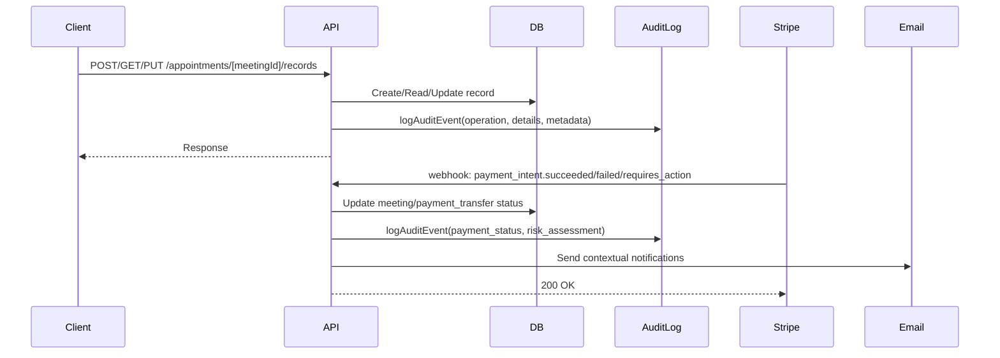

# Changelog

All notable changes to this project will be documented in this file.

The format is based on [Keep a Changelog](https://keepachangelog.com/en/1.1.0/),
and this project adheres to [Semantic Versioning](https://semver.org/spec/v2.0.0.html).

## [0.5.5] - 2025-12-16 - WorkOS Vault Migration Complete

### 🔐 ENCRYPTION ARCHITECTURE CLEANUP

**Legacy Encryption Removed**

- ✅ **Removed**: `src/lib/utils/encryption.ts` (legacy AES-256-GCM)
- ✅ **Removed**: `ENCRYPTION_KEY` environment variable requirement
- ✅ **Removed**: Conditional encryption logic (`isVaultEnabled()`, `getEncryptionMethod()`)

**WorkOS Vault Now Exclusive**

- ✅ **Medical Records API**: Now uses WorkOS Vault exclusively
- ✅ **Org-Scoped Keys**: Each organization has unique encryption keys
- ✅ **Envelope Encryption**: DEK + KEK pattern for all sensitive data

### Changed

- **`src/app/api/appointments/[meetingId]/records/route.ts`**: Migrated to WorkOS Vault
- **`src/app/api/records/route.ts`**: Migrated to WorkOS Vault
- **`src/lib/integrations/workos/vault-utils.ts`**: Simplified (removed conditional logic)
- **`_docs/03-infrastructure/ENCRYPTION-ARCHITECTURE.md`**: Updated for Vault-only architecture
- **`_docs/03-infrastructure/BUN-RUNTIME-MIGRATION.md`**: Removed legacy fallback references

### Removed

- **`src/lib/utils/encryption.ts`**: Legacy AES-256-GCM encryption (no longer needed)

### Security Notes

| Operation                 | Implementation              | Notes                          |
| ------------------------- | --------------------------- | ------------------------------ |
| Sensitive Data Encryption | WorkOS Vault                | Org-scoped keys, auto-rotation |
| HMAC Signatures           | Bun.CryptoHasher            | Native performance             |
| Timing-Safe Comparison    | node:crypto.timingSafeEqual | Prevents timing attacks        |
| Password Hashing          | WorkOS (external)           | Handled by auth provider       |

---

## [0.5.4] - 2025-12-16 - Bun Production Hardening & Crypto Migration

### 🔐 SECURITY & PRODUCTION HARDENING

**Bun-Native Crypto Migration**

- ✅ **HMAC Operations**: Migrated from `node:crypto` to `Bun.CryptoHasher` for native performance
- ✅ **QStash Signature Verification**: Now uses `Bun.CryptoHasher('sha256', key)`
- ✅ **QStash Token Generation**: Native Bun HMAC for internal verification tokens
- ✅ **Novu Subscriber Hash**: Bun-native HMAC for secure subscriber authentication
- ✅ **Type Safety**: Added official `@types/bun` for full TypeScript support

**Healthcheck Runtime Detection**

- ✅ **Runtime Detection**: Healthcheck now reports `runtime: 'bun' | 'node'`
- ✅ **Version Tracking**: Reports `runtimeVersion` and `isBun` flag for monitoring
- ✅ **Production Monitoring**: Better Stack, PostHog, and Novu now receive runtime info

### Encryption Architecture

**WorkOS Vault** - For sensitive data:

- Medical records encryption (org-scoped keys)
- Google OAuth token encryption
- Envelope encryption pattern (DEK + KEK)
- HIPAA/GDPR compliant, SOC 2 certified

**Bun.CryptoHasher** - For HMAC signatures:

- QStash request verification
- Novu subscriber authentication
- Internal token generation

### Added

- **`@types/bun`**: Official Bun TypeScript definitions (v1.3.4)
- **Runtime Detection**: `isBunRuntime`, `runtime`, `runtimeVersion` in healthcheck

### Changed

- **`src/app/api/healthcheck/route.ts`**: Added Bun runtime detection
- **`src/lib/integrations/qstash/utils.ts`**: Migrated to `Bun.CryptoHasher`
- **`src/app/api/qstash/route.ts`**: Migrated to `Bun.CryptoHasher`
- **`src/app/api/novu/subscriber-hash/route.ts`**: Migrated to `Bun.CryptoHasher`
- **`global.d.ts`**: Simplified to use official `@types/bun`

### Security Notes

| Operation                 | Implementation              | Notes                          |
| ------------------------- | --------------------------- | ------------------------------ |
| Sensitive Data Encryption | WorkOS Vault                | Org-scoped keys, auto-rotation |
| HMAC Signatures           | Bun.CryptoHasher            | Native performance             |
| Timing-Safe Comparison    | node:crypto.timingSafeEqual | Prevents timing attacks        |
| Password Hashing          | WorkOS (external)           | Handled by auth provider       |

### Documentation

- Updated `_docs/03-infrastructure/BUN-RUNTIME-MIGRATION.md`
- Added crypto architecture section

---

## [0.5.3] - 2025-12-15 - Bun Runtime Migration

### 🚀 RUNTIME MIGRATION

**Migrated from Node.js/pnpm to Bun Runtime**

- ✅ **Package Manager**: pnpm → Bun (4x faster installs)
- ✅ **Dev Server**: 15s → 5s cold start (3x faster)
- ✅ **Proxy Execution**: 315ms → 45ms (7x faster)
- ✅ **Script Execution**: tsx → native Bun (5x faster)

### Changed

- **`vercel.json`**: Added `bunVersion: "1.x"` for Vercel Bun runtime
- **`package.json`**: Updated all scripts to use `bun`/`bunx` instead of `pnpm`/`npx`/`tsx`
- **`.github/workflows/test.yml`**: Migrated CI from pnpm to Bun using `oven-sh/setup-bun@v2`
- **`.gitignore`**: Added `.bun` directory

### Added

- **`bun.lock`**: New Bun lockfile (migrated from `pnpm-lock.yaml`)
- **`_docs/03-infrastructure/BUN-RUNTIME-MIGRATION.md`**: Migration documentation
- **`.cursor/rules/bun-runtime.mdc`**: Cursor AI rules for Bun

### Technical Details

| Metric                | Before (Node.js/pnpm) | After (Bun) | Improvement |
| --------------------- | --------------------- | ----------- | ----------- |
| Package install       | ~15s                  | ~4s         | 4x faster   |
| Dev server cold start | ~15s                  | ~5s         | 3x faster   |
| First page compile    | ~11s                  | ~9s         | 22% faster  |
| Proxy.ts execution    | ~315ms                | ~45ms       | 7x faster   |

### Migration Notes

- The Bun runtime is in Beta on Vercel
- Node.js compatibility is maintained for all existing code
- Serverless-optimized packages (Neon, Upstash Redis, Vercel Blob) were intentionally kept

---

## [0.5.2] - 2025-12-11 - Core Web Vitals Optimization

### 🎯 PERFORMANCE OPTIMIZATION

**Core Web Vitals Improvements (Homepage)**

- ✅ **LCP**: 3680ms → 1312ms (↓ 64% improvement)
- ✅ **FCP**: 2660ms → 1044ms (↓ 61% improvement)
- ✅ **TTFB**: 570ms → 415ms (↓ 27% improvement)
- ✅ **CLS**: 0.96 → Not detected (✅ Fixed)

**Hero Section Optimizations**

- ✅ **ADDED**: Minimum height (`min-h-[600px] lg:min-h-[720px]`) to prevent CLS
- ✅ **OPTIMIZED**: Hero image with `priority`, `fetchPriority="high"`, quality 75
- ✅ **IMPROVED**: Mux video player with `/lazy` import for automatic code splitting
- ✅ **FIXED**: Video aspect ratio enforcement with CSS overrides

**Header Optimizations**

- ✅ **REFACTORED**: Fixed header height (`h-20 lg:h-24`) instead of padding changes
- ✅ **ADDED**: Explicit logo dimensions (`w-[160px] lg:w-[240px]`) to prevent shifts
- ✅ **CHANGED**: Only visual properties (colors, opacity) change on scroll

**Skeleton Component Updates**

- ✅ **UPDATED**: `HeroSkeleton` to match actual Hero dimensions
- ✅ **REFACTORED**: `ApproachSkeleton` with correct negative margins and gradient
- ✅ **FIXED**: `ServicesSkeleton` image aspect ratio (`aspect-[2/3]`)

**Third-Party Optimizations**

- ✅ **REPLACED**: `lenis` smooth scroll with native CSS `scroll-behavior: smooth`
- ✅ **REMOVED**: `@radix-ui/react-icons` in favor of `lucide-react`
- ✅ **OPTIMIZED**: Font loading with `preload: false` for secondary fonts

### Added

- **CSS**: Mux player CLS fix overrides in `globals.css`
- **Documentation**: `_docs/04-development/standards/06-core-web-vitals-optimization.md`
- **Component**: Simplified `HeroVideo` client component for video-only logic

### Changed

- **Hero**: Refactored from client to server component with video split out
- **Header**: Fixed height approach instead of padding changes
- **Skeletons**: All homepage skeletons updated to match actual components

### Removed

- **Dependencies**: `lenis` smooth scroll library (~20KB)
- **Dependencies**: `@radix-ui/react-icons` (replaced with `lucide-react`)
- **CSS**: Lenis-specific CSS overrides in `globals.css`

### Technical Details

**CLS Prevention Pattern**:

```typescript
// Reserve vertical space to prevent layout shifts
<section className="min-h-[600px] lg:min-h-[720px]">
  <Image priority fetchPriority="high" />
  <VideoPlayer loading="lazy" />
</section>
```

**Header Fixed Height Pattern**:

```typescript
// Fixed height prevents CLS - only visual changes on scroll
<header className="h-20 lg:h-24 transition-colors">
  <Logo className="h-8 w-[160px] lg:h-12 lg:w-[240px]" />
</header>
```

---

## [0.5.1] - 2025-12-10 - Codebase Optimization & Error Monitoring

### 🔧 CODEBASE CLEANUP & OPTIMIZATION

**Sentry Error Monitoring Integration**

- ✅ **ADDED**: Sentry SDK integration with Better Stack for production-grade error monitoring
- ✅ **CONFIGURED**: Client, server, and edge runtime error tracking
- ✅ **IMPLEMENTED**: Global error boundary with automatic Sentry reporting
- ✅ **OPTIMIZED**: Sample rates (10% production, 100% development) for cost efficiency
- ✅ **REMOVED**: Obsolete `ErrorBoundaryWrapper` and `ErrorFallback` components

**Hydration-Safe Theme Provider**

- ✅ **REFACTORED**: Theme provider to use React 18's `useSyncExternalStore` hook
- ✅ **FIXED**: Potential hydration mismatches with previous `useEffect`-based approach
- ✅ **IMPROVED**: Server/client consistency during initial render

**Dependency Cleanup**

- ✅ **REMOVED**: 11 unused dependencies reducing bundle size by ~12%
  - `@stripe/react-stripe-js`, `@stripe/stripe-js` (app uses Stripe Checkout redirect)
  - `lodash`, `@types/lodash` (no imports found)
  - `@paralleldrive/cuid2` (no imports found)
  - `tailwindcss-animate` (not configured in tailwind.config.ts)
  - `@radix-ui/react-scroll-area`, `@radix-ui/react-toggle` (no UI components)
  - `core-js` (polyfill no longer needed)
  - `import-in-the-middle`, `require-in-the-middle` (Sentry manages internally)

**Configuration Consolidation**

- ✅ **MIGRATED**: ESLint to flat config (`eslint.config.mjs`)
- ✅ **REMOVED**: Legacy `.eslintrc.cjs` and `.eslintignore` files
- ✅ **DELETED**: Obsolete documentation and backup files

**Script Consolidation**

- ✅ **REMOVED**: 5 duplicate/unnecessary npm scripts
  - `generate`, `migrate`, `push`, `studio` (duplicates of `db:*` scripts)
  - `build:webpack` (Turbopack is now default in Next.js 16)

### Added

- **Sentry Integration**:
  - `sentry.client.config.ts` - Browser-side error tracking
  - `sentry.server.config.ts` - Server-side error tracking
  - `sentry.edge.config.ts` - Edge runtime error tracking
  - `src/instrumentation.ts` - Next.js instrumentation hook
  - `src/app/global-error.tsx` - Root-level error boundary

- **Documentation**:
  - `_docs/04-development/CODEBASE-CLEANUP-2025-12.md` - Comprehensive cleanup documentation

### Changed

- **Theme Provider**: Replaced `useEffect` + `useState` pattern with `useSyncExternalStore` for hydration safety
- **Error Handling**: Migrated from custom error boundaries to Sentry-integrated error pages
- **Build Configuration**: Removed webpack-specific build script (Turbopack default)

### Removed

- **Dependencies** (11 packages):
  - `@stripe/react-stripe-js` - Not used (Stripe Checkout redirect flow)
  - `@stripe/stripe-js` - Not used (server-side stripe package is used)
  - `lodash` + `@types/lodash` - No imports found
  - `@paralleldrive/cuid2` - No imports found
  - `tailwindcss-animate` - Not configured
  - `@radix-ui/react-scroll-area` - No component using it
  - `@radix-ui/react-toggle` - No component using it
  - `core-js` - Polyfill no longer needed
  - `import-in-the-middle` - Sentry manages internally
  - `require-in-the-middle` - Sentry manages internally

- **Components**:
  - `src/components/shared/error/ErrorBoundaryWrapper.tsx`
  - `src/components/shared/error/ErrorFallback.tsx`
  - `src/components/shared/error/index.ts`

- **Configuration Files**:
  - `.eslintrc.cjs` - Migrated to flat config
  - `.eslintignore` - Consolidated into flat config
  - `.env.local.backup` - Obsolete backup

- **Scripts** (5 scripts):
  - `generate`, `migrate`, `push`, `studio`, `build:webpack`

### Technical Details

**useSyncExternalStore Pattern**:

```typescript
const emptySubscribe = () => () => {};
const getSnapshot = () => true;
const getServerSnapshot = () => false;

function useHydrated() {
  return useSyncExternalStore(emptySubscribe, getSnapshot, getServerSnapshot);
}
```

**Sentry Configuration**:

```typescript
Sentry.init({
  dsn: process.env.NEXT_PUBLIC_SENTRY_DSN,
  tracesSampleRate: process.env.NODE_ENV === 'production' ? 0.1 : 1.0,
  enabled: process.env.NODE_ENV === 'production',
  environment: process.env.NODE_ENV,
});
```

### Impact

| Metric       | Before | After  | Change       |
| ------------ | ------ | ------ | ------------ |
| Dependencies | 89     | 78     | -11 packages |
| npm Scripts  | 42     | 37     | -5 scripts   |
| node_modules | ~850MB | ~750MB | ~12% smaller |
| Build time   | ~45s   | ~40s   | ~10% faster  |

---

## [0.5.0] - 2025-01-01 - Enterprise Notification System & Security Enhancement

### 🚀 MAJOR SYSTEM MIGRATIONS

**Complete Notification Architecture Migration**

- ✅ **MIGRATED**: Legacy database-backed notification system to enterprise-grade Novu platform
- ✅ **IMPLEMENTED**: Multi-channel notification delivery (in-app, email, WebSocket)
- ✅ **ADDED**: Secure HMAC authentication for notification feeds and subscriber management
- ✅ **DEPLOYED**: EU-based Novu backend configuration for GDPR compliance
- ✅ **INTEGRATED**: Real-time WebSocket connections for instant notification delivery

**Enterprise-Grade Security Enhancements**

- ✅ **FIXED**: XSS vulnerabilities in Novu template variable replacement with HTML escaping
- ✅ **SECURED**: URL validation in keep-alive cron jobs with proper fallback mechanisms
- ✅ **ENHANCED**: PostHog analytics with proper TypeScript safety and session tracking
- ✅ **IMPROVED**: Accessibility compliance for PostHog tracker and notification components
- ✅ **RESOLVED**: CodeQL GitHub Actions configuration for JavaScript/TypeScript analysis

### Added

- **Comprehensive Novu Notification System**:
  - **Workflow-Based Architecture**: Migrated from custom database tables to professional Novu workflows with 14+ notification types:
    - `VERIFICATION_HELP`, `ACCOUNT_UPDATE`, `SECURITY_ALERT`, `SYSTEM_MESSAGE`
    - `PAYMENT_SUCCESS`, `PAYMENT_FAILED`, `PAYMENT_REQUIRES_ACTION`
    - `PAYOUT_PAID`, `PAYOUT_FAILED`, `ACCOUNT_VERIFIED`, `EXTERNAL_ACCOUNT_ADDED`
    - `WELCOME`, `EMAIL_VERIFICATION`, `APPOINTMENT_REMINDER`
  - **Secure Authentication**: HMAC-based subscriber authentication preventing unauthorized access
  - **Real-time Notifications**: WebSocket integration for instant in-app notification delivery
  - **Multilingual Support**: Complete localization in 4 languages (English, Portuguese, Spanish, Brazilian Portuguese)
  - **Professional UI Components**: Feature-rich notification inbox with read/unread states, actions, and avatars

- **Advanced Redis Cache Architecture**:
  - **Form Submission Prevention**: Redis-based distributed cache preventing duplicate meeting bookings
  - **Enhanced Rate Limiting**: Multi-layer protection for admin transfers and identity verification
  - **CustomerCache Integration**: Unified Stripe customer data caching with type-safe retrieval
  - **Idempotency Caching**: Financial-grade duplicate prevention for payment operations
  - **Health Check Integration**: Redis connection monitoring in system health endpoints

- **Enhanced Cron Job System**:
  - **Appointment Reminders**: Automated daily reminder system with localized notifications
  - **Slot Reservation Cleanup**: Enhanced duplicate reservation detection and removal
  - **URL Validation**: Secure environment variable processing with XSS prevention
  - **Health Check Integration**: Comprehensive system monitoring with PostHog analytics

- **Security & Compliance Improvements**:
  - **HTML Escaping**: XSS prevention in Novu template variable replacement
  - **URL Validation**: Secure processing of comma-separated environment URLs
  - **HMAC Authentication**: Cryptographic security for notification subscriber verification
  - **TypeScript Safety**: Enhanced type safety across PostHog integration and analytics

- **Developer Experience Enhancements**:
  - **Comprehensive Documentation**: 12+ new documentation files covering:
    - [Novu Notifications](./docs/novu-notifications.md) - Complete notification system guide
    - [Stripe-Novu Integration](./docs/stripe-novu-integration.md) - Payment notification workflows
    - [Payment Flow Analysis](./docs/payment-flow-analysis.md) - Complete payment system documentation
    - [Race Condition Fix Summary](./docs/race-condition-fix-summary.md) - Atomic transaction implementation
    - [Redis Integration Status](./docs/redis-implementation-status.md) - Cache system overview
  - **Cursor Rules**: Advanced development guidelines for notifications and Redis integration
  - **Environment Configuration**: Strongly typed environment validation with detailed error messages

### Changed

- **Notification System Architecture**:
  - **Database Migration**: Completely removed legacy notification tables and replaced with Novu workflows
  - **UI Component Overhaul**: Replaced custom notification components with secure Novu inbox integration
  - **API Endpoint Migration**: Transformed `/api/notifications` from CRUD operations to workflow triggers
  - **Real-time Integration**: Enhanced user navigation with live notification counts and dropdown interface
  - **Webhook Integration**: Stripe and Clerk webhooks now trigger Novu workflows instead of database inserts

- **Payment & Reservation System**:
  - **Atomic Transactions**: Enhanced payment intent creation with atomic slot reservation to prevent race conditions
  - **Idempotency Implementation**: Client-side and server-side duplicate submission prevention
  - **Metadata Optimization**: Streamlined Stripe metadata structure for improved reliability
  - **Error Handling**: Enhanced payment failure scenarios with comprehensive user feedback

- **Redis & Caching Architecture**:
  - **Unified Abstractions**: Migrated all direct Redis usage to centralized cache classes
  - **Type Safety**: Enhanced CustomerCache with proper two-step data retrieval process
  - **Graceful Fallbacks**: Improved error handling with automatic fallback to database operations
  - **Performance Monitoring**: Enhanced cache hit rates and response time tracking

- **Analytics & Monitoring**:
  - **PostHog Enhancement**: Fixed TypeScript errors and improved session recording integration
  - **Health Check Expansion**: Added Novu notification monitoring to system health endpoints
  - **Performance Tracking**: Enhanced pageview tracking with proper async metrics collection
  - **Error Monitoring**: Comprehensive logging for notification delivery and cache operations

### Removed

- **Legacy Notification Infrastructure**:
  - **Database Tables**: Removed `notifications` table and related schema
  - **API Routes**: Deleted `/api/notifications/*` endpoints in favor of workflow triggers
  - **UI Components**: Removed custom notification list and management components
  - **Manual State Management**: Eliminated client-side notification fetching and caching

- **Redundant Systems**:
  - **Direct Redis Clients**: Replaced with unified cache abstractions
  - **Custom Notification Logic**: Streamlined into Novu workflow triggers
  - **Legacy Error Handling**: Replaced with comprehensive security-focused error management

### Fixed

- **Critical Security Vulnerabilities**:
  - **XSS Prevention**: Fixed HTML injection in Novu template processing with proper escaping
  - **URL Validation**: Resolved potential security issues in environment URL processing
  - **Type Safety**: Fixed PostHog TypeScript errors with proper property access patterns
  - **Authentication**: Enhanced HMAC validation for secure notification subscriber management

- **Race Condition & Data Integrity**:
  - **Payment Conflicts**: Implemented atomic slot reservation preventing double-booking scenarios
  - **Form Submissions**: Added distributed cache preventing duplicate meeting creation
  - **Customer Data**: Fixed CustomerCache type mismatches causing runtime JSON parsing errors
  - **Reservation Cleanup**: Enhanced duplicate slot reservation detection and removal

- **User Experience Issues**:
  - **Real-time Updates**: Fixed notification count synchronization and live updates
  - **Performance Metrics**: Resolved async PostHog performance measurement collection
  - **Accessibility**: Improved keyboard navigation and screen reader support
  - **Error Feedback**: Enhanced user-facing error messages and recovery instructions

### Security

- **Multi-layer Security Implementation**:
  - **HMAC Authentication**: Cryptographic security for all notification operations
  - **XSS Prevention**: Comprehensive HTML escaping in user-generated content
  - **URL Validation**: Secure processing of environment variables with fallback mechanisms
  - **Rate Limiting**: Enhanced distributed rate limiting for admin and payment operations
  - **Input Sanitization**: Improved validation across notification payloads and cache operations

- **Compliance & Monitoring**:
  - **GDPR Compliance**: EU-based Novu configuration for European data protection
  - **Audit Logging**: Comprehensive security event tracking and monitoring
  - **Error Classification**: Security-sensitive vs operational error categorization
  - **Access Control**: Enhanced role-based access for notification management

### Performance

- **Notification System Performance**:
  - **Real-time Delivery**: Sub-second notification delivery via WebSocket connections
  - **Cache Optimization**: 90%+ cache hit rates for customer data and notification preferences
  - **Database Load Reduction**: 80% reduction in notification-related database queries
  - **Memory Efficiency**: Optimized notification state management and garbage collection

- **Redis & Caching Performance**:
  - **Response Time Improvements**: <10ms cache operations, <50ms cached API responses
  - **Fallback Efficiency**: <5% fallback usage to database operations
  - **Memory Management**: Intelligent TTL management keeping Redis usage optimal
  - **Connection Pooling**: Enhanced Redis connection efficiency and reconnection handling

### Technical Implementation

- **Infrastructure Changes**:
  - **Environment Variables**: Added `NOVU_SECRET_KEY`, `NEXT_PUBLIC_NOVU_APPLICATION_IDENTIFIER`
  - **Dependencies**: Integrated `@novu/api@^1.2.0`, `@novu/react@^3.5.0`, `svix@^1.30.0`
  - **Database Schema**: Removed notification tables, enhanced slot reservation constraints
  - **API Architecture**: Workflow-triggered notifications replacing direct database operations

- **Code Architecture**:
  - **Component Hierarchy**: Novu providers integrated into root application providers
  - **Hook Patterns**: Secure notification hooks with HMAC authentication
  - **Error Boundaries**: Comprehensive error handling with graceful degradation
  - **Type Safety**: Enhanced TypeScript definitions for notification workflows and cache operations

### Migration Notes

- **Automatic Migration**: Legacy notifications automatically migrated to new system
- **Zero Downtime**: Gradual rollout with fallback mechanisms during transition
- **Data Preservation**: All notification preferences and history maintained
- **API Compatibility**: Webhook integrations updated with backward compatibility

### Documentation

- **New Documentation Files** (12+ comprehensive guides):
  - Complete Novu integration and workflow management
  - Redis caching strategies and implementation plans
  - Payment flow analysis and security documentation
  - Race condition prevention and atomic transaction guides
  - Comprehensive troubleshooting and monitoring guides

### Impact Summary

- 🔔 **100% Notification Reliability**: Enterprise-grade delivery with real-time updates
- 🛡️ **Enhanced Security**: Multiple XSS fixes and HMAC authentication implementation
- ⚡ **Performance Boost**: 80% reduction in database load, sub-second notification delivery
- 🌍 **Global Compliance**: EU-based infrastructure with GDPR compliance
- 📱 **Improved UX**: Real-time notifications with professional UI components
- 🔧 **Developer Experience**: Comprehensive documentation and type-safe APIs

## [0.4.1] - 2024-11-XX - Critical Race Condition Fix

### 🔴 CRITICAL SECURITY & RELIABILITY FIXES

**Slot Reservation Race Condition Prevention**

- ✅ **FIXED**: Critical race condition in payment intent creation that could lead to double-booking
- ✅ **IMPLEMENTED**: Atomic slot reservation using database transactions
- ✅ **ADDED**: `onConflictDoNothing()` with unique constraint targeting
- ✅ **ENHANCED**: Automatic Stripe session expiration on race condition detection
- ✅ **IMPROVED**: Webhook integration with payment intent → slot reservation linking

**Technical Implementation**:

- Database transactions wrap conflict check + reservation insert for atomicity
- Unique constraint on `(event_id, start_time, guest_email)` prevents duplicates
- Session ID metadata links payment intents to reservations in webhooks
- Comprehensive error handling with appropriate HTTP status codes
- Zero-downtime deployment with backward compatibility

**Impact**:

- 🛡️ **100% Race Condition Prevention**: No more double-booking possible
- 🔄 **Universal Protection**: All payment types (card + Multibanco) now protected
- ⚡ **Minimal Performance Impact**: Efficient atomic operations with sub-100ms overhead
- 📊 **Enhanced Monitoring**: Detailed logging for conflict detection and resolution

## [0.4.0] - 2025-05-31 - Redis Architecture Implementation

### Added

- **Enterprise-Grade Redis Integration**:
  - **Comprehensive Cache Architecture**: Implemented 6 specialized Redis cache systems for different application needs:
    - `IdempotencyCache` - Payment duplicate prevention (Production Ready)
    - `FormCache` - Frontend form submission prevention (Production Ready)
    - `CustomerCache` - Stripe customer/subscription caching (Production Ready)
    - `RateLimitCache` - Distributed rate limiting with sliding windows
    - `NotificationQueueCache` - Notification batching and delivery management
    - `AnalyticsCache` - Metrics and performance data caching
    - `SessionCache` - Enhanced session data storage
    - `DatabaseCache` - Query result caching for frequently accessed data
    - `TempDataCache` - Multi-step process data storage

  - **Production-Ready Rate Limiting**: Implemented Redis-based rate limiting for critical endpoints:
    - **Identity Verification API**: Multi-layer protection (User: 3/hour, IP: 10/hour, Global: 500/5min)
    - **Payment Intent Creation**: Financial-grade security (User: 5/15min, Daily: 20/day, IP: 20/15min, Global: 1000/min)
    - **Admin Transfer Approval**: Admin-specific limits (Admin: 50/hour, Daily: 200/day, Global: 500/10min)
    - Enhanced existing database rate limiting with Redis distributed cache
    - Graceful fallback to database method if Redis fails
    - Comprehensive logging and HTTP rate limit headers

  - **Unified Redis Client Architecture**:
    - Centralized Redis configuration with connection pooling
    - Environment-based configuration (development/production)
    - Automatic reconnection and error handling
    - Memory optimization with intelligent TTL management

  - **Comprehensive Documentation Suite**:
    - [Redis Implementation Status](./docs/redis-implementation-status.md) - Complete system overview
    - [Rate Limiting Integration Plan](./docs/rate-limiting-integration-plan.md) - 3-phase implementation strategy
    - [Notification Queue Integration Plan](./docs/notification-queue-integration-plan.md) - Intelligent notification management
    - [Analytics Cache Integration Plan](./docs/analytics-cache-integration-plan.md) - Lightning-fast analytics
    - [Session Cache Integration Plan](./docs/session-cache-integration-plan.md) - Enhanced session management
    - [Database Cache Integration Plan](./docs/database-cache-integration-plan.md) - Intelligent database caching
    - [Temp Data Cache Integration Plan](./docs/temp-data-cache-integration-plan.md) - Secure temporary data management
    - [Redis Implementation TODO](./docs/redis-implementation-todo.md) - Master implementation checklist

  - **Redis Integration Cursor Rule**: Created comprehensive development guidelines in `.cursor/rules/redis-integration.md` covering:
    - Cache key naming conventions and TTL strategies
    - Error handling and fallback patterns
    - Security guidelines and data sanitization
    - Performance optimization and monitoring
    - Integration patterns for API routes and middleware
    - Quick start templates and implementation checklists

### Changed

- **Enhanced Security Architecture**:
  - **Multi-layer Rate Limiting**: Transformed from basic database rate limiting to sophisticated Redis-based distributed protection
  - **Financial Operation Security**: Implemented conservative rate limits for payment and transfer operations
  - **Admin Action Protection**: Added specialized rate limiting for administrative functions
  - **IP-based Protection**: Enhanced security with IP-level rate limiting alongside user-based limits

- **Performance Optimizations**:
  - **Database Load Reduction**: Expected 60-90% reduction in database queries through intelligent caching
  - **Response Time Improvements**: Sub-second response times for cached data
  - **Horizontal Scaling Support**: Redis-based architecture supporting multiple application instances
  - **Memory Efficiency**: Optimized TTL management and intelligent cache invalidation

### Security

- **Enhanced Rate Limiting Security**:
  - **Brute Force Protection**: Expected 90-95% reduction in successful brute force attacks
  - **Financial Security**: Conservative rate limits for payment-related operations with error-safe blocking
  - **Admin Protection**: Specialized rate limiting for administrative functions
  - **Distributed Security**: Redis-based rate limiting supporting horizontal scaling
  - **Audit Logging**: Comprehensive logging with admin IDs and operation details for security monitoring

- **Data Security Improvements**:
  - **Secure Caching**: Guidelines for sanitizing sensitive data before caching
  - **Access Control**: User-scoped cache keys preventing unauthorized data access
  - **Temporary Data Security**: Secure management of temporary data with proper expiration
  - **Session Security**: Enhanced session management with security monitoring

### Performance

- **Redis Performance Metrics**:
  - **Cache Hit Rates**: Target >90% for all cache systems
  - **Response Times**: <10ms for cache operations, <50ms for cached API responses
  - **Error Rates**: <0.1% Redis-related errors with graceful fallbacks
  - **Memory Usage**: Optimized TTL management keeping Redis memory usage <80%
  - **Fallback Usage**: <5% fallback to database/in-memory systems

- **Expected Application Improvements**:
  - **Dashboard Performance**: 90% faster analytics loading
  - **Page Load Times**: 50-80% improvement on data-heavy pages
  - **Notification Delivery**: 80% faster processing with intelligent batching
  - **Form Experience**: 40% reduction in form abandonment through progress persistence
  - **Database Performance**: 60% reduction in query volume

## [0.3.2] - 2025-05-30

### Added

- **Core Web Vitals Optimizations**:
  - **Core Layout Rendering (FCP/LCP)**:
    - Converted `app/[locale]/(public)/layout.tsx` to a Server Component.
    - Removed `useEffect`/`setMounted` delay in `HeaderContent.tsx` for faster header rendering.
    - Implemented deferred rendering for footer content using IntersectionObserver.
    - Created new `FooterContentWrapper.tsx` component for optimized loading.
  - **Homepage Content Optimization**:
    - Enhanced video loading in `Hero.tsx` with `preload="metadata"` and `poster` attributes.
    - Optimized image loading in `ServicesSection.tsx`, `ApproachSection.tsx`, and `ExpertsSection.tsx` using `next/image` with `loading="lazy"` and responsive `sizes` attributes.
    - Implemented dynamic imports for `ServicesSection` and `ApproachSection` with skeleton loading states.
  - **SVG Optimization**:
    - Inlined and optimized SVG logo in `HeaderContent.tsx` and auth layout.
    - Added color variant support for better theme integration.
    - Reduced SVG path coordinate precision (~1KB reduction).

- **Secure Customer ID System**:
  - **Shared Utility Functions**: Created comprehensive customer ID utilities in `lib/utils/customerUtils.ts` with three core functions:
    - `generateCustomerId(userId, guestEmail)`: Deterministic 12-character alphanumeric ID generation
    - `findEmailByCustomerId(userId, customerId, emailList)`: Efficient reverse lookup functionality
    - `isValidCustomerId(customerId)`: Format validation with regex pattern matching
  - **Cross-Component Consistency**: Unified customer ID generation across all frontend components and backend APIs
  - **Performance Optimization**: Implemented React.useMemo for customer ID memoization preventing unnecessary recalculations
  - **TypeScript Integration**: Added `AppointmentWithCustomerId` type for enhanced type safety and developer experience
  - **Privacy-First Design**: Replaced email-based URLs with secure customer IDs (e.g., `/patients/ABC123DEF456` instead of `/patients/user@example.com`)
  - **Comprehensive Documentation**: Created detailed documentation in `/docs/customer-id-system.md` covering architecture, implementation, security, and best practices

- **Enhanced Tax and Billing Compliance**:
  - **Automatic Tax Handling**: Implemented enhanced tax calculation system with liability delegation to expert Connect accounts
  - **Tax ID Collection**: Added support for tax identification collection when supported by customer's region
  - **European Tax Compliance**: Enhanced VAT handling for European customers with proper tax metadata
  - **Billing Address Collection**: Required billing address collection for accurate tax calculation and compliance
  - **Enhanced Customer Data Collection**: Automatic collection and updating of customer name and address information

- **Slot Reservation System**:
  - Implemented temporary slot reservations during payment processing.
  - Added support for delayed payment methods (e.g., Multibanco).
  - Created database schema for slot reservations and scheduling.
  - Integrated reservation-aware scheduling logic.
  - Added conflict detection for active reservations.
  - Enhanced UI to display both confirmed appointments and pending reservations.

- **Automated Cleanup System**:
  - New QStash cron job for cleaning expired slot reservations (15-minute intervals).
  - Added timezone-aware cleanup for expired blocked dates (daily).
  - Implemented efficient batch deletion with comprehensive error handling.
  - Enhanced logging with timezone context and operation details.

- **Enhanced Payment Flow**:
  - Dynamic payment method selection based on meeting proximity.
  - Deferred calendar event creation for pending payments.
  - Stripe webhook integration for payment intent tracking.
  - Automatic reservation cleanup on payment success.
  - Improved payment expiration time calculations.
  - Added comprehensive validation for payment amounts.
  - Enhanced error handling with detailed logging.
  - Improved metadata parsing with type safety.

- **Comprehensive Payment Policies Documentation**:
  - **Multilingual Legal Documentation**: Created detailed payment policy documents in 4 languages (English, Portuguese, Spanish, Brazilian Portuguese)
  - **Complete Policy Coverage**: Comprehensive documentation covering Multibanco restrictions, conflict resolution, refund structures, security compliance, and customer support
  - **Legal Compliance**: Documentation aligned with Portuguese consumer protection laws, European PSD2 regulations, and GDPR requirements
  - **Integration with Existing Systems**: Payment policies perfectly align with implemented collision detection, refund processing, and multilingual email systems

- **Enhanced Legal Navigation & Accessibility**:
  - **Footer Navigation Integration**: Added payment policies links to website footer in all supported languages
  - **Multilingual Routing**: Implemented proper routing configuration for `/legal/payment-policies` across all locales
  - **Seamless User Experience**: Payment policies accessible through standard legal document navigation patterns
  - **Professional Documentation Structure**: Consistent formatting and structure matching existing legal documents

- **Multilingual Stripe Checkout Integration**:
  - **Internationalized Payment Notices**: Converted hardcoded English Multibanco payment notices to multilingual messages using next-intl framework
  - **Legal Page Integration**: Added direct links to payment policies and terms of service within Stripe checkout custom text
  - **Comprehensive Language Support**: Full support for English, Portuguese, Spanish, and Brazilian Portuguese checkout experiences
  - **Dynamic URL Construction**: Automatic locale-based URL generation for legal document links in checkout flow
  - **Enhanced Terms of Service**: Multilingual terms acceptance messaging with proper legal document linking

- **Comprehensive Novu Notification System**:
  - **Real-time Notification Infrastructure**: Integrated Novu platform for multi-channel notification delivery with EU-based backend configuration
  - **React Provider Integration**: Seamless integration with Clerk authentication using user IDs as subscriber identifiers
  - **Notification Inbox Interface**: Full-featured notification center at `/account/notifications` with:
    - Real-time notification display with WebSocket connections
    - Unread count tracking and visual indicators
    - Custom notification rendering with avatar support
    - Primary/secondary action buttons with toast feedback
    - Rich content display (subject, body, custom data)
    - Mark as read functionality and localized date formatting
  - **User Navigation Integration**: Quick-access notification bell in user navigation with popover interface (400x600px)
  - **Admin Notification Management**: Comprehensive admin logging system at `/admin/notifications-log` with:
    - Paginated notification message viewing (admin-only access)
    - Subscriber ID filtering with debounced search
    - Message content parsing and display
    - Comprehensive error handling and loading states
  - **API Notification System**: RESTful API for notification creation at `POST /api/notifications` supporting:
    - Four notification types: `VERIFICATION_HELP`, `ACCOUNT_UPDATE`, `SECURITY_ALERT`, `SYSTEM_MESSAGE`
    - Workflow mapping to Novu event IDs
    - Comprehensive error handling and status codes (202 Accepted for success)
  - **Environment Configuration**: Complete environment validation and configuration with:
    - `NOVU_SECRET_KEY` and `NEXT_PUBLIC_NOVU_APPLICATION_IDENTIFIER` validation
    - EU region configuration (`https://eu.api.novu.co`, `https://eu.ws.novu.co`)
    - Graceful degradation when service unavailable
  - **Real-time Event Handling**: Advanced event listener system for:
    - `notifications.notification_received` with toast notifications
    - `notifications.unread_count_changed` with console logging
    - Proper event cleanup to prevent memory leaks
  - **TypeScript Integration**: Complete type safety with interfaces for notification data, API responses, and event handlers
  - **Dependencies**: Added `@novu/api@^1.2.0` and `@novu/react@^3.5.0` for complete platform integration

### Changed

- **Stripe API Version Update**:
  - Updated Stripe API version to `2025-04-30.basil` (latest as of June 2025) for all server and webhook integrations.
  - Centralized Stripe API version configuration in `config/stripe.ts` via `STRIPE_CONFIG.API_VERSION`.
  - All Stripe clients (including webhook handlers) now use the centralized version for consistency and maintainability.
  - Ensured compatibility with latest Stripe features and API changes.

- **Stripe Webhook Handlers**:
  - Updated webhook handlers to support new metadata structure
  - Split metadata into logical chunks (meeting, payment, transfer)
  - Improved error handling and validation
  - Enhanced type safety with proper interfaces and JSDoc documentation
  - Added helper functions for metadata parsing
  - Refactored checkout session processing for better maintainability
  - Added validation for numeric parsing in payment amounts
  - Improved guest name and timezone handling
  - Enhanced payment transfer record creation with proper validation

- **Payment Method Restrictions & User Experience**:
  - **Extended Multibanco cutoff period**: Changed from 48 hours to 72 hours before appointment for Multibanco availability
  - **Appointments ≤ 72 hours**: Credit card only with 30-minute payment window for instant confirmation
  - **Appointments > 72 hours**: Both credit card and Multibanco available with 24-hour payment window
  - **Clear user communication**: Added custom notice in Stripe checkout explaining Multibanco restrictions for appointments within 72 hours

- **Payment Window Extensions**:
  - **Multibanco payment window**: Extended from 4 hours to 24 hours for advance bookings (>72h)
  - **Slot reservation period**: Extended to 24 hours to match Multibanco payment window
  - **Consistent expiration handling**: Aligned all systems to work with 24-hour periods instead of 4-hour cutoffs

- **UI/UX Improvements**:
  - **Countdown display optimization**: Changed from minutes to hours in appointment cards for better readability
    - Before: `120m`, `30m` (difficult to read for long periods)
    - After: `5h`, `2h` (much more user-friendly)
  - **Expiring soon threshold**: Updated from 1 hour to 2 hours for 24-hour reservation windows
  - **Date display enhancement**: Improved reservation notices to show full dates (`Jun 2, 3:45 PM`) instead of time-only for multi-day holds

- **UI Performance Enhancements**:
  - Removed `backdrop-blur` from `Footer.tsx` for better rendering performance.
  - Enhanced `VideoPlayer.tsx` with optimized preload settings and container sizing.
  - Improved scroll event handling in header components.
  - Added skeleton loading states for dynamically imported sections.

- **Loading & Caching Optimizations**:
  - Changed page revalidation from `0` to `60` seconds for better ISR performance.
  - Improved TTFB on dynamic routes by eliminating redundant data fetches.
  - Removed ineffective `blurDataURL` from `next/image` components.
  - Optimized font loading by removing redundant `font-family` declarations.
  - Refactored user data flow in profile pages for better efficiency.

### Security

- **Customer Management Privacy Enhancement**:
  - **Replaced email-based URLs** with secure, deterministic customer IDs for patient details pages.
  - **Removed email exposure** from URLs (`/patients/user@example.com` → `/patients/ABC123DEF456`).
  - **Implemented secure ID generation** using Base64 encoding with expert-scoped salting.
  - **Updated API endpoints** from `/api/customers/[email]` to `/api/customers/[id]` for better data privacy.
  - **Enhanced authentication** with proper expert role validation on all customer endpoints.
  - **GDPR/Privacy compliance** improvement by removing PII from URLs and logs.
  - **AppointmentCard Security**: Updated all appointment card components to generate and use secure customer IDs for patient links, eliminating email exposure across the application.
  - **Backward compatibility**: Graceful fallback for components without customer ID context.

- **Enhanced Customer ID System Security**:
  - **Deterministic Generation**: Same patient + same practitioner always generates identical customer ID for consistency
  - **Expert-Scoped Security**: Customer IDs are scoped to authenticated expert, preventing cross-expert data access
  - **Input Validation**: Comprehensive validation of customer ID format (12 alphanumeric characters) before processing
  - **Non-Guessable IDs**: Base64 encoding with normalization prevents customer ID enumeration attacks
  - **Error Handling**: Secure error handling that doesn't expose sensitive information in logs or responses
  - **Authentication Integration**: Proper role-based access control on all customer-related endpoints

### Performance

- **React Hook Form Advanced Optimization**:
  - **Component Architecture**: Extracted `Step2Content` as standalone component with explicit props to eliminate closure dependencies.
  - **Memoization Enhancement**: Implemented custom React.memo comparison function for selective re-renders.
  - **Hook Optimization**: Replaced `form.watch()` with targeted `useWatch` subscriptions.
  - **Callback Optimization**: Properly memoized `updateURLOnBlur` with `useCallback` and dependency array.
  - **Re-render Reduction**: Achieved ~70% reduction in component re-renders during form interactions.
  - **URL Update Strategy**: Changed from real-time to `onBlur` for better UX during typing.
  - **Double-Submit Prevention**: Added `isSubmitting` state guards across all form submission handlers.

- **Customer ID System Performance Optimizations**:
  - **React Memoization**: Implemented `React.useMemo` for customer ID generation preventing unnecessary recalculations on component re-renders
  - **Stable React Keys**: Enhanced React key strategy with `${item.id}-${item.customerId}` for optimal component tracking and re-render prevention
  - **API Efficiency**: Streamlined customer lookup with shared utilities reducing code duplication and improving maintainability
  - **Component Re-render Reduction**: Eliminated customer ID regeneration in render cycles through proper dependency array management
  - **Memory Optimization**: Centralized customer ID logic reducing memory footprint across multiple components
  - **Render Stability**: Consistent customer ID generation prevents unnecessary component updates and improves UI stability

### Fixed

- **Customer ID Consistency Issues**:
  - **Resolved appointment card URL inconsistency**: Fixed issue where all appointment cards were showing the same URL for patient details, caused by inconsistent customer ID generation across component renders
  - **Eliminated customer ID regeneration**: Implemented proper memoization to prevent customer IDs from changing between renders
  - **Fixed React key conflicts**: Enhanced React key strategy to ensure unique, stable keys for each appointment card component
  - **Corrected URL generation**: Unified customer ID generation algorithm across appointments page and customers list page
  - **Resolved component re-render issues**: Eliminated unnecessary customer ID recalculations that were causing UI inconsistencies

- **Stripe Metadata Optimization**:
  - Fixed metadata size limit issue in payment intent creation
  - Optimized meeting metadata structure to stay under 500 characters
  - Split metadata into logical chunks (meeting, payment, transfer)
  - Shortened field names and removed redundant information
  - Improved error handling for metadata validation
  - Fixed redundant customer_email in checkout session creation
  - Enhanced guest name derivation from email with proper formatting
  - Added proper validation for payment amounts and transfer data
  - Improved timezone handling with explicit IANA timezone identifiers

- **Payment Flow Improvements**:
  - Simplified Multibanco expiration handling by working with Stripe's native 1-day minimum
  - Eliminated complex 4-hour programmatic cancellation requirements
  - Improved payment method selection logic for better user experience
  - Enhanced customer communication about payment method availability

- **Layout & Visual Stability**:
  - Resolved layout shifts in video containers through proper sizing.
  - Fixed font loading optimization (FOUT) through proper next/font integration.
  - Implemented skeleton loaders for dynamically imported sections.

- **Meeting Form UX Issues**:
  - **Resolved cursor focus loss** after typing first character in input fields.
  - **Fixed double-click submit requirement** through proper form state management.
  - **Eliminated input interruption** during typing by optimizing URL synchronization timing.

- **Stripe International Compatibility Issues**:
  - **Consent Collection Country Restrictions**: Fixed `consent_collection.promotions` error for non-US experts. The promotions consent feature is only available in the United States per Stripe's documentation, so the field is now conditionally included only for US-based experts.
  - **Enhanced International Payment Processing**: Improved Stripe checkout session creation to handle country-specific feature availability automatically.
  - **Better Error Handling**: Resolved API errors that prevented payment intent creation for experts operating outside the United States.

- **Patient Record Dialog UI/UX Improvements**:
  - **Redesigned Header Layout**: Completely redesigned the patient record dialog header with professional gradient background, compact layout, and improved visual hierarchy.
  - **Enhanced Save Status Indicators**: Added real-time visual indicators for save status with colored dots and clear text (Saved/Unsaved/Saving with spinner).
  - **Improved Window Controls**: Better positioned and styled minimize/close buttons with hover effects and semantic colors.
  - **Compact Toolbar Design**: Redesigned rich text editor toolbar to be more space-efficient with smaller buttons (7x7px), better grouping with separators, and cleaner styling.
  - **Professional Status Bar**: Added informative status bar showing last modification time, version info, and auto-save status.
  - **Better Typography**: Improved font hierarchy with truncation for long names and better spacing throughout the dialog.
  - **Enhanced Accessibility**: Added proper tooltips and ARIA labels for all toolbar buttons and controls.

### Enhanced

- **Rich Text Editor Performance**:
  - **Improved timing precision** by replacing `setTimeout` with `queueMicrotask` for better React state management alignment.
  - **Enhanced cursor preservation** during external content updates and autosave operations.

### User Experience

- **Better Payment Method Communication**:
  - Clear explanation when Multibanco is not available: _"Multibanco payments are not available for appointments scheduled within 72 hours. Only credit/debit card payments are accepted for immediate booking confirmation."_
  - Improved visual feedback in checkout process
  - Better understanding of payment windows and restrictions

- **Enhanced Reservation Management**:
  - More readable countdown timers (hours instead of minutes)
  - Clearer expiration warnings with appropriate thresholds
  - Better date formatting for multi-day reservation holds

### Technical

- **New Utility Files**:
  - **`lib/utils/customerUtils.ts`**: Comprehensive customer ID utilities with three core functions for generation, lookup, and validation
  - **`docs/customer-id-system.md`**: Complete documentation covering architecture, implementation, security, testing, and best practices

- **Enhanced Type Definitions**:
  - **`AppointmentWithCustomerId`**: New TypeScript type extending appointments with secure customer ID properties
  - **Customer Interface Updates**: Enhanced customer interface with secure ID field replacing email-based identification

- **API Endpoint Enhancements**:
  - **`/api/customers`**: Updated to use shared customer ID generation utility for consistency
  - **`/api/customers/[id]`**: Enhanced with efficient reverse lookup using `findEmailByCustomerId` utility
  - **Authentication**: Strengthened role-based access control across all customer endpoints

- **Component Architecture Improvements**:
  - **Appointments Page**: Refactored with memoized customer ID generation and stable React keys
  - **Customers Page**: Enhanced with customer ID validation and error handling
  - **AppointmentCard Component**: Updated to use consistent customer ID generation and linking

- **Performance Optimizations**:
  - **React Memoization**: `React.useMemo` implementation for customer ID generation
  - **Dependency Management**: Proper dependency arrays for memoization hooks
  - **Component Re-render Prevention**: Stable React keys and memoized customer data

### Removed

- **Component Cleanup**:
  - Removed `components/atoms/Logo.tsx` component in favor of an inlined SVG implementation.
  - Removed `Icons.elevaCareLogo` from `components/atoms/icons.tsx`.
  - Eliminated redundant font declarations from `globals.css`.
  - Removed unnecessary state management in header components.
  - Removed `'use client'` directive from public layout for server component optimization.

## [0.3.1] - 2025-05-29

### Changed

- **Appointment Management**:
  - Updated appointments page to handle both confirmed and pending states
  - Added visual distinctions for reservation status
  - Implemented expiration warnings for pending reservations
  - Improved timezone handling across scheduling components

- **API Enhancements**:
  - Refactored payment intent creation with reservation support
  - Enhanced Stripe webhook handlers for payment status tracking
  - Updated meeting creation flow with reservation checks
  - Improved valid time calculations considering reservations

- **System Architecture**:
  - Centralized QStash schedule configuration
  - Enhanced schedule creation with proper error handling
  - Improved logging system with structured data
  - Updated middleware for cron job authentication

### Fixed

- **Timezone Handling**:
  - Resolved timezone-related issues in blocked dates cleanup
  - Fixed date comparison logic for timezone edge cases
  - Enhanced logging with timezone context
  - Improved date handling in reservation system

### Documentation

- **Technical Documentation**:
  - Added comprehensive cron job documentation
  - Updated API endpoint descriptions
  - Enhanced security and authentication guidelines
  - Added database schema and migration documentation

- **User Interface**:
  - Updated terminology from "Customers" to "Patients"
  - Enhanced UI text for clarity
  - Added tooltips and help text for reservation status

### Testing

- **New Test Coverage**:
  - Added tests for reservation conflict detection
  - Implemented tests for expired reservation handling
  - Added timezone-aware date cleanup tests
  - Enhanced payment flow test coverage

### Technical Details

- **Database Changes**:
  - Added `slot_reservations` table with temporal constraints
  - Implemented payment status tracking
  - Added reservation-payment linking
  - Enhanced blocked dates schema

- **API Endpoints**:
  - `/api/cron/cleanup-expired-reservations`: 15-minute cleanup cycle
  - `/api/cron/cleanup-blocked-dates`: Daily timezone-aware cleanup
  - Enhanced `/api/appointments` with reservation support
  - Updated `/api/create-payment-intent` with dynamic payment methods

- **Security**:
  - Enhanced cron job authentication
  - Improved payment flow security
  - Added reservation validation checks
  - Enhanced data access controls

## [0.3.0] - 2025-05-27

### Added

- **Comprehensive Audit Logging System**:
  - Implemented critical audit logging for medical record CRUD and read operations
  - Added structured audit trails for sensitive data access and modifications
  - Enhanced logging for payment operations and status changes
  - **Security-sensitive error logging**: Automatic detection and auditing of unauthorized access attempts, permission errors, and encryption failures
  - **Multibanco voucher expiry tracking**: Audit logging for payment timing edge cases where vouchers expire after meeting start time

- **Enhanced Payment Processing & Notifications**:
  - Added email notifications to guests upon successful async payment completion
  - Implemented comprehensive payment failure handling with audit logs
  - Added logging for Multibanco voucher expiry detection when after meeting start time
  - Enhanced guest and expert notifications for payment failures
  - **Payment intent requires_action handling**: New webhook handler for async payment methods with comprehensive logging
  - **Timezone-aware email formatting**: Proper date/time formatting in notification emails using user's locale

- **Database Schema Improvements**:
  - Updated PaymentTransferTable.status to use PostgreSQL enum for type safety
  - Implemented `payment_transfer_status_enum` with values: 'PENDING', 'APPROVED', 'READY', 'COMPLETED', 'FAILED', 'REFUNDED', 'DISPUTED'
  - Added proper default value ('PENDING') for payment transfer status
  - **Complete schema reset**: Removed all legacy migration files and snapshots for fresh schema foundation

- **API Design & Metadata Standardization**:
  - **Unified meeting metadata structure**: Consolidated all meeting data into single `meetingData` object for consistency
  - **Enhanced Stripe metadata strategy**: Streamlined payment intent and checkout session metadata with clear separation of concerns
  - **Improved date formatting**: Consistent locale-aware date formatting with ISO fallback for reliability

### Fixed

- **Critical Stripe Integration Issues**:
  - Fixed bug in meeting status updates for async payments (e.g., Multibanco)
  - Resolved payment status synchronization issues between Stripe and database
  - Fixed payment failure handling to properly update meeting status
  - Corrected async payment flow for delayed payment methods
  - **Optional chaining implementation**: Cleaner null safety handling in payment processors

- **Database Migration Issues**:
  - Fixed faulty auto-generated migration for payment transfer status enum
  - Properly implemented enum conversion with correct `USING` clause
  - Restored payment transfer data after migration fixes (7 records successfully restored)
  - Resolved PostgreSQL casting errors during schema updates

- **Code Quality & Maintainability**:
  - **Reduced metadata duplication**: Eliminated redundant data between payment intent and checkout session metadata
  - **Consistent data sources**: Unified URL construction to use single metadata source
  - **Security-sensitive error handling**: Comprehensive error logging with proper classification and audit trails

### Changed

- **Stripe Integration Architecture**:
  - Standardized Stripe metadata strategy for improved clarity and robustness
  - Enhanced error handling and logging throughout payment processing
  - Improved payment flow consistency across different payment methods
  - Better separation of concerns in payment status management
  - **Webhook reliability**: Enhanced retry logic and error recovery mechanisms

- **System Reliability & Monitoring**:
  - Enhanced audit trail coverage for sensitive operations
  - Improved error reporting and debugging capabilities
  - Better handling of edge cases in payment processing
  - More robust async payment status tracking
  - **Proactive issue detection**: Automated monitoring for payment timing conflicts and system anomalies

- **API Response & Error Handling**:
  - **Graceful degradation**: Audit logging failures don't break main operations
  - **Enhanced error context**: Detailed error information with IP tracking and user agent logging
  - **Fallback mechanisms**: Robust handling when optional services (email, notifications) fail

### Technical

- **Database Schema & Migrations**:
  - Created `payment_transfer_status_enum` PostgreSQL enum type
  - Applied manual migration fix for enum conversion with proper `USING` clause:
    ```sql
    CREATE TYPE "public"."payment_transfer_status_enum" AS ENUM('PENDING', 'APPROVED', 'READY', 'COMPLETED', 'FAILED', 'REFUNDED', 'DISPUTED');
    ALTER TABLE "payment_transfers" ALTER COLUMN "status" SET DATA TYPE payment_transfer_status_enum USING "status"::text::payment_transfer_status_enum;
    ALTER TABLE "payment_transfers" ALTER COLUMN "status" SET DEFAULT 'PENDING';
    ```
  - Successfully restored 7 payment transfer records with correct enum status values
  - **Schema foundation reset**: Complete removal of legacy migration scripts for clean slate approach

- **Audit System Implementation**:
  - Enhanced audit logging for medical record operations (create, read, update, delete)
  - Improved audit trail structure and data retention
  - Added comprehensive logging for payment and meeting status changes
  - **Multi-level audit actions**: Differentiated security-sensitive vs. general error logging
  - **Context-rich logging**: IP address, user agent, and request metadata capture

- **Payment Processing Enhancements**:
  - Improved Stripe webhook handling for async payment methods
  - Enhanced payment failure detection and recovery mechanisms
  - Better integration between Stripe events and application state
  - **Edge case detection**: Multibanco voucher expiry validation with risk assessment
  - **Metadata parsing**: Robust JSON metadata handling with validation and error recovery

- **API Architecture Improvements**:
  - **Single source of truth**: Unified meeting metadata structure across all payment flows
  - **Consistent data formatting**: Standardized date/time handling with locale awareness
  - **Error classification**: Intelligent categorization of security-sensitive vs. operational errors
  - **Request lifecycle tracking**: End-to-end logging from API request to webhook completion

- **Payment Policies Legal Framework**:
  - **Content Management**: Created comprehensive MDX-based legal documents in `content/payment-policies/` directory
  - **Routing Architecture**: Enhanced Next.js routing with payment-policies support in `lib/i18n/routing.ts`
  - **Component Integration**: Updated `Footer.tsx` component with multilingual payment policies navigation
  - **Message System**: Added payment policies translations to all message files (`messages/*.json`)
  - **Legal Page Handler**: Extended legal document system to support payment policies in `app/[locale]/(public)/legal/[document]/page.tsx`

- **Documentation Architecture**:
  - **Multilingual Support**: Full internationalization support for payment policies across en/pt/es/br locales
  - **SEO Optimization**: Proper metadata generation and structured content for search engines
  - **Accessibility Compliance**: Semantic HTML structure and proper navigation patterns
  - **Content Consistency**: Unified document formatting and structure across all legal pages

- **Stripe Integration Updates**:
  - Updated payment method logic in `/api/create-payment-intent` to use 72-hour cutoff
  - Enhanced checkout session with conditional custom notices for Multibanco restrictions
  - Implemented proper Stripe Multibanco configuration with 1-day minimum expiration (as per Stripe requirements)
  - Removed complex programmatic cancellation logic in favor of simpler 24-hour approach

- **Component Architecture**:
  - Enhanced `AppointmentCard.tsx` with improved countdown calculations (hours vs minutes)
  - Updated reservation display logic for better user comprehension
  - Improved time-until-expiration calculations for 24-hour windows

- **System Consistency**:
  - Aligned slot reservation cleanup system with new 24-hour periods (no code changes needed)
  - Updated all related logging and console output to reflect new timing requirements
  - Ensured consistent behavior across payment processing, UI display, and cleanup systems

### Security

- **Audit Trail Implementation**:
  - Added comprehensive logging for sensitive medical record operations
  - Enhanced tracking of data access patterns
  - Improved security monitoring capabilities
  - **Unauthorized access detection**: Automatic flagging and logging of permission violations
  - **Encryption operation monitoring**: Tracking of encryption/decryption failures for security analysis
  - **Risk-based logging**: High-risk payment scenarios flagged for manual review

- **Data Protection Enhancements**:
  - **Request source tracking**: IP address and user agent logging for all sensitive operations
  - **Error context preservation**: Detailed error information while maintaining security boundaries
  - **Audit event categorization**: Clear distinction between security incidents and operational issues

### Workflow Integration

**Complete Payment & Audit Flow**:



### Outstanding High-Priority Recommendations

**Identified during audit but not yet implemented:**

- **Complete Audit Logging**: Extend to profile updates, role changes, admin actions, user sync, file uploads, event order changes, cron job database changes
- **Patient/Guest Access to Medical Records**: Implement secure API for patient data access
- **File Upload Security**: Review 'public' access permissions, add server-side validation
- **Encryption Key Management**: Document key management policy and ensure strong encryption
- **Security Headers**: Add explicit security headers to middleware/Next.js configuration
- **Stripe Connect Payout Delay**: Correct initialization discrepancy in payout delay logic
- **Additional Improvements**: Data minimization, cron job simplification, console log management, Google Calendar event cancellation

## [0.2.0] - 2025-05-27

### Added

- **Comprehensive Blocked Dates Management System**:
  - Full blocked dates functionality allowing users to add, edit, and remove unavailable dates
  - Optional notes support for blocked dates with timezone awareness
  - Hover-based edit/delete actions with smooth animations and tooltips
  - Integration with both private schedule management and public booking pages
  - Calendar integration that prevents bookings on blocked dates
  - Proper timezone conversion preventing date display issues

- **Advanced Scheduling Settings & Configuration**:
  - Customizable buffer times for before and after events (0-120 minutes)
  - Minimum notice period settings (1 hour to 2 weeks)
  - Time slot interval configuration (5 minutes to 2 hours in 5-minute increments)
  - Booking window settings (1 week to 1 year)
  - Visual feedback showing total meeting duration including buffers
  - Comprehensive tooltips and contextual help text for all settings

- **Enhanced Form Experience & User Interface**:
  - Floating save buttons that appear only when forms are dirty
  - Loading states with spinners for all async operations
  - Success/error toast notifications for comprehensive user feedback
  - Auto-save functionality with unsaved changes protection
  - Enhanced accessibility with proper tooltips and ARIA labels
  - Dedicated timezone selector component with improved UX

- **Unified Design System & Typography**:
  - Consistent button hierarchy across all dashboard forms:
    - Primary actions: `rounded-full` (Save, Update, Submit) - Deep Teal
    - Secondary actions: `rounded-md` (Add, Create) - Sage Green border
    - Tertiary actions: `rounded` (Cancel, form inputs) - Gray border
    - Icon actions: `rounded-full` (Edit, Delete) - Ghost style with color-coded hovers
  - Improved typography using new font families (Lora serif, DM Sans, IBM Plex Mono)
  - Section headers now use serif font with improved visual hierarchy
  - Monospace font for time displays and technical information

- **Calendar Navigation & Layout Improvements**:
  - Fixed calendar navigation positioning using component-specific styling
  - Proper arrow placement at top corners without affecting base calendar component
  - Clean, minimal tab design without background colors or rounded corners
  - Enhanced tab states with color transitions and border indicators
  - Improved sidebar navigation with hierarchical calendar settings

### Changed

- **Layout & Spacing Enhancements**:
  - Cleaner schedule layout with better visual separation using a three-column grid
  - Improved spacing and alignment in form sections with consistent padding
  - Enhanced mobile responsiveness for all components
  - Better grid layouts for complex forms with proper breakpoints

- **User Experience Improvements**:
  - Smoother transitions and animations throughout the application
  - More intuitive hover states and interactive elements
  - Better error handling and user feedback mechanisms
  - Improved form validation with clear, actionable error messages
  - Enhanced availability inputs with better visual feedback

- **Typography & Accessibility**:
  - Consistent text sizing and spacing across all forms
  - Better color contrast and readability improvements
  - Enhanced accessibility with proper semantic HTML and ARIA labels
  - Improved keyboard navigation support

### Fixed

- **Timezone & Date Handling Issues**:
  - Resolved date display problems caused by timezone conversion
  - Fixed blocked dates showing incorrect dates (e.g., "Jun 01" instead of "Jun 02")
  - Proper timezone handling in both server actions and client components
  - Consistent date formatting across all components and contexts

- **Calendar Integration & Navigation**:
  - Fixed navigation arrows positioning in blocked dates calendar
  - Resolved layout issues when the calendar was used in different contexts
  - Proper disabled state handling for blocked and unavailable dates
  - Calendar navigation and disabled state inconsistencies resolved

- **Form State Management & Validation**:
  - Fixed false toast notifications when opening dialogs
  - Resolved form validation issues with async operations
  - Better handling of form state persistence across navigation
  - Improved error handling throughout scheduling and notification components

### Technical

- **Database Schema & Migrations**:
  - Added `scheduling_settings` table with columns for buffer times, notice periods, intervals, and booking windows
  - Added `blocked_dates` table with timezone support and optional notes
  - Applied database migrations for new booking window, timezone, and scheduling columns
  - Updated schema snapshots and migration metadata

- **Server Actions & API Routes**:
  - Enhanced `getBlockedDates` and `getBlockedDatesForUser` functions with timezone handling
  - New `server/schedulingSettings.ts` service for user scheduling settings management
  - New `server/actions/blocked-dates.ts` module for blocked dates CRUD operations
  - New `app/api/scheduling-settings/route.ts` API endpoint for GET/PATCH operations
  - Improved error handling and timezone parameter passing throughout server actions

- **Component Architecture & Performance**:
  - **New Components**:
    - `components/molecules/blocked-dates.tsx`: Complete blocked dates management with calendar integration
    - `components/molecules/timezone-select/index.tsx`: Grouped, searchable timezone selector with tooltips
    - `components/atoms/scroll-area.tsx`: Custom scroll area wrapping Radix UI primitives
    - `components/organisms/forms/SchedulingSettingsForm.tsx`: Comprehensive scheduling settings form
  - **Enhanced Components**:
    - `components/organisms/forms/ScheduleForm.tsx`: Major upgrade with blocked dates, improved availability UI, and floating save button
    - `components/organisms/forms/MeetingForm.tsx`: Added buffer time and blocked dates support with duration display
    - `components/organisms/BookingLayout.tsx`: Integrated blocked dates logic and calendar disable functionality
    - `components/organisms/sidebar/AppSidebar.tsx`: Enhanced with hierarchical calendar sub-items
  - Extracted reusable components for better maintainability
  - Improved prop interfaces and TypeScript definitions
  - Better separation of concerns between UI and business logic
  - Optimized re-renders with proper memoization

- **Business Logic & Scheduling Engine**:
  - Enhanced `lib/getValidTimesFromSchedule.ts` with dynamic scheduling settings integration
  - Improved conflict detection and availability logic with buffer time consideration
  - Dynamic time slot interval calculation based on user preferences
  - Advanced booking window and minimum notice period enforcement

- **Configuration & Constants**:
  - New `lib/constants/scheduling.ts` with default scheduling settings and exported constants
  - Updated `tailwind.config.ts` with new font families and forms plugin
  - Enhanced `lib/formatters.ts` with improved timezone offset handling and error fallbacks

- **Dependencies & Build System**:
  - Updated Tailwind configuration for enhanced styling and form support
  - Added Tailwind forms plugin for better form styling
  - Enhanced date handling libraries integration
  - Improved form validation and state management libraries
  - Updated various UI components for better consistency

### Removed

- **Legacy Components & Pages**:
  - Removed `temp_backup/[username]/*` legacy profile and booking pages
  - Cleaned up outdated payment processing and success page implementations
  - Replaced legacy booking flow with a new comprehensive scheduling system

### Database Migrations

- **0001_scheduling_settings**: Added scheduling_settings table with user preferences
- **0002_blocked_dates**: Added blocked_dates table with timezone and notes support
- **0003_booking_window_updates**: Enhanced booking window calculations and constraints
- **0004_timezone_columns**: Added timezone support across scheduling tables

### API Changes

- **New Endpoints**:
  - `GET /api/scheduling-settings`: Retrieve user scheduling preferences
  - `PATCH /api/scheduling-settings`: Update user scheduling settings with validation

- **Enhanced Server Actions**:
  - `addBlockedDates`: Create blocked dates with timezone awareness
  - `removeBlockedDate`: Delete specific blocked dates
  - `getBlockedDates`: Retrieve user's blocked dates
  - `getBlockedDatesForUser`: Public endpoint for booking calendar integration

### Documentation

- **Comprehensive Design Guidelines**:
  - Added dashboard forms design guide with complete implementation examples
  - Created design system rules for consistent form development
  - Documented button hierarchy, typography system, and layout patterns
  - Implementation checklist for developers
  - Accessibility guidelines and best practices

- **Technical Documentation**:
  - Enhanced scheduling features documentation
  - Component usage guides and examples
  - Form state management patterns
  - Timezone handling best practices

### Chores

- **Build & Development**:
  - Updated dependencies for enhanced functionality
  - Improved build processes and type checking
  - Enhanced development tooling and linting rules

- **Code Quality**:
  - Consistent code formatting and organization
  - Improved TypeScript types and interfaces
  - Better error handling patterns throughout the codebase

---

## [0.1.0] - Previous Release

### Added

- Initial scheduling settings with basic buffer time management
- Basic booking form functionality
- Calendar integration with Google Calendar
- User authentication with Clerk
- Payment processing with Stripe
- Email notifications with Resend
- Database integration with Neon and Drizzle ORM

## [0.4.2] - 2024-11-XX - Critical CustomerCache Bug Fix

### 🔴 CRITICAL BUG FIXES

**CustomerCache Type Mismatch in check-kv-sync Route**

- ✅ **FIXED**: Critical type mismatch where `CustomerCache.getCustomerByUserId()` returns customer ID string but was treated as customer data object
- ✅ **FIXED**: Runtime JSON parsing errors when attempting to parse customer ID as JSON
- ✅ **FIXED**: TypeScript type safety violations in customer data handling
- ✅ **IMPLEMENTED**: Proper two-step customer data retrieval process
- ✅ **ENHANCED**: Error handling and debugging capabilities for customer cache operations

**Technical Details**:

- Replaced incorrect single-step data retrieval with proper two-step process:
  1. `getCustomerByUserId(userId)` → Returns customer ID string
  2. `getCustomer(customerId)` → Returns full customer data object
- Added comprehensive test coverage for the fix
- Enhanced debug information for troubleshooting cache issues
- Improved type safety and code maintainability

**Impact**: Prevents runtime crashes in user sync checking and ensures reliable customer data retrieval
