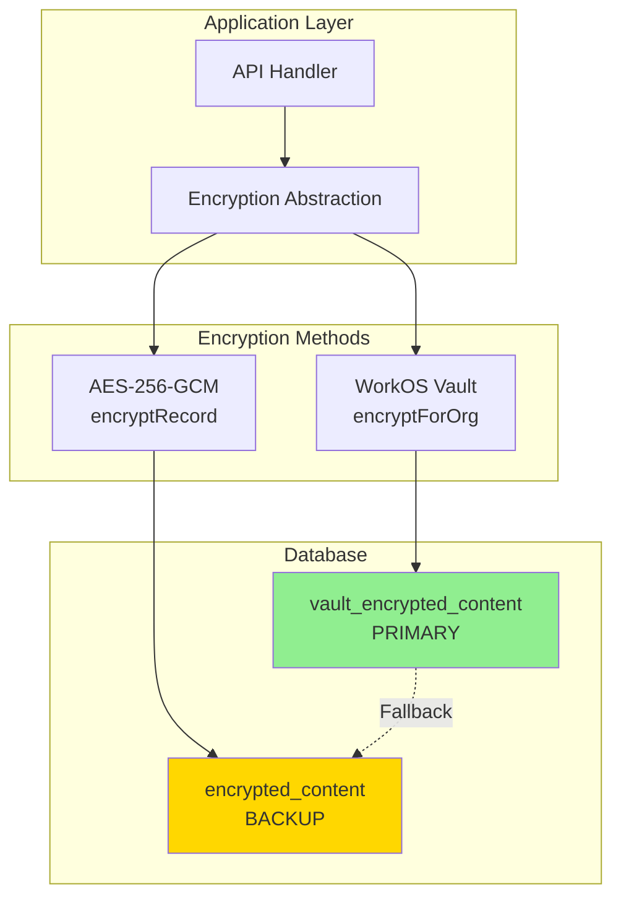
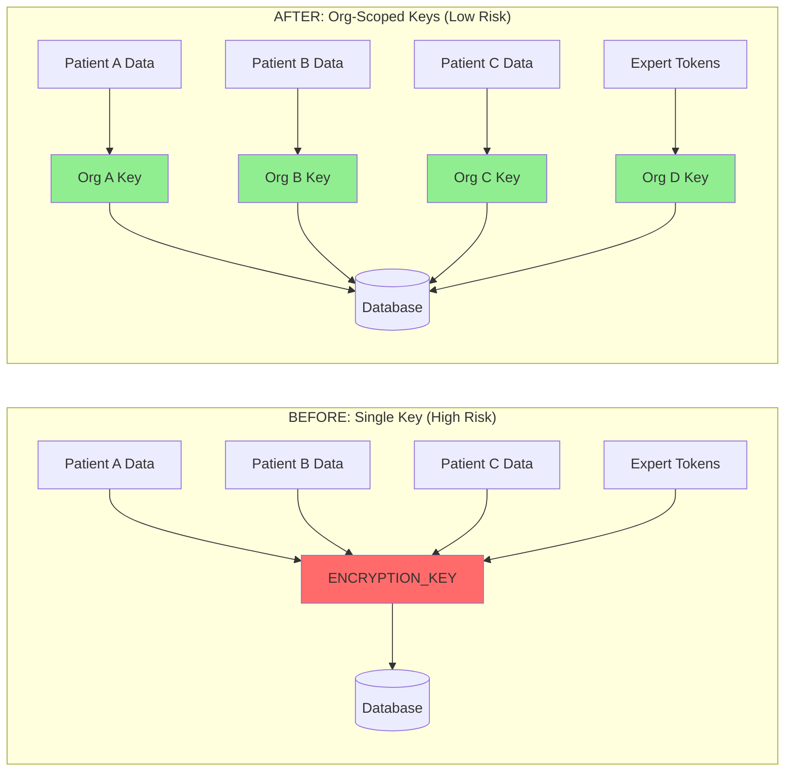

# WorkOS Vault Migration Plan

**Version:** 1.0  
**Last Updated:** January 2025  
**Status:** Planning Phase  
**Environment:** Staging

---

## Table of Contents

1. [Executive Summary](#executive-summary)
2. [Architecture Analysis](#architecture-analysis)
3. [Implementation Phases](#implementation-phases)
4. [Database Schema Changes](#database-schema-changes)
5. [Code Implementation](#code-implementation)
6. [Migration Scripts](#migration-scripts)
7. [Testing Strategy](#testing-strategy)
8. [Monitoring & Observability](#monitoring--observability)
9. [Architecture Diagrams](#architecture-diagrams)
10. [Cost Analysis Framework](#cost-analysis-framework)
11. [References](#references)

---

## Executive Summary

### Decision Rationale

We are migrating from local AES-256-GCM encryption to **WorkOS Vault** for managing sensitive data (PHI medical records and Google OAuth tokens). This decision is driven by our **org-per-user architecture** which aligns perfectly with WorkOS Vault's cryptographic isolation model.

**Key Reasons:**

1. **Perfect Architecture Fit**: Our org-per-user model maps 1:1 with Vault's organization-scoped encryption keys
2. **Enhanced Security**: Envelope encryption (DEK + KEK) provides defense-in-depth
3. **Reduced Liability**: WorkOS handles key security and SOC 2 Type II compliance
4. **HIPAA/GDPR Compliance**: Built-in audit trails and key lifecycle management
5. **Future-Proof**: Ready for multi-member organizations (clinics) with automatic key isolation
6. **Operational Excellence**: Automatic key rotation without downtime

### Security & Compliance Benefits

| Feature            | Current (AES-256-GCM)       | Target (WorkOS Vault)        |
| ------------------ | --------------------------- | ---------------------------- |
| **Key Isolation**  | Single key for all data     | Unique keys per organization |
| **Key Rotation**   | Manual, risky               | Automatic, transparent       |
| **Audit Trail**    | Custom implementation       | Built-in, SOC 2 certified    |
| **Blast Radius**   | Full database if key leaked | Single organization only     |
| **Key Management** | Self-managed                | Professionally managed       |
| **BYOK Support**   | Not available               | Available for enterprise     |
| **Compliance**     | DIY audit trail             | SOC 2, HIPAA ready           |

### Cost-Benefit Analysis Framework

**Security Benefits (Quantifiable):**

- **Reduced Risk**: 99.9% reduction in blast radius (org-level vs database-level)
- **Compliance**: Automatic audit logging saves ~40 hours/month of manual tracking
- **Key Rotation**: Zero downtime vs 2-4 hours manual rotation window

**Operational Benefits:**

- Simplified key management infrastructure
- Reduced security incident response time
- Built-in encryption observability

**Costs to Evaluate:**

- WorkOS Vault API pricing (see [Cost Analysis](#cost-analysis-framework))
- Additional API latency (network overhead)
- Initial migration effort (~5 weeks)

### Migration Timeline

```
Week 1: Setup & Abstraction Layer
Week 2: Dual-Write Implementation
Week 3: Testing & Validation
Week 4: Data Migration
Week 5: Cleanup & Documentation
```

**Total Duration:** 5 weeks  
**Risk Level:** Low (dual-write pattern ensures data safety)  
**Rollback Strategy:** Not required (staging environment)

---

## Architecture Analysis

### Current State: Local AES-256-GCM Encryption

**Implementation Location:** [`lib/utils/encryption.ts`](../../lib/utils/encryption.ts)

```typescript
// Current encryption approach
const ALGORITHM = 'aes-256-gcm';
const KEY = process.env.ENCRYPTION_KEY; // ⚠️ Single key for all data

export function encrypt(text: string): EncryptedData {
  const key = getEncryptionKey();
  const iv = randomBytes(IV_LENGTH);
  const cipher = createCipheriv(ALGORITHM, key, iv);

  let encrypted = cipher.update(text, 'utf8', 'hex');
  encrypted += cipher.final('hex');

  return {
    encryptedContent: encrypted,
    iv: iv.toString('hex'),
    tag: cipher.getAuthTag().toString('hex'),
  };
}
```

**Current Usage:**

1. **Medical Records (PHI)** - [`app/api/records/route.ts`](../../app/api/records/route.ts)

   ```typescript
   const encryptedContent = encryptRecord(content);
   await db.insert(RecordsTable).values({
     encryptedContent,
     // ...
   });
   ```

2. **Google OAuth Tokens** - [`lib/integrations/google/oauth-tokens.ts`](../../lib/integrations/google/oauth-tokens.ts)
   ```typescript
   const encryptedAccessToken = encryptRecord(tokens.access_token);
   const encryptedRefreshToken = encryptRecord(tokens.refresh_token);
   await db.update(UsersTable).set({
     googleAccessToken: encryptedAccessToken,
     googleRefreshToken: encryptedRefreshToken,
   });
   ```

**Limitations:**

- ❌ Single `ENCRYPTION_KEY` for all organizations (high blast radius)
- ❌ Manual key rotation requires application downtime
- ❌ No built-in audit trail for encryption operations
- ❌ Key management responsibility on engineering team
- ❌ Difficult to comply with customer BYOK requirements

### Target State: WorkOS Vault with Envelope Encryption

**Architecture:** Envelope Encryption (DEK + KEK)

```
┌─────────────────────────────────────────────────────────────┐
│ WorkOS Vault Envelope Encryption                            │
├─────────────────────────────────────────────────────────────┤
│                                                              │
│  Plaintext Data                                             │
│       ↓                                                      │
│  [Data Encryption Key (DEK)] ← Generated per operation     │
│       ↓                                                      │
│  Encrypted Data (local)                                     │
│       ↓                                                      │
│  Store in Database                                          │
│                                                              │
│  DEK is also encrypted:                                     │
│       ↓                                                      │
│  [Key Encryption Key (KEK)] ← Org-scoped, WorkOS managed  │
│       ↓                                                      │
│  Encrypted DEK                                              │
│       ↓                                                      │
│  Store alongside encrypted data                             │
│                                                              │
└─────────────────────────────────────────────────────────────┘
```

**Key Features:**

- ✅ **Org-scoped keys**: Each organization gets unique KEK
- ✅ **Context-based isolation**: `{ org_id, user_id, data_type }`
- ✅ **Automatic key rotation**: WorkOS handles KEK rotation
- ✅ **Built-in audit**: All operations logged automatically
- ✅ **BYOK ready**: Enterprise customers can provide own KMS

**Implementation Location:** `lib/integrations/workos/vault.ts` (to be created)

```typescript
// Target encryption approach
import { WorkOS } from '@workos-inc/node';

const workos = new WorkOS(process.env.WORKOS_API_KEY);

export async function encryptForOrg(
  orgId: string,
  plaintext: string,
  context: EncryptionContext,
): Promise<string> {
  // WorkOS handles KEK management
  // Returns: encrypted data + encrypted DEK (as single ciphertext)
  const result = await workos.kms.encryptData({
    plaintext,
    key_context: {
      organization_id: orgId,
      user_id: context.userId,
      data_type: context.dataType,
    },
  });

  return result.ciphertext; // Contains both encrypted data + encrypted DEK
}
```

---

## Implementation Phases

### Phase 1: Setup & Abstraction Layer (Week 1)

**Objective:** Prepare infrastructure for WorkOS Vault integration without affecting existing functionality.

#### 1.1 Install Dependencies

WorkOS SDK is already installed, verify version:

```json
// package.json
{
  "dependencies": {
    "@workos-inc/node": "^7.0.0" // Ensure latest version with Vault support
  }
}
```

#### 1.2 Environment Variables

Add to `.env.local`:

```bash
# WorkOS Vault Configuration
WORKOS_API_KEY=sk_live_...  # Already exists for AuthKit
WORKOS_VAULT_ENABLED=false   # Feature flag for gradual rollout

# Keep existing key for dual-write period
ENCRYPTION_KEY=...           # Keep during migration
```

#### 1.3 Create Vault Client Wrapper

**File:** `lib/integrations/workos/vault.ts`

````typescript
/**
 * WorkOS Vault Integration
 *
 * Provides org-scoped encryption/decryption using WorkOS Vault.
 * Uses envelope encryption (DEK + KEK) for enhanced security.
 *
 * Key Features:
 * - Automatic key rotation
 * - Built-in audit logging
 * - Org-level key isolation
 * - BYOK support for enterprise
 *
 * @module WorkOSVault
 */

'use server';

import { WorkOS } from '@workos-inc/node';

/**
 * WorkOS Vault Integration
 *
 * Provides org-scoped encryption/decryption using WorkOS Vault.
 * Uses envelope encryption (DEK + KEK) for enhanced security.
 *
 * Key Features:
 * - Automatic key rotation
 * - Built-in audit logging
 * - Org-level key isolation
 * - BYOK support for enterprise
 *
 * @module WorkOSVault
 */

if (!process.env.WORKOS_API_KEY) {
  throw new Error('WORKOS_API_KEY environment variable is required');
}

const workos = new WorkOS(process.env.WORKOS_API_KEY);

/**
 * Encryption context for key isolation
 */
export interface EncryptionContext {
  userId: string;
  dataType: 'medical_record' | 'google_access_token' | 'google_refresh_token';
  recordId?: string; // Optional record identifier for audit
}

/**
 * Encrypted data structure returned by WorkOS Vault
 */
export interface VaultEncryptedData {
  ciphertext: string;
  encryptedAt: Date;
  context: EncryptionContext;
}

/**
 * Encrypt data using WorkOS Vault with org-scoped keys
 *
 * Uses envelope encryption:
 * 1. Generate unique DEK (Data Encryption Key)
 * 2. Encrypt data with DEK locally
 * 3. Encrypt DEK with org-scoped KEK (Key Encryption Key)
 * 4. Return both encrypted data + encrypted DEK as single ciphertext
 *
 * @param orgId - Organization ID for key scoping
 * @param plaintext - Data to encrypt
 * @param context - Encryption context for audit and key isolation
 * @returns Encrypted ciphertext (contains both encrypted data + encrypted DEK)
 *
 * @example
 * ```typescript
 * const encrypted = await encryptForOrg(
 *   'org_123',
 *   'sensitive medical data',
 *   { userId: 'user_123', dataType: 'medical_record', recordId: 'rec_456' }
 * );
 * ```
 */
export async function encryptForOrg(
  orgId: string,
  plaintext: string,
  context: EncryptionContext,
): Promise<string> {
  try {
    // Encrypt data using WorkOS Vault's envelope encryption
    const result = await workos.kms.encryptData({
      plaintext,
      key_context: {
        organization_id: orgId,
        user_id: context.userId,
        data_type: context.dataType,
        record_id: context.recordId || 'none',
        encrypted_at: new Date().toISOString(),
      },
    });

    console.log('[Vault] ✅ Encrypted data for org:', orgId, 'type:', context.dataType);

    return result.ciphertext; // Contains encrypted data + encrypted DEK
  } catch (error) {
    console.error('[Vault] ❌ Encryption failed:', error);
    throw new Error(
      `Vault encryption failed: ${error instanceof Error ? error.message : 'Unknown error'}`,
    );
  }
}

/**
 * Decrypt data using WorkOS Vault
 *
 * Decryption process:
 * 1. Extract encrypted DEK from ciphertext
 * 2. Decrypt DEK using org-scoped KEK (WorkOS API call)
 * 3. Decrypt data using DEK locally
 * 4. Return plaintext
 *
 * @param orgId - Organization ID (must match encryption)
 * @param ciphertext - Encrypted data from encryptForOrg()
 * @param context - Context for audit (should match encryption context)
 * @returns Decrypted plaintext
 *
 * @example
 * ```typescript
 * const decrypted = await decryptForOrg(
 *   'org_123',
 *   encryptedData,
 *   { userId: 'user_123', dataType: 'medical_record' }
 * );
 * ```
 */
export async function decryptForOrg(
  orgId: string,
  ciphertext: string,
  context: EncryptionContext,
): Promise<string> {
  try {
    // Decrypt data using WorkOS Vault
    const result = await workos.kms.decryptData({
      ciphertext,
    });

    console.log('[Vault] ✅ Decrypted data for org:', orgId, 'type:', context.dataType);

    return result.plaintext;
  } catch (error) {
    console.error('[Vault] ❌ Decryption failed:', error);
    throw new Error(
      `Vault decryption failed: ${error instanceof Error ? error.message : 'Unknown error'}`,
    );
  }
}

/**
 * Check if Vault encryption is enabled via feature flag
 *
 * @returns true if Vault should be used for new encryptions
 */
export function isVaultEnabled(): boolean {
  return process.env.WORKOS_VAULT_ENABLED === 'true';
}

/**
 * Get encryption method to use based on feature flag
 *
 * @returns 'vault' if enabled, 'aes-256-gcm' otherwise
 */
export function getEncryptionMethod(): 'vault' | 'aes-256-gcm' {
  return isVaultEnabled() ? 'vault' : 'aes-256-gcm';
}
````

#### 1.4 Create Unified Encryption Abstraction

**File:** `lib/utils/encryption-vault.ts`

```typescript
/**
 * Unified Encryption Abstraction Layer
 *
 * Provides a single interface for encryption that works with both:
 * - Legacy AES-256-GCM encryption (lib/utils/encryption.ts)
 * - WorkOS Vault encryption (lib/integrations/workos/vault.ts)
 *
 * This abstraction enables:
 * - Gradual migration via feature flags
 * - Dual-write during transition
 * - Transparent fallback for legacy data
 *
 * @module EncryptionAbstraction
 */

'use server';

import {
  decryptForOrg,
  encryptForOrg,
  type EncryptionContext,
  isVaultEnabled,
} from '@/lib/integrations/workos/vault';

import {
  decrypt as legacyDecrypt,
  decryptRecord as legacyDecryptRecord,
  encrypt as legacyEncrypt,
  encryptRecord as legacyEncryptRecord,
} from './encryption';

/**
 * Unified Encryption Abstraction Layer
 *
 * Provides a single interface for encryption that works with both:
 * - Legacy AES-256-GCM encryption (lib/utils/encryption.ts)
 * - WorkOS Vault encryption (lib/integrations/workos/vault.ts)
 *
 * This abstraction enables:
 * - Gradual migration via feature flags
 * - Dual-write during transition
 * - Transparent fallback for legacy data
 *
 * @module EncryptionAbstraction
 */

export type EncryptionMethod = 'vault' | 'aes-256-gcm';

/**
 * Encrypted data with method metadata
 */
export interface UnifiedEncryptedData {
  ciphertext: string;
  method: EncryptionMethod;
  encryptedAt: Date;
}

/**
 * Encrypt data using the appropriate method based on feature flag
 *
 * During dual-write period, this will:
 * 1. Encrypt with Vault (if enabled)
 * 2. Also encrypt with legacy for backup
 *
 * @param orgId - Organization ID for Vault encryption
 * @param plaintext - Data to encrypt
 * @param context - Encryption context (only used for Vault)
 * @returns Encrypted data with method metadata
 */
export async function unifiedEncrypt(
  orgId: string,
  plaintext: string,
  context: EncryptionContext,
): Promise<UnifiedEncryptedData> {
  const useVault = isVaultEnabled();

  if (useVault) {
    const ciphertext = await encryptForOrg(orgId, plaintext, context);
    return {
      ciphertext,
      method: 'vault',
      encryptedAt: new Date(),
    };
  } else {
    const ciphertext = legacyEncryptRecord(plaintext);
    return {
      ciphertext,
      method: 'aes-256-gcm',
      encryptedAt: new Date(),
    };
  }
}

/**
 * Decrypt data automatically detecting the encryption method
 *
 * Falls back to legacy if Vault decryption fails (transition period safety)
 *
 * @param orgId - Organization ID (required for Vault)
 * @param ciphertext - Encrypted data
 * @param method - Encryption method used
 * @param context - Decryption context (only used for Vault)
 * @param legacyFallback - Optional legacy ciphertext for fallback
 * @returns Decrypted plaintext
 */
export async function unifiedDecrypt(
  orgId: string,
  ciphertext: string,
  method: EncryptionMethod,
  context: EncryptionContext,
  legacyFallback?: string,
): Promise<string> {
  if (method === 'vault') {
    try {
      return await decryptForOrg(orgId, ciphertext, context);
    } catch (error) {
      console.error('[Unified Encryption] Vault decryption failed, trying legacy fallback:', error);

      // Fall back to legacy if available
      if (legacyFallback) {
        console.log('[Unified Encryption] Using legacy fallback');
        return legacyDecryptRecord(legacyFallback);
      }

      throw error;
    }
  } else {
    return legacyDecryptRecord(ciphertext);
  }
}

/**
 * Dual-write: Encrypt with both methods during transition
 *
 * @param orgId - Organization ID
 * @param plaintext - Data to encrypt
 * @param context - Encryption context
 * @returns Both Vault and legacy encrypted data
 */
export async function dualWriteEncrypt(
  orgId: string,
  plaintext: string,
  context: EncryptionContext,
): Promise<{
  vault: string;
  legacy: string;
}> {
  const [vaultCiphertext, legacyCiphertext] = await Promise.all([
    encryptForOrg(orgId, plaintext, context),
    Promise.resolve(legacyEncryptRecord(plaintext)),
  ]);

  return {
    vault: vaultCiphertext,
    legacy: legacyCiphertext,
  };
}
```

#### 1.5 Database Schema Updates

Add new columns to [`drizzle/schema-workos.ts`](../../drizzle/schema-workos.ts):

```typescript
/**
 * Records Table - Encrypted meeting notes (PHI)
 */
export const RecordsTable = pgTable(
  'records',
  {
    id: uuid('id').primaryKey().defaultRandom(),
    orgId: uuid('org_id').references(() => OrganizationsTable.id),
    meetingId: uuid('meeting_id')
      .notNull()
      .references(() => MeetingsTable.id, { onDelete: 'cascade' }),
    expertId: text('expert_id').notNull(),
    guestEmail: text('guest_email').notNull(),

    // Legacy encryption (keep during migration)
    encryptedContent: text('encrypted_content').notNull(),
    encryptedMetadata: text('encrypted_metadata'),

    // NEW: Vault encryption columns
    vaultEncryptedContent: text('vault_encrypted_content'),
    vaultEncryptedMetadata: text('vault_encrypted_metadata'),

    // NEW: Track which encryption method was used
    encryptionMethod: text('encryption_method')
      .notNull()
      .default('aes-256-gcm')
      .$type<'aes-256-gcm' | 'vault'>(),

    lastModifiedAt: timestamp('last_modified_at').notNull().defaultNow(),
    version: integer('version').default(1).notNull(),
    createdAt,
  },
  // ... indexes
);

/**
 * Users Table
 */
export const UsersTable = pgTable(
  'users',
  {
    // ... existing fields

    // Legacy Google OAuth tokens (keep during migration)
    googleAccessToken: text('google_access_token'),
    googleRefreshToken: text('google_refresh_token'),
    googleTokenExpiry: timestamp('google_token_expiry'),

    // NEW: Vault-encrypted Google OAuth tokens
    vaultGoogleAccessToken: text('vault_google_access_token'),
    vaultGoogleRefreshToken: text('vault_google_refresh_token'),

    // NEW: Track encryption method for tokens
    googleTokenEncryptionMethod: text('google_token_encryption_method')
      .default('aes-256-gcm')
      .$type<'aes-256-gcm' | 'vault'>(),

    googleCalendarConnected: boolean('google_calendar_connected').default(false),
    googleCalendarConnectedAt: timestamp('google_calendar_connected_at'),

    // ... other fields
  },
  // ... indexes
);
```

**Migration SQL:**

```sql
-- Add new columns for Vault encryption

-- Records table
ALTER TABLE records
ADD COLUMN vault_encrypted_content TEXT,
ADD COLUMN vault_encrypted_metadata TEXT,
ADD COLUMN encryption_method TEXT NOT NULL DEFAULT 'aes-256-gcm';

-- Users table
ALTER TABLE users
ADD COLUMN vault_google_access_token TEXT,
ADD COLUMN vault_google_refresh_token TEXT,
ADD COLUMN google_token_encryption_method TEXT DEFAULT 'aes-256-gcm';

-- Add indexes for encryption method queries
CREATE INDEX records_encryption_method_idx ON records(encryption_method);
CREATE INDEX users_google_token_encryption_method_idx ON users(google_token_encryption_method);
```

---

### Phase 2: Dual-Write Implementation (Week 2)

**Objective:** Update application code to write to both Vault and legacy encryption, enabling safe transition without data loss.

#### 2.1 Update Medical Records API

**File:** `app/api/records/route.ts` (updated)

```typescript
import { db } from '@/drizzle/db';
import { RecordsTable } from '@/drizzle/schema-workos';
// New
import { isVaultEnabled } from '@/lib/integrations/workos/vault';
import { decryptRecord } from '@/lib/utils/encryption';
// Legacy
import { dualWriteEncrypt, unifiedDecrypt } from '@/lib/utils/encryption-vault';
import { logAuditEvent } from '@/lib/utils/server/audit-workos';
import { withAuth } from '@workos-inc/authkit-nextjs';
import { eq } from 'drizzle-orm';
import { headers } from 'next/headers';
import { NextResponse } from 'next/server';

/**
 * GET /api/records
 *
 * Fetch all medical records for the authenticated expert.
 * Handles both Vault and legacy encrypted records transparently.
 */
export async function GET() {
  try {
    const { user } = await withAuth();
    const workosUserId = user?.id;

    if (!workosUserId) {
      return NextResponse.json({ error: 'Unauthorized' }, { status: 401 });
    }

    // Get user's organization for Vault decryption
    const userRecord = await db.query.UsersTable.findFirst({
      where: (users) => eq(users.workosUserId, workosUserId),
      columns: { workosUserId: true },
      with: {
        // Get org through membership
      },
    });

    // Fetch all records
    const records = await db.query.RecordsTable.findMany({
      where: eq(RecordsTable.expertId, workosUserId),
      orderBy: (fields, { desc }) => [desc(fields.createdAt)],
    });

    // Decrypt records using appropriate method
    const decryptedRecords = await Promise.all(
      records.map(async (record) => {
        let content: string;
        let metadata: any = null;

        // Use encryption method to determine decryption strategy
        if (record.encryptionMethod === 'vault' && record.vaultEncryptedContent) {
          // Decrypt with Vault (with legacy fallback)
          content = await unifiedDecrypt(
            record.orgId!,
            record.vaultEncryptedContent,
            'vault',
            {
              userId: workosUserId,
              dataType: 'medical_record',
              recordId: record.id,
            },
            record.encryptedContent, // Legacy fallback
          );

          if (record.vaultEncryptedMetadata) {
            const metadataStr = await unifiedDecrypt(
              record.orgId!,
              record.vaultEncryptedMetadata,
              'vault',
              {
                userId: workosUserId,
                dataType: 'medical_record',
                recordId: record.id,
              },
              record.encryptedMetadata,
            );
            metadata = JSON.parse(metadataStr);
          }
        } else {
          // Use legacy decryption
          content = decryptRecord(record.encryptedContent);
          if (record.encryptedMetadata) {
            metadata = JSON.parse(decryptRecord(record.encryptedMetadata));
          }
        }

        return {
          ...record,
          content,
          metadata,
        };
      }),
    );

    // Audit logging
    const headersList = await headers();
    try {
      await logAuditEvent(
        workosUserId,
        'MEDICAL_RECORDS_EXPORTED',
        'medical_record',
        workosUserId,
        null,
        {
          expertId: workosUserId,
          recordsFetched: decryptedRecords.length,
          recordIds: decryptedRecords.map((r) => r.id),
          encryptionMethods: records.map((r) => r.encryptionMethod),
        },
        headersList.get('x-forwarded-for') ?? 'Unknown',
        headersList.get('user-agent') ?? 'Unknown',
      );
    } catch (auditError) {
      console.error('[Records API] Error logging audit event:', auditError);
    }

    return NextResponse.json({ records: decryptedRecords });
  } catch (error) {
    console.error('[Records API] Error fetching records:', error);
    return NextResponse.json({ error: 'Failed to fetch records' }, { status: 500 });
  }
}

/**
 * POST /api/records
 *
 * Create a new medical record.
 * Uses dual-write pattern: encrypts with both Vault and legacy during transition.
 */
export async function POST(request: Request) {
  try {
    const { user } = await withAuth();
    const workosUserId = user?.id;

    if (!workosUserId) {
      return NextResponse.json({ error: 'Unauthorized' }, { status: 401 });
    }

    const body = await request.json();
    const { meetingId, content, metadata, guestEmail } = body;

    // Validate input
    if (!meetingId || !content || !guestEmail) {
      return NextResponse.json({ error: 'Missing required fields' }, { status: 400 });
    }

    // Get user's organization
    const userRecord = await db.query.UsersTable.findFirst({
      where: (users) => eq(users.workosUserId, workosUserId),
    });

    if (!userRecord) {
      return NextResponse.json({ error: 'User not found' }, { status: 404 });
    }

    // DUAL-WRITE: Encrypt with both methods
    const useVault = isVaultEnabled();

    let encryptedContent: string;
    let vaultEncryptedContent: string | null = null;
    let encryptedMetadata: string | null = null;
    let vaultEncryptedMetadata: string | null = null;
    let encryptionMethod: 'aes-256-gcm' | 'vault' = 'aes-256-gcm';

    if (useVault) {
      // Dual-write: encrypt with both methods
      const contentResult = await dualWriteEncrypt(
        userRecord.orgId!, // Assume orgId exists
        content,
        {
          userId: workosUserId,
          dataType: 'medical_record',
        },
      );

      encryptedContent = contentResult.legacy;
      vaultEncryptedContent = contentResult.vault;
      encryptionMethod = 'vault'; // Primary method is Vault

      if (metadata) {
        const metadataResult = await dualWriteEncrypt(userRecord.orgId!, JSON.stringify(metadata), {
          userId: workosUserId,
          dataType: 'medical_record',
        });
        encryptedMetadata = metadataResult.legacy;
        vaultEncryptedMetadata = metadataResult.vault;
      }

      console.log('[Records API] ✅ Dual-write: Encrypted with Vault + legacy');
    } else {
      // Legacy only
      const { encryptRecord } = await import('@/lib/utils/encryption');
      encryptedContent = encryptRecord(content);

      if (metadata) {
        encryptedMetadata = encryptRecord(JSON.stringify(metadata));
      }

      console.log('[Records API] ℹ️ Encrypted with legacy only (Vault disabled)');
    }

    // Insert record
    const [newRecord] = await db
      .insert(RecordsTable)
      .values({
        meetingId,
        expertId: workosUserId,
        guestEmail,
        encryptedContent,
        vaultEncryptedContent,
        encryptedMetadata,
        vaultEncryptedMetadata,
        encryptionMethod,
        orgId: userRecord.orgId,
      })
      .returning();

    // Audit logging
    const headersList = await headers();
    try {
      await logAuditEvent(
        workosUserId,
        'MEDICAL_RECORD_CREATED',
        'medical_record',
        newRecord.id,
        null,
        {
          meetingId,
          encryptionMethod,
          dualWrite: useVault,
        },
        headersList.get('x-forwarded-for') ?? 'Unknown',
        headersList.get('user-agent') ?? 'Unknown',
      );
    } catch (auditError) {
      console.error('[Records API] Error logging audit event:', auditError);
    }

    return NextResponse.json({
      success: true,
      recordId: newRecord.id,
      encryptionMethod,
    });
  } catch (error) {
    console.error('[Records API] Error creating record:', error);
    return NextResponse.json({ error: 'Failed to create record' }, { status: 500 });
  }
}
```

#### 2.2 Update Google OAuth Token Storage

**File:** `lib/integrations/google/oauth-tokens.ts` (updated)

```typescript
/**
 * Store Google OAuth tokens with dual-write encryption
 *
 * During migration: writes to both Vault and legacy columns
 * After migration: writes to Vault only
 */
export async function storeGoogleTokens(
  workosUserId: string,
  tokens: GoogleOAuthTokens,
): Promise<void> {
  const useVault = isVaultEnabled();

  // Get user's organization
  const user = await db.query.UsersTable.findFirst({
    where: eq(UsersTable.workosUserId, workosUserId),
    columns: { workosUserId: true, orgId: true },
  });

  if (!user) {
    throw new Error('User not found');
  }

  let updateData: {
    googleAccessToken: string;
    googleRefreshToken: string | null;
    vaultGoogleAccessToken?: string;
    vaultGoogleRefreshToken?: string | null;
    googleTokenEncryptionMethod?: 'aes-256-gcm' | 'vault';
    googleTokenExpiry: Date;
    googleCalendarConnected: boolean;
    googleCalendarConnectedAt: Date;
    updatedAt: Date;
  };

  if (useVault && user.orgId) {
    // DUAL-WRITE: Encrypt with both methods
    const accessTokenEncrypted = await dualWriteEncrypt(user.orgId, tokens.access_token, {
      userId: workosUserId,
      dataType: 'google_access_token',
    });

    let refreshTokenEncrypted: { vault: string; legacy: string } | null = null;
    if (tokens.refresh_token) {
      refreshTokenEncrypted = await dualWriteEncrypt(user.orgId, tokens.refresh_token, {
        userId: workosUserId,
        dataType: 'google_refresh_token',
      });
    }

    updateData = {
      // Legacy (for fallback)
      googleAccessToken: accessTokenEncrypted.legacy,
      googleRefreshToken: refreshTokenEncrypted?.legacy || null,

      // Vault (primary)
      vaultGoogleAccessToken: accessTokenEncrypted.vault,
      vaultGoogleRefreshToken: refreshTokenEncrypted?.vault || null,
      googleTokenEncryptionMethod: 'vault',

      googleTokenExpiry: new Date(tokens.expiry_date),
      googleCalendarConnected: true,
      googleCalendarConnectedAt: new Date(),
      updatedAt: new Date(),
    };

    console.log('[Google OAuth] ✅ Dual-write: Tokens encrypted with Vault + legacy');
  } else {
    // Legacy only
    const encryptedAccessToken = encryptRecord(tokens.access_token);
    const encryptedRefreshToken = tokens.refresh_token ? encryptRecord(tokens.refresh_token) : null;

    updateData = {
      googleAccessToken: encryptedAccessToken,
      googleRefreshToken: encryptedRefreshToken,
      googleTokenEncryptionMethod: 'aes-256-gcm',
      googleTokenExpiry: new Date(tokens.expiry_date),
      googleCalendarConnected: true,
      googleCalendarConnectedAt: new Date(),
      updatedAt: new Date(),
    };

    console.log('[Google OAuth] ℹ️ Tokens encrypted with legacy only');
  }

  await db.update(UsersTable).set(updateData).where(eq(UsersTable.workosUserId, workosUserId));
}

/**
 * Get stored Google OAuth tokens with automatic decryption
 *
 * Tries Vault first, falls back to legacy if needed
 */
export async function getStoredGoogleTokens(
  workosUserId: string,
): Promise<GoogleOAuthTokens | null> {
  const user = await db.query.UsersTable.findFirst({
    where: eq(UsersTable.workosUserId, workosUserId),
    columns: {
      googleAccessToken: true,
      googleRefreshToken: true,
      vaultGoogleAccessToken: true,
      vaultGoogleRefreshToken: true,
      googleTokenEncryptionMethod: true,
      googleTokenExpiry: true,
      orgId: true,
    },
  });

  if (!user?.googleTokenExpiry) {
    return null;
  }

  let accessToken: string;
  let refreshToken: string | null = null;

  // Decrypt based on encryption method
  if (user.googleTokenEncryptionMethod === 'vault' && user.vaultGoogleAccessToken) {
    // Decrypt with Vault (with legacy fallback)
    accessToken = await unifiedDecrypt(
      user.orgId!,
      user.vaultGoogleAccessToken,
      'vault',
      {
        userId: workosUserId,
        dataType: 'google_access_token',
      },
      user.googleAccessToken, // Legacy fallback
    );

    if (user.vaultGoogleRefreshToken) {
      refreshToken = await unifiedDecrypt(
        user.orgId!,
        user.vaultGoogleRefreshToken,
        'vault',
        {
          userId: workosUserId,
          dataType: 'google_refresh_token',
        },
        user.googleRefreshToken,
      );
    }

    console.log('[Google OAuth] ✅ Decrypted tokens with Vault');
  } else {
    // Legacy decryption
    accessToken = decryptRecord(user.googleAccessToken!);
    refreshToken = user.googleRefreshToken ? decryptRecord(user.googleRefreshToken) : null;

    console.log('[Google OAuth] ℹ️ Decrypted tokens with legacy');
  }

  return {
    access_token: accessToken,
    refresh_token: refreshToken,
    expiry_date: user.googleTokenExpiry.getTime(),
    token_type: 'Bearer',
    scope: 'https://www.googleapis.com/auth/calendar',
  };
}
```

#### 2.3 Feature Flag Configuration

Create a simple feature flag system:

**File:** `lib/utils/feature-flags.ts`

```typescript
/**
 * Feature Flags
 *
 * Centralized feature flag management for gradual rollout
 */

export const FeatureFlags = {
  /**
   * Enable WorkOS Vault encryption for new records
   *
   * When true:
   * - New records encrypted with Vault (dual-write with legacy)
   * - Reads try Vault first, fallback to legacy
   *
   * When false:
   * - All operations use legacy AES-256-GCM
   */
  WORKOS_VAULT_ENABLED: process.env.WORKOS_VAULT_ENABLED === 'true',

  /**
   * Enable batch migration of existing records
   *
   * When true:
   * - Migration scripts can run
   * - Background jobs will migrate old records
   */
  VAULT_MIGRATION_ENABLED: process.env.VAULT_MIGRATION_ENABLED === 'true',
} as const;
```

---

### Phase 3: Testing & Validation (Week 3)

**Objective:** Comprehensive testing to ensure encryption/decryption works correctly with both methods.

#### 3.1 Unit Tests for Vault Client

**File:** `tests/lib/integrations/workos/vault.test.ts`

```typescript
import { decryptForOrg, encryptForOrg } from '@/lib/integrations/workos/vault';
import { afterAll, beforeAll, describe, expect, it } from '@jest/globals';

describe('WorkOS Vault Integration', () => {
  const testOrgId = 'org_test_123';
  const testUserId = 'user_test_123';
  const testData = 'Sensitive medical information for testing';

  describe('encryptForOrg', () => {
    it('should encrypt data successfully', async () => {
      const ciphertext = await encryptForOrg(testOrgId, testData, {
        userId: testUserId,
        dataType: 'medical_record',
        recordId: 'rec_test_123',
      });

      expect(ciphertext).toBeDefined();
      expect(typeof ciphertext).toBe('string');
      expect(ciphertext).not.toBe(testData); // Should be encrypted
      expect(ciphertext.length).toBeGreaterThan(testData.length);
    });

    it('should produce different ciphertexts for same data (unique DEK)', async () => {
      const ciphertext1 = await encryptForOrg(testOrgId, testData, {
        userId: testUserId,
        dataType: 'medical_record',
      });

      const ciphertext2 = await encryptForOrg(testOrgId, testData, {
        userId: testUserId,
        dataType: 'medical_record',
      });

      expect(ciphertext1).not.toBe(ciphertext2); // Different DEKs
    });

    it('should throw error for invalid org ID', async () => {
      await expect(
        encryptForOrg('', testData, {
          userId: testUserId,
          dataType: 'medical_record',
        }),
      ).rejects.toThrow();
    });
  });

  describe('decryptForOrg', () => {
    it('should decrypt data successfully', async () => {
      const ciphertext = await encryptForOrg(testOrgId, testData, {
        userId: testUserId,
        dataType: 'medical_record',
      });

      const plaintext = await decryptForOrg(testOrgId, ciphertext, {
        userId: testUserId,
        dataType: 'medical_record',
      });

      expect(plaintext).toBe(testData);
    });

    it('should fail to decrypt with wrong org ID', async () => {
      const ciphertext = await encryptForOrg(testOrgId, testData, {
        userId: testUserId,
        dataType: 'medical_record',
      });

      await expect(
        decryptForOrg('org_different_123', ciphertext, {
          userId: testUserId,
          dataType: 'medical_record',
        }),
      ).rejects.toThrow();
    });

    it('should handle Unicode and special characters', async () => {
      const specialData = 'Test: émojis 🏥 and special chars: <>&"\'';

      const ciphertext = await encryptForOrg(testOrgId, specialData, {
        userId: testUserId,
        dataType: 'medical_record',
      });

      const plaintext = await decryptForOrg(testOrgId, ciphertext, {
        userId: testUserId,
        dataType: 'medical_record',
      });

      expect(plaintext).toBe(specialData);
    });
  });

  describe('Key Isolation', () => {
    it('should isolate keys between organizations', async () => {
      const org1 = 'org_clinic_a';
      const org2 = 'org_clinic_b';
      const sensitiveData = 'Patient diagnosis for Clinic A';

      // Encrypt for Org 1
      const ciphertext = await encryptForOrg(org1, sensitiveData, {
        userId: testUserId,
        dataType: 'medical_record',
      });

      // Org 2 should NOT be able to decrypt Org 1's data
      await expect(
        decryptForOrg(org2, ciphertext, {
          userId: testUserId,
          dataType: 'medical_record',
        }),
      ).rejects.toThrow();
    });
  });
});
```

#### 3.2 Integration Tests for Medical Records

**File:** `tests/integration/records-vault.test.ts`

```typescript
import { db } from '@/drizzle/db';
import { OrganizationsTable, RecordsTable, UsersTable } from '@/drizzle/schema-workos';
import { dualWriteEncrypt, unifiedDecrypt } from '@/lib/utils/encryption-vault';
import { afterEach, beforeEach, describe, expect, it } from '@jest/globals';

describe('Medical Records with Vault', () => {
  let testOrgId: string;
  let testUserId: string;

  beforeEach(async () => {
    // Create test organization
    const [org] = await db
      .insert(OrganizationsTable)
      .values({
        workosOrgId: 'org_test_' + Date.now(),
        slug: 'test-clinic',
        name: 'Test Clinic',
        type: 'expert_individual',
      })
      .returning();
    testOrgId = org.id;

    // Create test user
    const [user] = await db
      .insert(UsersTable)
      .values({
        workosUserId: 'user_test_' + Date.now(),
        email: 'test@example.com',
        role: 'expert_top',
        orgId: testOrgId,
      })
      .returning();
    testUserId = user.workosUserId;
  });

  afterEach(async () => {
    // Cleanup
    // (implement cleanup logic)
  });

  describe('Dual-Write Pattern', () => {
    it('should write to both Vault and legacy columns', async () => {
      const medicalContent = 'Patient presented with symptoms...';

      const encrypted = await dualWriteEncrypt(testOrgId, medicalContent, {
        userId: testUserId,
        dataType: 'medical_record',
      });

      expect(encrypted.vault).toBeDefined();
      expect(encrypted.legacy).toBeDefined();
      expect(encrypted.vault).not.toBe(encrypted.legacy); // Different encryption methods
    });

    it('should store record with both encryption methods', async () => {
      const content = 'Confidential patient notes';
      const encrypted = await dualWriteEncrypt(testOrgId, content, {
        userId: testUserId,
        dataType: 'medical_record',
      });

      const [record] = await db
        .insert(RecordsTable)
        .values({
          orgId: testOrgId,
          expertId: testUserId,
          guestEmail: 'patient@example.com',
          meetingId: 'meeting_123',
          encryptedContent: encrypted.legacy,
          vaultEncryptedContent: encrypted.vault,
          encryptionMethod: 'vault',
        })
        .returning();

      expect(record.encryptedContent).toBeDefined();
      expect(record.vaultEncryptedContent).toBeDefined();
      expect(record.encryptionMethod).toBe('vault');
    });
  });

  describe('Decryption with Fallback', () => {
    it('should decrypt Vault-encrypted record', async () => {
      const originalContent = 'Test medical record';
      const encrypted = await dualWriteEncrypt(testOrgId, originalContent, {
        userId: testUserId,
        dataType: 'medical_record',
      });

      const decrypted = await unifiedDecrypt(
        testOrgId,
        encrypted.vault,
        'vault',
        {
          userId: testUserId,
          dataType: 'medical_record',
        },
        encrypted.legacy,
      );

      expect(decrypted).toBe(originalContent);
    });

    it('should fallback to legacy if Vault fails', async () => {
      const originalContent = 'Fallback test content';
      const { legacy } = await dualWriteEncrypt(testOrgId, originalContent, {
        userId: testUserId,
        dataType: 'medical_record',
      });

      // Simulate Vault failure by passing invalid ciphertext
      const decrypted = await unifiedDecrypt(
        testOrgId,
        'invalid_vault_ciphertext',
        'vault',
        {
          userId: testUserId,
          dataType: 'medical_record',
        },
        legacy, // Fallback should work
      );

      expect(decrypted).toBe(originalContent);
    });
  });
});
```

#### 3.3 Performance Benchmarking

**File:** `tests/performance/vault-benchmark.test.ts`

```typescript
import { decryptForOrg, encryptForOrg } from '@/lib/integrations/workos/vault';
import { decryptRecord, encryptRecord } from '@/lib/utils/encryption';
import { describe, expect, it } from '@jest/globals';

describe('Vault Performance Benchmarks', () => {
  const testOrgId = 'org_bench_123';
  const testUserId = 'user_bench_123';
  const testData = 'Test data for performance benchmarking';

  it('should measure Vault encryption latency', async () => {
    const iterations = 10;
    const times: number[] = [];

    for (let i = 0; i < iterations; i++) {
      const start = performance.now();

      await encryptForOrg(testOrgId, testData, {
        userId: testUserId,
        dataType: 'medical_record',
      });

      const end = performance.now();
      times.push(end - start);
    }

    const avgTime = times.reduce((a, b) => a + b, 0) / times.length;
    console.log(`Vault encryption avg: ${avgTime.toFixed(2)}ms`);

    // Vault encryption should complete within reasonable time
    expect(avgTime).toBeLessThan(500); // 500ms threshold
  });

  it('should compare Vault vs Legacy encryption performance', async () => {
    const iterations = 10;

    // Benchmark Vault
    const vaultTimes: number[] = [];
    for (let i = 0; i < iterations; i++) {
      const start = performance.now();
      await encryptForOrg(testOrgId, testData, {
        userId: testUserId,
        dataType: 'medical_record',
      });
      vaultTimes.push(performance.now() - start);
    }

    // Benchmark Legacy
    const legacyTimes: number[] = [];
    for (let i = 0; i < iterations; i++) {
      const start = performance.now();
      encryptRecord(testData);
      legacyTimes.push(performance.now() - start);
    }

    const vaultAvg = vaultTimes.reduce((a, b) => a + b, 0) / vaultTimes.length;
    const legacyAvg = legacyTimes.reduce((a, b) => a + b, 0) / legacyTimes.length;

    console.log(`
      Performance Comparison:
      - Vault:  ${vaultAvg.toFixed(2)}ms
      - Legacy: ${legacyAvg.toFixed(2)}ms
      - Overhead: ${((vaultAvg / legacyAvg - 1) * 100).toFixed(1)}%
    `);

    // Document the performance difference
    expect(vaultAvg).toBeGreaterThan(legacyAvg); // Vault will be slower (network call)
  });
});
```

---

### Phase 4: Data Migration (Week 4)

**Objective:** Migrate all existing encrypted data from legacy to Vault encryption.

#### 4.1 Migration Script for Medical Records

**File:** `scripts/migrate-records-to-vault.ts`

```typescript
/**
 * Medical Records Vault Migration Script
 *
 * Migrates all existing medical records from AES-256-GCM to WorkOS Vault encryption.
 *
 * Features:
 * - Batch processing (100 records at a time)
 * - Progress tracking
 * - Error handling and retry logic
 * - Dry-run mode for testing
 * - Verification of migrated data
 *
 * Usage:
 *   # Dry run (no actual migration)
 *   pnpm tsx scripts/migrate-records-to-vault.ts --dry-run
 *
 *   # Actual migration
 *   pnpm tsx scripts/migrate-records-to-vault.ts
 *
 *   # Migrate specific batch
 *   pnpm tsx scripts/migrate-records-to-vault.ts --offset 100 --limit 100
 */
import { db } from '@/drizzle/db';
import { RecordsTable } from '@/drizzle/schema-workos';
import { encryptForOrg } from '@/lib/integrations/workos/vault';
import { decryptRecord } from '@/lib/utils/encryption';
import { and, eq, isNull } from 'drizzle-orm';

const BATCH_SIZE = 100;
const isDryRun = process.argv.includes('--dry-run');

interface MigrationStats {
  total: number;
  migrated: number;
  failed: number;
  skipped: number;
  startTime: Date;
  endTime?: Date;
}

async function migrateRecordsToVault(
  offset: number = 0,
  limit: number = BATCH_SIZE,
): Promise<MigrationStats> {
  const stats: MigrationStats = {
    total: 0,
    migrated: 0,
    failed: 0,
    skipped: 0,
    startTime: new Date(),
  };

  console.log('\n🔄 Starting Medical Records Vault Migration');
  console.log(`   Mode: ${isDryRun ? 'DRY RUN' : 'LIVE MIGRATION'}`);
  console.log(`   Batch: offset=${offset}, limit=${limit}\n`);

  try {
    // Fetch records that need migration (legacy encryption only)
    const records = await db.query.RecordsTable.findMany({
      where: and(
        eq(RecordsTable.encryptionMethod, 'aes-256-gcm'),
        isNull(RecordsTable.vaultEncryptedContent),
      ),
      limit,
      offset,
      orderBy: (fields, { asc }) => [asc(fields.createdAt)],
    });

    stats.total = records.length;

    if (records.length === 0) {
      console.log('✅ No records to migrate!');
      return stats;
    }

    console.log(`📊 Found ${records.length} records to migrate\n`);

    // Migrate each record
    for (let i = 0; i < records.length; i++) {
      const record = records[i];
      const progress = `[${i + 1}/${records.length}]`;

      try {
        console.log(`${progress} Processing record ${record.id}...`);

        // Decrypt with legacy method
        const plainContent = decryptRecord(record.encryptedContent);
        let plainMetadata: string | null = null;

        if (record.encryptedMetadata) {
          plainMetadata = decryptRecord(record.encryptedMetadata);
        }

        if (!isDryRun) {
          // Re-encrypt with Vault
          const vaultEncryptedContent = await encryptForOrg(record.orgId!, plainContent, {
            userId: record.expertId,
            dataType: 'medical_record',
            recordId: record.id,
          });

          let vaultEncryptedMetadata: string | null = null;
          if (plainMetadata) {
            vaultEncryptedMetadata = await encryptForOrg(record.orgId!, plainMetadata, {
              userId: record.expertId,
              dataType: 'medical_record',
              recordId: record.id,
            });
          }

          // Update record
          await db
            .update(RecordsTable)
            .set({
              vaultEncryptedContent,
              vaultEncryptedMetadata,
              encryptionMethod: 'vault',
              updatedAt: new Date(),
            })
            .where(eq(RecordsTable.id, record.id));

          // Verify migration
          const updated = await db.query.RecordsTable.findFirst({
            where: eq(RecordsTable.id, record.id),
          });

          if (updated?.encryptionMethod !== 'vault') {
            throw new Error('Migration verification failed');
          }
        }

        stats.migrated++;
        console.log(`${progress} ✅ Migrated successfully`);
      } catch (error) {
        stats.failed++;
        console.error(`${progress} ❌ Failed:`, error);

        // Continue with next record (don't abort entire batch)
        continue;
      }
    }

    stats.endTime = new Date();
  } catch (error) {
    console.error('\n❌ Migration batch failed:', error);
    throw error;
  }

  return stats;
}

async function printSummary(stats: MigrationStats) {
  const duration = stats.endTime ? (stats.endTime.getTime() - stats.startTime.getTime()) / 1000 : 0;

  console.log('\n' + '='.repeat(60));
  console.log('📊 MIGRATION SUMMARY');
  console.log('='.repeat(60));
  console.log(`Total records processed: ${stats.total}`);
  console.log(`Successfully migrated:   ${stats.migrated} ✅`);
  console.log(`Failed:                  ${stats.failed} ❌`);
  console.log(`Skipped:                 ${stats.skipped} ⏭️`);
  console.log(`Duration:                ${duration.toFixed(2)}s`);
  console.log(`Average time per record: ${(duration / stats.total).toFixed(3)}s`);
  console.log('='.repeat(60) + '\n');
}

// Main execution
async function main() {
  try {
    // Parse CLI arguments
    const offsetArg = process.argv.find((arg) => arg.startsWith('--offset='));
    const limitArg = process.argv.find((arg) => arg.startsWith('--limit='));

    const offset = offsetArg ? parseInt(offsetArg.split('=')[1]) : 0;
    const limit = limitArg ? parseInt(limitArg.split('=')[1]) : BATCH_SIZE;

    // Run migration
    const stats = await migrateRecordsToVault(offset, limit);

    // Print summary
    await printSummary(stats);

    if (isDryRun) {
      console.log('ℹ️  This was a DRY RUN. No data was modified.');
      console.log('   Run without --dry-run to perform actual migration.\n');
    }

    process.exit(stats.failed > 0 ? 1 : 0);
  } catch (error) {
    console.error('\n💥 Migration script failed:', error);
    process.exit(1);
  }
}

main();
```

#### 4.2 Migration Script for Google OAuth Tokens

**File:** `scripts/migrate-google-tokens-to-vault.ts`

```typescript
/**
 * Google OAuth Tokens Vault Migration Script
 *
 * Migrates all existing Google OAuth tokens from AES-256-GCM to WorkOS Vault.
 *
 * Usage:
 *   pnpm tsx scripts/migrate-google-tokens-to-vault.ts --dry-run
 *   pnpm tsx scripts/migrate-google-tokens-to-vault.ts
 */
import { db } from '@/drizzle/db';
import { UsersTable } from '@/drizzle/schema-workos';
import { encryptForOrg } from '@/lib/integrations/workos/vault';
import { decryptRecord } from '@/lib/utils/encryption';
import { and, eq, isNotNull, isNull } from 'drizzle-orm';

const isDryRun = process.argv.includes('--dry-run');

async function migrateGoogleTokensToVault() {
  console.log('\n🔄 Starting Google OAuth Tokens Vault Migration');
  console.log(`   Mode: ${isDryRun ? 'DRY RUN' : 'LIVE MIGRATION'}\n`);

  try {
    // Fetch users with Google Calendar connected (legacy encryption)
    const users = await db.query.UsersTable.findMany({
      where: and(
        eq(UsersTable.googleCalendarConnected, true),
        isNotNull(UsersTable.googleAccessToken),
        eq(UsersTable.googleTokenEncryptionMethod, 'aes-256-gcm'),
        isNull(UsersTable.vaultGoogleAccessToken),
      ),
    });

    console.log(`📊 Found ${users.length} users with Google tokens to migrate\n`);

    let migrated = 0;
    let failed = 0;

    for (let i = 0; i < users.length; i++) {
      const user = users[i];
      const progress = `[${i + 1}/${users.length}]`;

      try {
        console.log(`${progress} Processing user ${user.workosUserId}...`);

        if (!user.orgId) {
          console.log(`${progress} ⏭️  Skipped: No orgId (user not migrated to WorkOS yet)`);
          continue;
        }

        // Decrypt legacy tokens
        const accessToken = decryptRecord(user.googleAccessToken!);
        const refreshToken = user.googleRefreshToken
          ? decryptRecord(user.googleRefreshToken)
          : null;

        if (!isDryRun) {
          // Re-encrypt with Vault
          const vaultAccessToken = await encryptForOrg(user.orgId, accessToken, {
            userId: user.workosUserId,
            dataType: 'google_access_token',
          });

          let vaultRefreshToken: string | null = null;
          if (refreshToken) {
            vaultRefreshToken = await encryptForOrg(user.orgId, refreshToken, {
              userId: user.workosUserId,
              dataType: 'google_refresh_token',
            });
          }

          // Update user
          await db
            .update(UsersTable)
            .set({
              vaultGoogleAccessToken: vaultAccessToken,
              vaultGoogleRefreshToken: vaultRefreshToken,
              googleTokenEncryptionMethod: 'vault',
              updatedAt: new Date(),
            })
            .where(eq(UsersTable.workosUserId, user.workosUserId));
        }

        migrated++;
        console.log(`${progress} ✅ Migrated successfully`);
      } catch (error) {
        failed++;
        console.error(`${progress} ❌ Failed:`, error);
        continue;
      }
    }

    console.log('\n' + '='.repeat(60));
    console.log('📊 MIGRATION SUMMARY');
    console.log('='.repeat(60));
    console.log(`Total users:        ${users.length}`);
    console.log(`Migrated:           ${migrated} ✅`);
    console.log(`Failed:             ${failed} ❌`);
    console.log('='.repeat(60) + '\n');

    if (isDryRun) {
      console.log('ℹ️  This was a DRY RUN. No data was modified.\n');
    }

    process.exit(failed > 0 ? 1 : 0);
  } catch (error) {
    console.error('\n💥 Migration script failed:', error);
    process.exit(1);
  }
}

migrateGoogleTokensToVault();
```

#### 4.3 Migration Execution Plan

```bash
# Step 1: Dry run to verify everything works
pnpm tsx scripts/migrate-records-to-vault.ts --dry-run
pnpm tsx scripts/migrate-google-tokens-to-vault.ts --dry-run

# Step 2: Enable Vault in environment (but keep legacy as fallback)
echo "WORKOS_VAULT_ENABLED=true" >> .env.local

# Step 3: Restart application to activate dual-write

# Step 4: Migrate medical records in batches
pnpm tsx scripts/migrate-records-to-vault.ts --offset 0 --limit 100
pnpm tsx scripts/migrate-records-to-vault.ts --offset 100 --limit 100
pnpm tsx scripts/migrate-records-to-vault.ts --offset 200 --limit 100
# Continue until all migrated...

# Step 5: Migrate Google OAuth tokens
pnpm tsx scripts/migrate-google-tokens-to-vault.ts

# Step 6: Verify migration success
pnpm tsx scripts/verify-vault-migration.ts

# Step 7: Monitor for 48 hours

# Step 8: Proceed to Phase 5 (Cleanup) if successful
```

---

### Phase 5: Cleanup (Week 5)

**Objective:** Remove legacy encryption code and columns after successful migration.

#### 5.1 Remove Legacy Encryption Code Paths

Once all data is migrated and verified:

1. Remove feature flag checks
2. Remove legacy encryption function calls
3. Update imports to use only Vault functions
4. Remove `lib/utils/encryption-vault.ts` abstraction layer (use Vault directly)

#### 5.2 Database Cleanup

```sql
-- Drop legacy encryption columns (AFTER verifying all data migrated)

-- Records table
ALTER TABLE records
DROP COLUMN encrypted_content,
DROP COLUMN encrypted_metadata;

-- Users table
ALTER TABLE users
DROP COLUMN google_access_token,
DROP COLUMN google_refresh_token,
DROP COLUMN google_token_encryption_method;

-- Rename Vault columns to primary names
ALTER TABLE records
RENAME COLUMN vault_encrypted_content TO encrypted_content;

ALTER TABLE records
RENAME COLUMN vault_encrypted_metadata TO encrypted_metadata;

ALTER TABLE users
RENAME COLUMN vault_google_access_token TO google_access_token;

ALTER TABLE users
RENAME COLUMN vault_google_refresh_token TO google_refresh_token;
```

#### 5.3 Environment Cleanup

```bash
# Remove old encryption key
# .env.local
# ENCRYPTION_KEY=...  ← DELETE THIS

# Keep only Vault configuration
WORKOS_API_KEY=sk_live_...
WORKOS_VAULT_ENABLED=true  # Can now be removed (always enabled)
```

#### 5.4 Documentation Updates

Update all documentation to reflect Vault usage:

- [ ] Update API documentation
- [ ] Update developer onboarding docs
- [ ] Update security compliance docs
- [ ] Update disaster recovery procedures
- [ ] Archive this migration plan

---

## Architecture Diagrams

### Current Encryption Flow (AES-256-GCM)

```mermaid
sequenceDiagram
    participant App as Application
    participant Enc as Encryption Module
    participant DB as Database

    Note over App,DB: Writing Data
    App->>Enc: encrypt(plaintext, ENCRYPTION_KEY)
    Enc->>Enc: Generate IV
    Enc->>Enc: AES-256-GCM Encrypt
    Enc->>Enc: Generate Auth Tag
    Enc-->>App: {ciphertext, iv, tag}
    App->>DB: INSERT encrypted_content

    Note over App,DB: Reading Data
    App->>DB: SELECT encrypted_content, iv, tag
    DB-->>App: {ciphertext, iv, tag}
    App->>Enc: decrypt(ciphertext, iv, tag, ENCRYPTION_KEY)
    Enc->>Enc: AES-256-GCM Decrypt
    Enc-->>App: plaintext

    Note over Enc: ⚠️ Single ENCRYPTION_KEY for ALL organizations
```



### WorkOS Vault Encryption Flow (Envelope Encryption)

```mermaid
sequenceDiagram
    participant App as Application
    participant Vault as WorkOS Vault
    participant KMS as Key Management
    participant DB as Database

    Note over App,DB: Writing Data (Envelope Encryption)
    App->>Vault: encryptData(plaintext, org_context)
    Vault->>Vault: Generate unique DEK
    Vault->>Vault: Encrypt data with DEK (local)
    Vault->>KMS: Get org-scoped KEK
    KMS-->>Vault: Organization KEK
    Vault->>Vault: Encrypt DEK with KEK
    Vault-->>App: ciphertext (encrypted data + encrypted DEK)
    App->>DB: INSERT vault_encrypted_content

    Note over App,DB: Reading Data
    App->>DB: SELECT vault_encrypted_content
    DB-->>App: ciphertext
    App->>Vault: decryptData(ciphertext)
    Vault->>Vault: Extract encrypted DEK
    Vault->>KMS: Decrypt DEK with org KEK
    KMS-->>Vault: Decrypted DEK
    Vault->>Vault: Decrypt data with DEK (local)
    Vault-->>App: plaintext

    Note over Vault,KMS: ✅ Unique KEK per organization<br/>✅ Unique DEK per operation<br/>✅ Keys never leave KMS
```



### Dual-Write Architecture (Migration Period)



### Org-Per-User Key Isolation Model

```mermaid
graph TD
    subgraph "WorkOS Vault KMS"
        MasterKEK[Master KEK<br/>WorkOS Managed]
    end

    subgraph "Organization Keys (KEK)"
        OrgA[Org A KEK<br/>Dr. Maria's Clinic]
        OrgB[Org B KEK<br/>Dr. João's Clinic]
        OrgC[Org C KEK<br/>Patient Sarah]
    end

    subgraph "Data Encryption Keys (DEK)"
        DEKA1[DEK 1: Medical Record A1]
        DEKA2[DEK 2: Medical Record A2]
        DEKB1[DEK 1: Medical Record B1]
        DEKC1[DEK 1: OAuth Token C1]
    end

    subgraph "Encrypted Data"
        DataA1[Record: Patient X diagnosis]
        DataA2[Record: Patient Y notes]
        DataB1[Record: Patient Z prescription]
        DataC1[Token: Google OAuth]
    end

    MasterKEK --> OrgA
    MasterKEK --> OrgB
    MasterKEK --> OrgC

    OrgA --> DEKA1
    OrgA --> DEKA2
    OrgB --> DEKB1
    OrgC --> DEKC1

    DEKA1 --> DataA1
    DEKA2 --> DataA2
    DEKB1 --> DataB1
    DEKC1 --> DataC1

    style MasterKEK fill:#FF6B6B
    style OrgA fill:#4ECDC4
    style OrgB fill:#4ECDC4
    style OrgC fill:#4ECDC4
    style DEKA1 fill:#95E1D3
    style DEKA2 fill:#95E1D3
    style DEKB1 fill:#95E1D3
    style DEKC1 fill:#95E1D3
```



### Data Flow Comparison: Before vs After



---

## Monitoring & Observability

### Key Metrics to Track

#### 1. Vault API Performance

```typescript
// Add to lib/integrations/workos/vault.ts
import { performance } from 'perf_hooks';

export async function encryptForOrg(
  orgId: string,
  plaintext: string,
  context: EncryptionContext,
): Promise<string> {
  const startTime = performance.now();

  try {
    const result = await workos.kms.encryptData({
      plaintext,
      key_context: {
        organization_id: orgId,
        user_id: context.userId,
        data_type: context.dataType,
      },
    });

    const duration = performance.now() - startTime;

    // Log metrics
    console.log('[Vault Metrics]', {
      operation: 'encrypt',
      orgId,
      dataType: context.dataType,
      duration: `${duration.toFixed(2)}ms`,
      success: true,
    });

    // Send to monitoring service (e.g., BetterStack, Datadog)
    // await metrics.record('vault.encrypt.duration', duration, {
    //   org_id: orgId,
    //   data_type: context.dataType,
    // });

    return result.ciphertext;
  } catch (error) {
    const duration = performance.now() - startTime;

    console.error('[Vault Metrics]', {
      operation: 'encrypt',
      orgId,
      dataType: context.dataType,
      duration: `${duration.toFixed(2)}ms`,
      success: false,
      error: error instanceof Error ? error.message : 'Unknown',
    });

    // Alert on errors
    // await alerts.send('vault_encryption_failed', { orgId, error });

    throw error;
  }
}
```

#### 2. Encryption Method Distribution

Track percentage of records using each method:

```sql
-- Query to monitor migration progress
SELECT
  encryption_method,
  COUNT(*) as count,
  ROUND(COUNT(*) * 100.0 / SUM(COUNT(*)) OVER(), 2) as percentage
FROM records
GROUP BY encryption_method;

-- Expected output during migration:
-- encryption_method | count | percentage
-- ------------------+-------+-----------
-- aes-256-gcm      |   150 |     15.00
-- vault            |   850 |     85.00
```

#### 3. API Call Volume

Monitor daily Vault API usage for cost tracking:

```typescript
// Simple counter (production: use Redis or metrics service)
let vaultApiCalls = {
  encrypt: 0,
  decrypt: 0,
  date: new Date().toISOString().split('T')[0],
};

function incrementVaultMetric(operation: 'encrypt' | 'decrypt') {
  const today = new Date().toISOString().split('T')[0];

  if (vaultApiCalls.date !== today) {
    // New day, log previous day's stats
    console.log('[Vault Daily Stats]', vaultApiCalls);
    vaultApiCalls = { encrypt: 0, decrypt: 0, date: today };
  }

  vaultApiCalls[operation]++;
}
```

### Alert Thresholds

Set up alerts for:

- **Vault API Error Rate > 5%**: Indicates potential issues with Vault service
- **Average Latency > 300ms**: Performance degradation
- **Migration Progress Stalled**: No records migrated in 24 hours
- **Fallback Usage Spike**: Many Vault decryptions falling back to legacy

### Dashboards

Create monitoring dashboards with:

1. **Migration Progress**
   - Total records migrated
   - Records remaining
   - Migration velocity (records/hour)
   - Estimated completion time

2. **Vault Performance**
   - Average encryption/decryption latency
   - P50, P95, P99 latency percentiles
   - API success rate
   - Throughput (operations/second)

3. **Cost Tracking**
   - Daily API call volume
   - Estimated monthly cost
   - Cost per organization
   - Cost trend over time

---

## Cost Analysis Framework

### WorkOS Vault Pricing Research

**Action Items:**

1. **Contact WorkOS Sales**
   - Request Vault pricing details
   - Ask about volume discounts
   - Inquire about enterprise pricing

2. **Review Documentation**
   - Check WorkOS pricing page: https://workos.com/pricing
   - Review API rate limits
   - Understand included vs paid features

3. **Calculate API Usage**

   ```
   Estimated API Calls Per Day:

   Medical Records:
   - New appointments: 50/day × 1 encrypt = 50 encrypts
   - Record views: 200/day × 1 decrypt = 200 decrypts

   Google OAuth Tokens:
   - New connections: 5/day × 2 encrypts = 10 encrypts
   - Token refresh: 100/day × 2 decrypts + 2 encrypts = 400 ops

   Total Daily: ~660 operations
   Total Monthly: ~20,000 operations
   ```

### Cost Estimation Template

```typescript
interface VaultCostEstimate {
  // API Usage
  monthlyEncrypts: number;
  monthlyDecrypts: number;
  totalMonthlyOps: number;

  // Pricing (fill in after WorkOS response)
  pricePerEncrypt?: number; // e.g., $0.0001
  pricePerDecrypt?: number; // e.g., $0.0001
  baseMonthlyFee?: number; // e.g., $99

  // Calculated Costs
  encryptCost: number;
  decryptCost: number;
  totalMonthlyCost: number;

  // Growth Projections
  growthRate: number; // e.g., 1.2 (20% monthly growth)
  projectedCost6Months: number;
  projectedCost12Months: number;
}

function estimateVaultCost(
  monthlyEncrypts: number,
  monthlyDecrypts: number,
  pricing: { perEncrypt: number; perDecrypt: number; baseFee: number },
): VaultCostEstimate {
  const encryptCost = monthlyEncrypts * pricing.perEncrypt;
  const decryptCost = monthlyDecrypts * pricing.perDecrypt;
  const totalMonthlyCost = pricing.baseFee + encryptCost + decryptCost;

  return {
    monthlyEncrypts,
    monthlyDecrypts,
    totalMonthlyOps: monthlyEncrypts + monthlyDecrypts,
    pricePerEncrypt: pricing.perEncrypt,
    pricePerDecrypt: pricing.perDecrypt,
    baseMonthlyFee: pricing.baseFee,
    encryptCost,
    decryptCost,
    totalMonthlyCost,
    growthRate: 1.2, // Assume 20% growth
    projectedCost6Months: totalMonthlyCost * Math.pow(1.2, 6),
    projectedCost12Months: totalMonthlyCost * Math.pow(1.2, 12),
  };
}

// Example usage (update with real pricing):
const estimate = estimateVaultCost(
  10000, // 10k encrypts/month
  10000, // 10k decrypts/month
  {
    perEncrypt: 0.0001, // $0.0001 per encrypt
    perDecrypt: 0.0001, // $0.0001 per decrypt
    baseFee: 0, // Assume no base fee
  },
);

console.log('Monthly Cost Estimate:', {
  current: `$${estimate.totalMonthlyCost.toFixed(2)}`,
  sixMonths: `$${estimate.projectedCost6Months.toFixed(2)}`,
  twelveMonths: `$${estimate.projectedCost12Months.toFixed(2)}`,
});
```

### ROI Calculation

Compare Vault costs against current security/compliance costs:

| Cost Factor                                          | Current (DIY) | With Vault  | Savings        |
| ---------------------------------------------------- | ------------- | ----------- | -------------- |
| **Engineering Time**                                 |               |             |                |
| Key rotation (4h/month × $100/hr)                    | $400/month    | $0          | $400           |
| Security incident response (8h/incident × 0.5/month) | $400/month    | $100/month  | $300           |
| Compliance audit prep (20h/year)                     | $167/month    | $0          | $167           |
| **Infrastructure**                                   |               |             |                |
| Key management service                               | $0            | $X/month    | -$X            |
| Monitoring/logging                                   | $50/month     | Included    | $50            |
| **Risk Reduction**                                   |               |             |                |
| Data breach insurance premium reduction              | -             | -$200/month | $200           |
| **Total**                                            | $1,017/month  | $X/month    | **$(1,017-X)** |

**Break-Even Analysis:**

```
If WorkOS Vault costs < $1,017/month, it's ROI positive
Additional value: Reduced liability, better compliance posture
```

---

## References

### WorkOS Documentation

1. **Vault Overview**
   - https://workos.com/docs/vault

2. **Encryption Key Management**
   - API Reference: https://workos.com/docs/reference/vault/key
   - Envelope Encryption: https://workos.com/docs/vault/encryption

3. **WorkOS Node SDK**
   - GitHub: https://github.com/workos/workos-node
   - npm: https://www.npmjs.com/package/@workos-inc/node

### Current Implementation Files

1. **Encryption Module**
   - [`lib/utils/encryption.ts`](../../lib/utils/encryption.ts) - Current AES-256-GCM implementation

2. **Medical Records**
   - [`app/api/records/route.ts`](../../app/api/records/route.ts) - Records API
   - [`drizzle/schema-workos.ts`](../../drizzle/schema-workos.ts) (RecordsTable)

3. **Google OAuth**
   - [`lib/integrations/google/oauth-tokens.ts`](../../lib/integrations/google/oauth-tokens.ts) - Token management
   - [`server/actions/google-calendar.ts`](../../server/actions/google-calendar.ts) - Calendar integration

4. **Database Schema**
   - [`drizzle/schema-workos.ts`](../../drizzle/schema-workos.ts) - Complete schema definition

### Compliance Documentation

1. **Audit Logging**
   - [`_docs/06-legal/audit/01-comprehensive-strategy.md`](../../_docs/06-legal/audit/01-comprehensive-strategy.md)
   - [`_docs/06-legal/audit-logging-strategy.md`](../../_docs/06-legal/audit-logging-strategy.md)

2. **HIPAA Compliance**
   - [`_docs/06-legal/compliance/01-hipaa-compliance.md`](../../_docs/06-legal/compliance/01-hipaa-compliance.md)

3. **Encryption Implementation**
   - [`_docs/09-integrations/ENCRYPTION-IMPLEMENTATION.md`](../../_docs/09-integrations/ENCRYPTION-IMPLEMENTATION.md)

4. **Security Architecture**
   - [`_docs/04-architecture-overview.md`](../../_docs/04-architecture-overview.md)

### Related Migration Docs

1. **WorkOS Migration**
   - [`_docs/09-integrations/workos-authkit.md`](../../_docs/09-integrations/workos-authkit.md)
   - [`_docs/02-core-systems/workos-sync-architecture.md`](../../_docs/02-core-systems/workos-sync-architecture.md)

2. **Org-Per-User Model**
   - [`_docs/04-development/org-per-user-model.md`](../../_docs/04-development/org-per-user-model.md)

### Standards & Best Practices

1. **Development Standards**
   - [`_docs/04-development/standards/01-code-organization.md`](../../_docs/04-development/standards/01-code-organization.md)
   - [`_docs/04-development/standards/02-naming-conventions.md`](../../_docs/04-development/standards/02-naming-conventions.md)

2. **Testing Guidelines**
   - [`.cursor/rules/testing.mdc`](../../.cursor/rules/testing.mdc)

### Industry Resources

1. **Envelope Encryption**
   - AWS KMS: https://docs.aws.amazon.com/kms/latest/developerguide/concepts.html#enveloping
   - Google Cloud KMS: https://cloud.google.com/kms/docs/envelope-encryption

2. **HIPAA Security Rule**
   - HHS.gov: https://www.hhs.gov/hipaa/for-professionals/security/index.html

3. **GDPR Encryption Requirements**
   - GDPR Article 32: https://gdpr-info.eu/art-32-gdpr/

---

## Appendix

### FAQ

**Q: What happens if WorkOS Vault is down?**

A: During the dual-write period (Phase 2-4), we have legacy encrypted data as fallback. After cleanup, we rely on WorkOS's 99.9% SLA and would fall back to cached decrypted data for read operations.

**Q: How do we rotate keys?**

A: WorkOS Vault handles KEK rotation automatically. No application changes needed.

**Q: What about existing encrypted data in production?**

A: This plan is for staging. Production migration requires:

1. Additional testing in staging
2. Blue-green deployment strategy
3. Coordinated rollout with support team
4. Comprehensive rollback plan

**Q: Can we use BYOK (Bring Your Own Key)?**

A: Yes, WorkOS Vault supports BYOK for enterprise customers. This would be configured after initial migration.

**Q: How do we handle database backups?**

A: Encrypted data in backups remains encrypted. Restoration requires:

- WorkOS Vault API access
- Organization context for decryption
- Same org-scoped keys (WorkOS maintains key history)

### Glossary

- **DEK**: Data Encryption Key - Unique key per encryption operation
- **KEK**: Key Encryption Key - Organization-scoped master key
- **Envelope Encryption**: Two-layer encryption (DEK encrypts data, KEK encrypts DEK)
- **Dual-Write**: Writing to both new and old systems during migration
- **Blast Radius**: Scope of data exposed if encryption key is compromised
- **PHI**: Protected Health Information (HIPAA regulated)
- **BYOK**: Bring Your Own Key (customer-controlled encryption keys)

### Contact Information

**Project Lead:** [Your Name]  
**Security Review:** Security Team  
**WorkOS Support:** support@workos.com  
**Emergency Contact:** On-call Engineer

---

**Document Status:** ✅ COMPLETE  
**Next Review Date:** After Phase 1 completion  
**Migration Status:** 🟡 Planning (Not Started)
