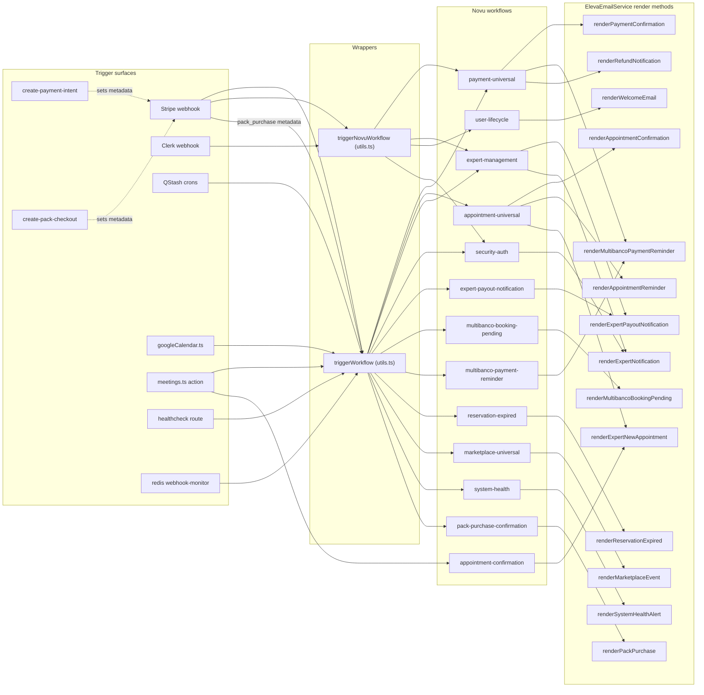

# Email & Novu System Audit — April 2026

> **Scope.** End-to-end audit of the email + Novu notification system: every
> template under `emails/`, every workflow in `config/novu.ts`, every
> `triggerWorkflow` callsite across `app/api/webhooks/`, `app/api/cron/`,
> `app/api/create-payment-intent/`, `app/api/create-pack-checkout/`,
> `server/`, and the Stripe-event-to-workflow map.
>
> **Audit date.** 2026-04-20 · **Stripe account.** `acct_1QIytSK5Ap4Um3Sp` (Eleva Care)
>
> **Status.** All findings resolved (2026-04-20). All three Stripe webhook
> endpoints (`/stripe`, `/stripe-identity`, `/stripe-connect`) verified
> subscribed to every code-handled event; `invoice.paid` ↔
> `invoice.payment_succeeded` mapping mismatch resolved by aligning the code
> map to Stripe's modern `invoice.paid` event.

---

## 1. Findings table

| # | Severity | Area | Finding | Status |
|---|---|---|---|---|
| 1 | **P0 critical** | Notifications core | Expert payment-failure / refund / account-update emails routed through `user-lifecycle` workflow → shipped a "Welcome to Eleva Care!" body | **Fixed** ([`lib/notifications/core.ts`](../../../lib/notifications/core.ts)) — re-routed to `expert-management.account-update`; added defensive guard in `userLifecycleWorkflow.step.email` |
| 2 | **P1 high** | Pack purchase | Pack confirmation email bypassed Novu entirely — direct Resend `sendEmail` from the webhook | **Fixed** — new `pack-purchase-confirmation` workflow, `renderPackPurchase` method, `propAdapter` row, and regression test |
| 3 | **P1 high** | Stripe webhook coverage | `payment_intent.processing`, `payment_intent.canceled`, `charge.dispute.updated`, `charge.dispute.closed`, `refund.updated` not handled | **Fixed** — new handlers in [`payment.ts`](../../../app/api/webhooks/stripe/handlers/payment.ts) + switch cases in [`route.ts`](../../../app/api/webhooks/stripe/route.ts); `STRIPE_EVENT_TO_WORKFLOW_MAPPINGS` and `STRIPE_TO_PAYMENT_EVENT_TYPE` updated |
| 4 | **P1 high** | Stripe Dashboard | Subscribed-events list on the production webhook endpoints must match the switches in the three webhook routes | **Fixed (2026-04-20)** — three endpoints (`/stripe`, `/stripe-identity`, `/stripe-connect`) verified subscribed to all code-handled events; see Section 4 |
| 5 | **P2 medium** | propAdapter gaps | Several `(workflow, eventType, userSegment)` triples in `templateMappings` had no adapter row → silent passThrough | **Fixed** — explicit adapter rows for `appointment-universal.cancelled` / `default`, `payment-universal.pending`, `appointment-confirmation.default` (patient + expert), `multibanco-booking-pending`, `reservation-expired`, `user-lifecycle.welcome`, plus 6 new tests |
| 6 | **P2 medium** | Templates | Multibanco entity / reference / amount / expires + service / expert rows rendered unconditionally | **Fixed** — wrapped in truthy guards in [`multibanco-booking-pending.tsx`](../../../emails/payments/multibanco-booking-pending.tsx) and [`multibanco-payment-reminder.tsx`](../../../emails/payments/multibanco-payment-reminder.tsx) |
| 7 | **P2 medium** | Templates | `appointment-reminder.tsx` heading / banner / preview / subject interpolated `appointmentType` without a guard | **Fixed** — `safeAppointmentType` derived value used everywhere |
| 8 | **P2 medium** | Templates | `pack-purchase-confirmation.tsx` `previewText` always appended `promotionCode`; promo block always rendered even when empty | **Fixed** — both gated on `promotionCode` truthy |
| 9 | **P2 medium** | Locale | Reminder caller collapsed `es` / `br` → `'en'` (es/br patients got English reminders) | **Fixed** — added full `es` and `br` translations; widened `AppointmentReminderLocale` to mirror `SupportedLocale`; caller passes normalized locale through |
| 10 | **P3 low** | Workflow registry | `config/novu-workflows.ts` advertised 5 IDs (`user-login-notification`, `payment-success`, `payment-failed`, `appointment-reminder-24hr`, `expert-account-updated`) with no workflow implementation | **Fixed** — removed dead constants, added them to `WORKFLOW_ID_MAPPINGS` so legacy callers route to the correct unified workflow; added `PACK_PURCHASE_CONFIRMATION` and `RESERVATION_EXPIRED` |
| 11 | **P3 low** | Inline-HTML emails | `marketplace-universal` and `system-health` shipped inline HTML strings — no branding, no localization | **Fixed** — new [`emails/experts/marketplace-event.tsx`](../../../emails/experts/marketplace-event.tsx) and [`emails/system/system-health-alert.tsx`](../../../emails/system/system-health-alert.tsx); workflows render through `elevaEmailService` like every other email |
| 12 | **P3 low** | Dead code | `email-service.ts` exported a second `triggerNovuWorkflow` shadowed by `utils.ts`, zero callers | **Fixed** — duplicate removed; replaced with a redirect comment pointing to the canonical version |
| 13 | **P3 low** | Workflow naming | `appointment-confirmation` is a near-duplicate of `appointment-universal.confirmed` | **Documented** — both kept on purpose: the meeting-actions path needs a workflow it can trigger directly without faking a Stripe event (see header comment in `config/novu.ts`) |

---

## 2. Architecture (post-audit)



---

## 3. Stripe event → workflow map (post-audit)

Source: [`lib/integrations/novu/utils.ts`](../../../lib/integrations/novu/utils.ts) `STRIPE_EVENT_TO_WORKFLOW_MAPPINGS` + `STRIPE_TO_PAYMENT_EVENT_TYPE`.

| Stripe event type | Novu workflow | Resolved `eventType` | Notes |
|---|---|---|---|
| `payment_intent.payment_failed` | `payment-universal` | `failed` | Patient + expert notification; expert path also creates `MEETING_PAYMENT_FAILED` audit |
| `payment_intent.processing` | `payment-universal` | `pending` | NEW — Multibanco voucher entered the 4-day buffer window |
| `payment_intent.canceled` | `payment-universal` | `cancelled` | NEW — patient or cron explicitly cancelled the PI |
| `charge.refunded` | `payment-universal` | `refunded` | Renders `RefundNotificationTemplate` |
| `charge.refund.updated` | `payment-universal` | `refunded` | Existing handler — catches failed/canceled refunds |
| `refund.updated` | `payment-universal` | `refunded` | NEW — modern refund-object event, mirrors `charge.refund.updated` |
| `charge.dispute.created` | `payment-universal` | `disputed` | Existing handler |
| `charge.dispute.updated` | `payment-universal` | `disputed` | NEW — fires on status change (`under_review` → `won`/`lost`) |
| `charge.dispute.closed` | `payment-universal` | `disputed` | NEW — final dispute resolution |
| `customer.subscription.{created,updated,deleted}` | `payment-universal` | `confirmed` / `cancelled` | Subscription products are not currently used; mappings retained for forward compatibility |
| `invoice.paid` | `payment-universal` | `success` | UPDATED — modern Stripe event for invoice payment success; matches Dashboard subscription. The legacy `invoice.payment_succeeded` is kept as a fallback in `STRIPE_TO_PAYMENT_EVENT_TYPE` for older webhook configs. |
| `invoice.payment_failed` | `payment-universal` | `failed` | |
| `account.updated` | `expert-management` | `account-update` | Connect account capability changes |
| `capability.updated` | `expert-management` | `account-update` | |
| `payout.paid` | `expert-payout-notification` | `payout` | Direct handler in `payout.ts` |
| `payout.failed` | `marketplace-universal` | `payout-failed` | Direct handler in `payout.ts` |
| `checkout.session.completed` | (handled inline) | n/a | `handleCheckoutSession` routes to `handlePackPurchase` (NEW: triggers `pack-purchase-confirmation`) or to the booking flow |
| `checkout.session.async_payment_succeeded` / `async_payment_failed` | (handled inline) | n/a | Multibanco / async post-checkout resolution |

---

## 4. Stripe Dashboard verification (resolved 2026-04-20)

> **Why this section exists.** The Stripe MCP server in this workspace
> exposes neither `WebhookEndpoints.list` nor `Events.list`, so the
> subscribed-events list on every endpoint had to be confirmed manually
> in the Dashboard. This section captures the final state after the audit
> remediation, so future agents can re-verify against a known-good baseline.
>
> **Where.** Stripe Dashboard → Webhooks for `acct_1QIytSK5Ap4Um3Sp`.

### 4.1 Three endpoints, one platform

We split webhook traffic across three endpoints by event scope. A single
endpoint subscribing to events from both the platform AND connected
accounts would either miss critical events (Connect-side refunds fire on
the connected account, not the platform) or duplicate work.

| Endpoint | Webhook ID | Event scope | Signing-secret env var |
|---|---|---|---|
| `https://eleva.care/api/webhooks/stripe` | `we_1QwZt1K5Ap4Um3SpFntS3oca` | "Your account" (platform) | `STRIPE_WEBHOOK_SECRET` |
| `https://eleva.care/api/webhooks/stripe-identity` | (Identity-only) | "Your account" — Identity events only | `STRIPE_IDENTITY_WEBHOOK_SECRET` |
| `https://eleva.care/api/webhooks/stripe-connect` | (Connect-only) | "Connected and v2 accounts" | (separate Connect secret) |

### 4.2 `/api/webhooks/stripe` — main platform endpoint (22 events) ✅

Routing happens in the top-level `POST` handler's `event.type` switch in
[`app/api/webhooks/stripe/route.ts`](../../../app/api/webhooks/stripe/route.ts);
the post-event Novu trigger is `triggerNovuNotificationFromStripeEvent`
in the same file.

Subscribed and code-handled (all ✅):

```text
account.updated                          capability.updated
charge.refunded                          charge.dispute.{closed,created,updated}
checkout.session.completed               checkout.session.async_payment_{succeeded,failed}
customer.subscription.{created,updated,deleted}
invoice.{paid,payment_failed}
payment_intent.{succeeded,payment_failed,requires_action,processing,canceled}
payout.{paid,failed}                     refund.updated
```

Notes:
- `invoice.paid` is the modern Stripe event; the code mapping was updated
  to match (`STRIPE_EVENT_TO_WORKFLOW_MAPPINGS` in
  [`lib/integrations/novu/utils.ts`](../../../lib/integrations/novu/utils.ts)
  now keys on `invoice.paid`; `invoice.payment_succeeded` retained as a
  fallback).
- `customer.subscription.*` and `invoice.*` are subscribed for forward
  compatibility — no subscription product exists today.
- `charge.refund.updated` is intentionally NOT subscribed here; it lives
  on the Connect endpoint where Connect-side refunds actually fire. The
  modern `refund.updated` covers the platform side.

### 4.3 `/api/webhooks/stripe-identity` — Identity-only endpoint (4 events) ✅

Handler: [`app/api/webhooks/stripe-identity/route.ts`](../../../app/api/webhooks/stripe-identity/route.ts)
uses a prefix match (`event.type.startsWith('identity.verification_session')`)
so all four subscribed events route through `handleVerificationSessionEvent`.

```text
identity.verification_session.{created,processing,requires_input,verified}
```

### 4.4 `/api/webhooks/stripe-connect` — Connected-accounts endpoint (15 events) ✅

Routing happens in the top-level `POST` handler's `event.type` switch in
[`app/api/webhooks/stripe-connect/route.ts`](../../../app/api/webhooks/stripe-connect/route.ts).
**Critical — events on this endpoint scope to "Connected and v2
accounts", not "Your account".** Connect-side refunds (initiated from the
expert's Express dashboard or the Connect view of your Dashboard) fire here
and would be missed entirely if subscribed only on the main endpoint.

Subscribed and code-handled (✅):

```text
account.updated                          account.application.deauthorized
account.external_account.{created,updated,deleted}
charge.refunded                          charge.refund.updated
payout.{created,paid,failed}
```

Subscribed but currently no-op (cosmetic; logged under default branch):

```text
account.application.authorized           capability.updated
payout.updated                           person.{created,updated}
```

These are safe to leave subscribed — useful if we ever add handler
cases. Unsubscribe to reduce inbound noise if preferred.

### 4.5 Re-verification recipe

If you suspect coverage drift later, walk through this once:

1. Open each of the three endpoints in the Stripe Dashboard.
2. For each, expand "Listen to events" and capture the subscribed list.
3. Diff against the code-handled events:
   - Main: the `event.type` switch inside the `POST` handler in [`app/api/webhooks/stripe/route.ts`](../../../app/api/webhooks/stripe/route.ts).
   - Identity: the `event.type.startsWith('identity.verification_session')` prefix match in [`app/api/webhooks/stripe-identity/route.ts`](../../../app/api/webhooks/stripe-identity/route.ts) → `handleVerificationSessionEvent`.
   - Connect: the `event.type` switch inside the `POST` handler in [`app/api/webhooks/stripe-connect/route.ts`](../../../app/api/webhooks/stripe-connect/route.ts).
4. For any handler missing a subscription, add it in the Dashboard.
   For any subscription with no handler, decide: add a case, or unsubscribe.
5. Cross-check `STRIPE_EVENT_TO_WORKFLOW_MAPPINGS` in
   [`lib/integrations/novu/utils.ts`](../../../lib/integrations/novu/utils.ts)
   matches the subscribed event names exactly (the `invoice.paid` vs
   `invoice.payment_succeeded` mismatch was a real-world example — both
   exist as Stripe events, but they're not interchangeable in maps).
6. After any subscription change, send a test event from the Dashboard
   ("Send test webhook") and confirm the endpoint returns HTTP 200 in
   the delivery log.

---

## 5. Resolution status tracker

| Plan todo | Status | Commit / file(s) |
|---|---|---|
| `p0-fix-user-lifecycle-branching` | Done | [`lib/notifications/core.ts`](../../../lib/notifications/core.ts), [`config/novu.ts`](../../../config/novu.ts) |
| `p1-pack-novu-workflow` | Done | [`config/novu.ts`](../../../config/novu.ts), [`lib/integrations/novu/email-service.ts`](../../../lib/integrations/novu/email-service.ts), [`app/api/webhooks/stripe/route.ts`](../../../app/api/webhooks/stripe/route.ts), [`tests/lib/integrations/novu/email-service.test.ts`](../../../tests/lib/integrations/novu/email-service.test.ts) |
| `p1-stripe-events` | Done | [`app/api/webhooks/stripe/handlers/payment.ts`](../../../app/api/webhooks/stripe/handlers/payment.ts), [`app/api/webhooks/stripe/route.ts`](../../../app/api/webhooks/stripe/route.ts), [`lib/integrations/novu/utils.ts`](../../../lib/integrations/novu/utils.ts) |
| `p1-stripe-dashboard-check` | Done (2026-04-20) | Section 4 above — three endpoints (`/stripe`, `/stripe-identity`, `/stripe-connect`) verified subscribed to all code-handled events |
| `p2-multibanco-rows` | Done | [`emails/payments/multibanco-booking-pending.tsx`](../../../emails/payments/multibanco-booking-pending.tsx), [`emails/payments/multibanco-payment-reminder.tsx`](../../../emails/payments/multibanco-payment-reminder.tsx) |
| `p2-reminder-appttype` | Done | [`emails/appointments/appointment-reminder.tsx`](../../../emails/appointments/appointment-reminder.tsx) |
| `p2-pack-promo-preview` | Done | [`emails/packs/pack-purchase-confirmation.tsx`](../../../emails/packs/pack-purchase-confirmation.tsx) |
| `p2-adapter-gaps` | Done | [`lib/integrations/novu/email-service.ts`](../../../lib/integrations/novu/email-service.ts) (6 new adapter rows + 6 regression tests) |
| `p2-reminder-translations` | Done | [`emails/appointments/appointment-reminder.tsx`](../../../emails/appointments/appointment-reminder.tsx) (es + br); caller in [`email-service.ts`](../../../lib/integrations/novu/email-service.ts) updated |
| `p3-workflow-registry` | Done | [`config/novu-workflows.ts`](../../../config/novu-workflows.ts) |
| `p3-marketplace-template` | Done | [`emails/experts/marketplace-event.tsx`](../../../emails/experts/marketplace-event.tsx), [`emails/system/system-health-alert.tsx`](../../../emails/system/system-health-alert.tsx), [`config/novu.ts`](../../../config/novu.ts), [`lib/integrations/novu/email-service.ts`](../../../lib/integrations/novu/email-service.ts) |
| `p3-dead-trigger` | Done | [`lib/integrations/novu/email-service.ts`](../../../lib/integrations/novu/email-service.ts) |
| `p3-appt-confirmation-dedupe` | Documented | Header comment in [`config/novu.ts`](../../../config/novu.ts) above `appointmentConfirmationWorkflow` |

---

## 6. How to keep this audit green

1. **Adapters.** When adding a new workflow, add a matching `propAdapter` row in [`lib/integrations/novu/email-service.ts`](../../../lib/integrations/novu/email-service.ts) (even if it's identity) AND a regression test in [`tests/lib/integrations/novu/email-service.test.ts`](../../../tests/lib/integrations/novu/email-service.test.ts). The default `passThrough` fallback works only when the payload happens to match the template's prop names — which is exactly the silent failure mode the placeholder-leak bug shipped on.
2. **Templates.** When adding a row to a template, gate it on the truthy value of the prop it depends on. Empty cells / dangling labels look like layout bugs to the recipient.
3. **Workflow IDs.** Don't add a constant to [`config/novu-workflows.ts`](../../../config/novu-workflows.ts) without a matching `workflow(...)` definition in [`config/novu.ts`](../../../config/novu.ts). Use `WORKFLOW_ID_MAPPINGS` for legacy aliases.
4. **Stripe events.** When adding a new `case` in [`app/api/webhooks/stripe/route.ts`](../../../app/api/webhooks/stripe/route.ts), add the matching mapping in [`lib/integrations/novu/utils.ts`](../../../lib/integrations/novu/utils.ts) AND subscribe the event in the production webhook endpoint.
5. **Email body source.** Prefer React Email templates over inline HTML in `step.email` returns. The two remaining inline-HTML escape hatches were replaced in this audit; new ones should follow the same pattern.
