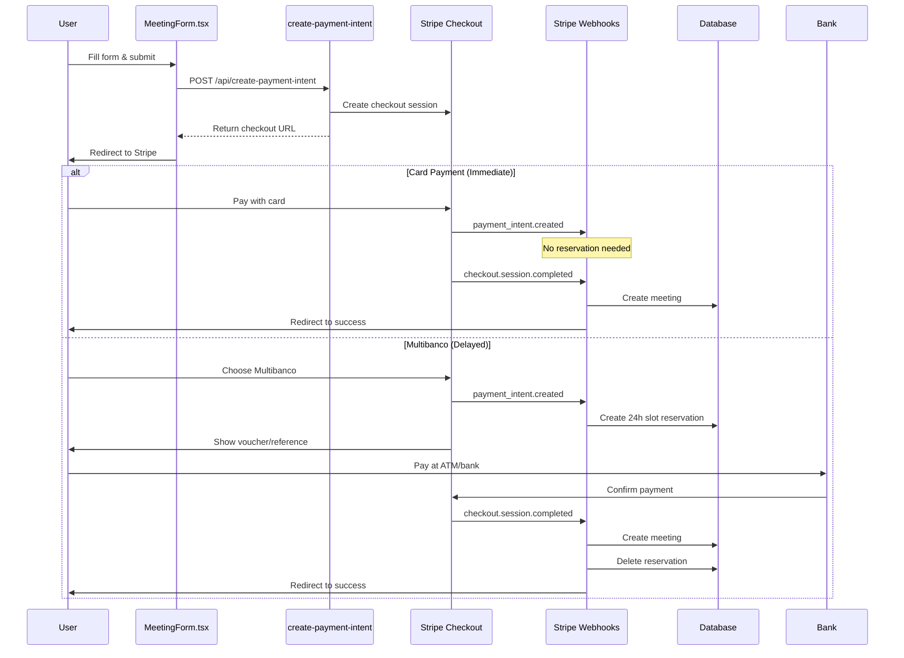

# Complete Payment Flow Guide: From Booking to Confirmation

## Overview

This document provides a comprehensive walkthrough of the entire payment flow in the Eleva Care application, from initial booking through payment confirmation. The system handles two distinct payment types: immediate card payments and delayed Multibanco payments.

## Flow Architecture



## Step-by-Step Flow

### 1. Frontend: MeetingForm.tsx

#### Duplicate Prevention

```typescript
// Immediate duplicate prevention using refs
const isProcessingRef = React.useRef(false);
const lastRequestRef = React.useRef<string | null>(null);

// Generate unique request keys for deduplication
const generateRequestKey = React.useCallback(() => {
  const formValues = form.getValues();
  return `${eventId}-${formValues.guestEmail}-${formValues.startTime?.toISOString()}-${Date.now()}`;
}, [eventId, form]);
```

#### Payment Intent Creation

```typescript
const createPaymentIntent = React.useCallback(
  async () => {
    // Critical: Immediate duplicate check using ref
    if (isProcessingRef.current) {
      console.log('🚫 Payment intent creation already in progress');
      return checkoutUrl;
    }

    // Set processing flag immediately
    isProcessingRef.current = true;
    lastRequestRef.current = requestKey;

    try {
      const response = await fetch('/api/create-payment-intent', {
        method: 'POST',
        headers: {
          'Content-Type': 'application/json',
          'Idempotency-Key': requestKey, // Server-side deduplication
        },
        body: JSON.stringify({
          eventId,
          price,
          meetingData: {
            guestName: formValues.guestName,
            guestEmail: formValues.guestEmail,
            guestNotes: formValues.guestNotes,
            startTime: formValues.startTime.toISOString(),
            timezone: formValues.timezone || 'UTC',
            locale: userLocale,
          },
          username,
          eventSlug,
          requestKey,
        }),
      });

      const { url } = await response.json();
      setCheckoutUrl(url);
      return url;
    } finally {
      isProcessingRef.current = false;
    }
  },
  [
    /* dependencies */
  ],
);
```

### 2. Backend: create-payment-intent API

#### Server-Side Idempotency

```typescript
// Idempotency cache to prevent duplicate requests
const idempotencyCache = new Map<string, { url: string; timestamp: number }>();
const CACHE_TTL_MS = 10 * 60 * 1000; // 10 minutes

export async function POST(request: NextRequest) {
  // Check for duplicate requests
  const idempotencyKey = request.headers.get('Idempotency-Key');

  if (idempotencyKey) {
    cleanupCache();
    const cachedResult = idempotencyCache.get(idempotencyKey);
    if (cachedResult) {
      return NextResponse.json({ url: cachedResult.url });
    }
  }

  // ... rest of processing
}
```

#### Payment Method Selection Logic

```typescript
// Determine payment methods based on meeting timing
const hoursUntilMeeting = (meetingDate.getTime() - currentTime.getTime()) / (1000 * 60 * 60);

let paymentMethodTypes: string[];
let paymentExpiresAt: Date;

if (hoursUntilMeeting <= 72) {
  // Meeting within 72 hours - CARD ONLY for instant confirmation
  paymentMethodTypes = ['card'];
  paymentExpiresAt = new Date(currentTime.getTime() + 30 * 60 * 1000); // 30 min
} else {
  // Meeting > 72 hours - Allow Card + Multibanco
  paymentMethodTypes = ['card', 'multibanco'];
  paymentExpiresAt = new Date(currentTime.getTime() + 24 * 60 * 60 * 1000); // 24 hours
}
```

#### Conflict Detection

```typescript
// Check for existing active reservations
const existingReservation = await db.query.SlotReservationTable.findFirst({
  where: and(
    eq(SlotReservationTable.eventId, eventId),
    eq(SlotReservationTable.startTime, appointmentStartTime),
    gt(SlotReservationTable.expiresAt, new Date()),
  ),
});

if (existingReservation && existingReservation.guestEmail !== meetingData.guestEmail) {
  return NextResponse.json(
    {
      error: 'This time slot is temporarily reserved by another user.',
      code: 'SLOT_TEMPORARILY_RESERVED',
    },
    { status: 409 },
  );
}
```

### 3. Stripe Checkout Session Creation

#### Enhanced Configuration

```typescript
const session = await stripe.checkout.sessions.create({
  payment_method_types: paymentMethodTypes,
  line_items: [
    /* product details */
  ],
  mode: 'payment',
  success_url: `${baseUrl}/${locale}/booking/success?session_id={CHECKOUT_SESSION_ID}`,
  cancel_url: `${baseUrl}/${locale}/${username}/${eventSlug}`,
  expires_at: Math.floor(paymentExpiresAt.getTime() / 1000),

  // Enhanced tax handling
  automatic_tax: { enabled: true },
  tax_id_collection: { enabled: true },
  billing_address_collection: 'required',

  // Conditional messaging for Multibanco
  ...(paymentMethodTypes.includes('multibanco') && {
    custom_text: {
      submit: {
        message:
          'Multibanco payments require 24h confirmation. Slot will be held during this period.',
      },
    },
  }),

  // Metadata for webhook processing
  metadata: sharedMetadata,
  payment_intent_data: {
    application_fee_amount: platformFee,
    transfer_data: { destination: expertStripeAccountId },
    metadata: sharedMetadata,
  },
});
```

### 4. Stripe Webhooks: Payment Processing

#### Payment Intent Created (Multibanco Only)

```typescript
case 'payment_intent.created': {
  const paymentIntent = event.data.object as Stripe.PaymentIntent;
  const hasMultibanco = paymentIntent.payment_method_types?.includes('multibanco');

  if (hasMultibanco && paymentIntent.metadata?.meeting) {
    const meetingData = JSON.parse(paymentIntent.metadata.meeting);

    // Create 24-hour slot reservation for Multibanco
    await db.insert(SlotReservationTable).values({
      id: crypto.randomUUID(),
      eventId: meetingData.id,
      clerkUserId: meetingData.expert,
      guestEmail: meetingData.guest,
      startTime: new Date(meetingData.start),
      endTime: new Date(new Date(meetingData.start).getTime() + (meetingData.dur * 60 * 1000)),
      expiresAt: new Date(Date.now() + 24 * 60 * 60 * 1000), // 24 hours
      stripePaymentIntentId: paymentIntent.id,
      stripeSessionId: null,
    });

    console.log(`✅ Slot reserved for Multibanco payment: ${meetingData.guest}`);
  }
  break;
}
```

#### Checkout Session Completed (Final Booking)

```typescript
case 'checkout.session.completed': {
  const session = event.data.object as StripeCheckoutSession;

  // Create the meeting record
  const result = await createMeeting({
    eventId: meetingData.id,
    clerkUserId: meetingData.expert,
    startTime: new Date(meetingData.start),
    guestEmail: meetingData.guest,
    guestName: getGuestName(meetingData),
    guestNotes: meetingData.notes,
    timezone: meetingData.timezone || 'UTC',
    stripeSessionId: session.id,
    stripePaymentStatus: mapPaymentStatus(session.payment_status),
    locale: meetingData.locale || 'en',
  });

  // Clean up any existing slot reservation (Multibanco)
  if (result.meeting && session.payment_intent) {
    const deletedReservations = await db
      .delete(SlotReservationTable)
      .where(eq(SlotReservationTable.stripePaymentIntentId, session.payment_intent.toString()))
      .returning({ id: SlotReservationTable.id });

    if (deletedReservations.length > 0) {
      console.log(`🧹 Cleaned up ${deletedReservations.length} slot reservation(s)`);
    }
  }

  // Create payment transfer record for expert payout
  if (session.payment_intent) {
    await createPaymentTransferIfNotExists({
      session,
      meetingData,
      paymentData,
      transferData,
    });
  }

  break;
}
```

## Payment Method Comparison

### 💳 Card Payments (Immediate)

**Flow:**

1. User submits form → API creates checkout session
2. No slot reservations created
3. User pays with card → Payment confirmed instantly
4. `checkout.session.completed` webhook → Meeting created
5. Meeting record serves as final booking

**Characteristics:**

- ✅ Instant confirmation
- ✅ No slot reservations needed
- ✅ 30-minute payment window for urgent bookings
- ✅ No orphaned reservations

### 🏧 Multibanco Payments (Delayed)

**Flow:**

1. User submits form → API creates checkout session
2. User selects Multibanco → `payment_intent.created` webhook
3. Slot reservation created (24-hour expiry)
4. User receives voucher/reference number
5. User pays at ATM/bank within 24 hours
6. `checkout.session.completed` webhook → Meeting created
7. Slot reservation cleaned up

**Characteristics:**

- ⏰ 24-hour payment window
- 🔒 Slot held during payment period
- 📄 Voucher-based payment
- 🧹 Automatic cleanup after confirmation

## Database Schema Impact

### Slot Reservations Table

```sql
CREATE TABLE slot_reservations (
  id UUID PRIMARY KEY DEFAULT gen_random_uuid(),
  event_id UUID NOT NULL REFERENCES events(id) ON DELETE CASCADE,
  clerk_user_id TEXT NOT NULL,
  guest_email TEXT NOT NULL,
  start_time TIMESTAMP NOT NULL,
  end_time TIMESTAMP NOT NULL,
  expires_at TIMESTAMP NOT NULL,
  stripe_payment_intent_id TEXT,
  stripe_session_id TEXT,
  created_at TIMESTAMP DEFAULT NOW(),
  updated_at TIMESTAMP DEFAULT NOW(),

  -- Unique constraint to prevent duplicate active reservations
  CONSTRAINT unique_active_reservation
    UNIQUE (event_id, start_time, guest_email)
    WHERE expires_at > NOW()
);
```

### Meetings Table

```sql
-- Meeting records serve as final bookings
-- No additional reservations needed once meeting is created
SELECT * FROM meetings
WHERE stripe_payment_status = 'succeeded'
  AND start_time > NOW()
ORDER BY start_time;
```

## Error Handling

### Race Conditions

- **Frontend**: Refs for immediate duplicate prevention
- **Backend**: Idempotency keys and caching
- **Database**: Unique constraints on active reservations

### Abandoned Checkouts

- **Card payments**: No reservations created → No cleanup needed
- **Multibanco**: Reservations expire automatically after 24h

### Double Bookings

- **Prevention**: Collision detection in create-payment-intent
- **Resolution**: Automatic refunds for confirmed duplicate payments

## Monitoring and Logs

### Key Log Messages

```
🚀 Payment intent created with key: {idempotencyKey}
⚡ Quick booking: Meeting in {hours}h - Card only, 30min to pay
🕒 Advance booking: Meeting in {hours}h - Card + Multibanco, 24h to pay
🏧 Multibanco payment detected - creating slot reservation
💳 Immediate payment method detected - no reservation needed
✅ Slot reserved for Multibanco payment: {guestEmail}
🧹 Cleaned up {count} slot reservation(s) after meeting confirmation
```

### Metrics to Monitor

- Checkout session completion rates by payment method
- Slot reservation cleanup success rate
- Multibanco payment confirmation time
- Duplicate request prevention effectiveness

## Best Practices

### Frontend

1. Use refs for immediate state updates
2. Implement proper loading states
3. Send idempotency keys with requests
4. Handle network errors gracefully

### Backend

1. Validate all input data
2. Implement idempotency caching
3. Use database constraints for data integrity
4. Log detailed error information

### Webhooks

1. Verify Stripe signatures
2. Handle webhook retries properly
3. Make webhook handlers idempotent
4. Clean up resources after successful processing

## Testing Scenarios

### Card Payment Test

1. Fill form → Submit → Redirect to Stripe
2. Use test card `4242424242424242`
3. Verify immediate meeting creation
4. Confirm no slot reservations in database

### Multibanco Payment Test

1. Fill form for future date (>72h) → Submit
2. Select Multibanco → Verify reservation created
3. Complete payment → Verify meeting created
4. Confirm reservation cleaned up

### Race Condition Test

1. Rapidly submit same form multiple times
2. Verify only one checkout session created
3. Check idempotency cache functionality

This comprehensive flow ensures reliable, secure, and user-friendly payment processing for both immediate and delayed payment methods while maintaining data integrity and preventing common issues like race conditions and orphaned reservations.
