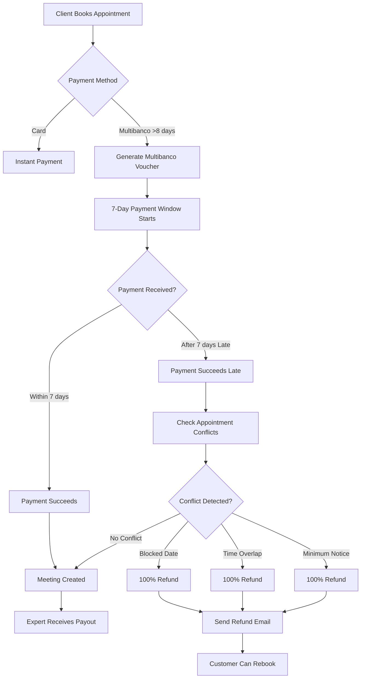

# Multibanco Refund Flow - Comprehensive Audit & Consolidation

**Date**: January 27, 2025  
**Auditor**: AI Assistant (Claude)  
**Status**: 🔴 **CRITICAL - Documentation Consolidation Required**

---

## 🚨 Executive Summary

### Key Findings

1. **❌ OUTDATED DOCUMENTATION**: Multiple docs reference obsolete refund policies (v1.0, v2.0)
2. **✅ CODE ALIGNED**: Backend implementation correctly reflects v3.0 policy (100% all conflicts)
3. **✅ LEGAL CONTENT ALIGNED**: Payment policies updated across all 4 languages
4. **✅ EMAIL TRANSLATIONS ALIGNED**: Notification messages updated for v3.0
5. **⚠️ DOCUMENTATION DEBT**: Legacy docs need archival or updating

---

## 📊 Policy Evolution Timeline

| Version  | Date         | Policy                                         | Status          |
| -------- | ------------ | ---------------------------------------------- | --------------- |
| **v1.0** | Dec 2024     | First-time waiver (100% first, 90% subsequent) | ❌ **OBSOLETE** |
| **v2.0** | Jan 26, 2025 | Blocked date = 100%, others = 90%              | ❌ **OBSOLETE** |
| **v3.0** | Jan 27, 2025 | **ALL conflicts = 100%**                       | ✅ **CURRENT**  |

---

## 🔍 Complete Multibanco Refund Flow (Current State)

### Flow Diagram



### Step-by-Step Flow

#### 1. **Payment Intent Creation**

**File**: `app/api/create-payment-intent/route.ts`

**Logic**:

```typescript
// Determine if Multibanco is available
const daysUntilMeeting = differenceInDays(appointmentStart, currentTime);

if (daysUntilMeeting <= 8) {
  paymentMethodTypes = ['card']; // Only card for near-term bookings
} else {
  paymentMethodTypes = ['card', 'multibanco']; // Both for advance bookings
}
```

**Key Points**:

- ✅ Multibanco only available if booking >8 days in advance
- ✅ Creates Stripe Checkout Session with 24-hour expiration
- ✅ Multibanco voucher valid for 7 days (handled by Stripe)

#### 2. **Multibanco Voucher Generation**

**File**: `app/api/webhooks/stripe/handlers/payment.ts`

**Event**: `checkout.session.completed`

**Logic**:

- Creates meeting record with `stripePaymentStatus: 'pending'`
- Sends `MultibancoBookingPending` email with payment instructions
- Stores voucher details in meeting metadata

#### 3. **Payment Reminder System**

**File**: `app/api/cron/send-payment-reminders/route.ts`

**Schedule**:

- Day 3: Gentle reminder email
- Day 6: Urgent reminder email

**Emails**:

- `MultibancoPaymentReminder` (gentle/urgent variants)
- Translated in all 4 languages (en, pt, es, br)

#### 4. **Late Payment Detection & Refund Processing**

**File**: `app/api/webhooks/stripe/handlers/payment.ts`

**Event**: `payment_intent.succeeded`

**Current Logic (v3.0)**:

```typescript
// 1. Detect late payment
const isMultibancoPayment = paymentIntent.payment_method_types?.includes('multibanco');
const createdAt = new Date(paymentIntent.created * 1000);
const sevenDaysAgo = new Date(Date.now() - 7 * 24 * 60 * 60 * 1000);
const isLatePayment = createdAt < sevenDaysAgo;

if (isMultibancoPayment && isLatePayment) {
  // 2. Check for conflicts
  const conflictResult = await checkAppointmentConflict(expertId, appointmentStart, eventId);

  if (conflictResult.hasConflict) {
    // 3. Process 100% refund (v3.0 policy)
    const refund = await processPartialRefund(
      paymentIntent,
      conflictResult.reason || 'unknown',
      conflictResult.reason as ConflictType,
    );

    // 4. Send email notification
    await notifyAppointmentConflict(
      guestEmail,
      guestName,
      expertName,
      appointmentStart,
      refund.amount, // 100% of original
      originalAmount,
      locale,
      conflictResult.reason,
    );
  }
}
```

#### 5. **Conflict Detection (Priority Order)**

**Function**: `checkAppointmentConflict()`

**Priority 1: Blocked Dates**

```typescript
const appointmentDateString = format(startTime, 'yyyy-MM-dd', { timeZone: 'UTC' });

const blockedDate = await db.query.BlockedDatesTable.findFirst({
  where: and(
    eq(BlockedDatesTable.clerkUserId, expertId),
    eq(BlockedDatesTable.date, appointmentDateString)
  ),
});

if (blockedDate) {
  return {
    hasConflict: true,
    reason: 'expert_blocked_date',
    blockedDateReason: blockedDate.reason || undefined,
  };
}
```

**Priority 2: Time Overlaps**

```typescript
const conflictingMeetings = await db.query.MeetingTable.findMany({
  where: and(
    eq(MeetingTable.clerkUserId, expertId),
    eq(MeetingTable.stripePaymentStatus, 'succeeded')
  ),
});

for (const existingMeeting of conflictingMeetings) {
  if (hasTimeOverlap(startTime, endTime, existingMeeting.startTime, existingEndTime)) {
    return { hasConflict: true, reason: 'time_range_overlap' };
  }
}
```

**Priority 3: Minimum Notice Violations**

```typescript
const settings = await db.query.schedulingSettings.findFirst({
  where: eq(schedulingSettings.clerkUserId, expertId)
});

if (settings?.minimumNotice) {
  const minimumNoticeMs = settings.minimumNotice * 60 * 1000;
  if (startTime.getTime() - now.getTime() < minimumNoticeMs) {
    return {
      hasConflict: true,
      reason: 'minimum_notice_violation',
      minimumNoticeHours: Math.floor(settings.minimumNotice / 60)
    };
  }
}
```

#### 6. **Refund Processing (v3.0 Policy)**

**Function**: `processPartialRefund()`

**Current Implementation**:

```typescript
async function processPartialRefund(
  paymentIntent: Stripe.PaymentIntent,
  reason: string,
  conflictType:
    | 'expert_blocked_date'
    | 'time_range_overlap'
    | 'minimum_notice_violation'
    | 'unknown_conflict',
): Promise<Stripe.Refund | null> {
  const originalAmount = paymentIntent.amount;

  // 🆕 CUSTOMER-FIRST POLICY (v3.0): Always 100% refund for any conflict
  const refundAmount = originalAmount; // Always 100%
  const processingFee = 0; // No fee charged
  const refundPercentage = '100';

  const refund = await stripe.refunds.create({
    payment_intent: paymentIntent.id,
    amount: refundAmount,
    reason: 'requested_by_customer',
    metadata: {
      reason: reason,
      conflict_type: conflictType,
      original_amount: originalAmount.toString(),
      processing_fee: '0',
      refund_percentage: '100',
      policy_version: '3.0', // Current policy version
    },
  });

  return refund;
}
```

**Key Changes from v2.0**:

- ❌ Removed: `isBlockedDateConflict` conditional logic
- ❌ Removed: 90% calculation `Math.floor(originalAmount * 0.9)`
- ✅ Added: Always 100% refund for any conflict
- ✅ Updated: `policy_version: '3.0'`

#### 7. **Email Notification**

**Function**: `notifyAppointmentConflict()`

**Email Content** (from `messages/*.json`):

```json
{
  "Payments": {
    "collision": {
      "title": "Appointment Conflict - Full Refund Processed",
      "latePaymentExplanation": "Since this was a delayed Multibanco payment and the slot is no longer available, we have processed a full refund of €{refundAmount} (100% of the original amount). We believe in treating our customers fairly, so no processing fees are charged.",
      "refundDetails": {
        "originalAmount": "Original amount: €{amount}",
        "refundAmount": "Refund amount: €{amount} (100% - Full refund)",
        "processingFee": "Processing fee: €{amount} (No fee charged)"
      }
    }
  }
}
```

**Languages**:

- ✅ English (`en.json`)
- ✅ Portuguese (`pt.json`)
- ✅ Spanish (`es.json`)
- ✅ Brazilian Portuguese (`br.json`)

---

## 📚 Documentation Alignment Status

### ✅ ALIGNED (Current v3.0 Policy)

| File                   | Status | Notes                                                            |
| ---------------------- | ------ | ---------------------------------------------------------------- |
| **Backend Code**       | ✅     | `app/api/webhooks/stripe/handlers/payment.ts`                    |
| **Tests**              | ✅     | `tests/api/webhooks/blocked-date-refund.test.ts` (15/15 passing) |
| **Legal Content**      | ✅     | `content/payment-policies/*.mdx` (all 4 languages)               |
| **Email Translations** | ✅     | `messages/*.json` (all 4 languages)                              |
| **v3.0 Documentation** | ✅     | `docs/.../09-policy-v3-customer-first-100-refund.md`             |

### ❌ OUTDATED (References Old Policies)

| File                                                 | Policy Referenced        | Action Required                      |
| ---------------------------------------------------- | ------------------------ | ------------------------------------ |
| **README.md**                                        | v1.0 (First-time waiver) | ⚠️ **UPDATE** or **ARCHIVE**         |
| **06-first-time-waiver-implementation.md**           | v1.0 (First-time waiver) | ⚠️ **ARCHIVE** (superseded by v3.0)  |
| **07-first-time-waiver-linear-issues.md**            | v1.0 (First-time waiver) | ⚠️ **ARCHIVE** (superseded by v3.0)  |
| **08-blocked-date-refund-implementation-summary.md** | v2.0 (100%/90% split)    | ⚠️ **ARCHIVE** or **UPDATE** to v3.0 |

### ⚠️ NEEDS REVIEW

| File                                 | Status  | Notes                              |
| ------------------------------------ | ------- | ---------------------------------- |
| **01-payment-flow-analysis.md**      | Unknown | Check for refund policy references |
| **02-stripe-integration.md**         | Unknown | Check for refund logic mentions    |
| **03-payment-restrictions.md**       | Unknown | Check for policy references        |
| **04-race-condition-fixes.md**       | Unknown | Check for refund logic             |
| **05-multibanco-integration.md**     | ✅      | Generic integration doc, likely OK |
| **06-multibanco-reminder-system.md** | ✅      | Reminder system only, likely OK    |

---

## 🔧 Stripe API Best Practices Compliance

### ✅ Implemented Best Practices

Based on Context7 Stripe documentation:

1. **✅ Webhook Signature Verification**

   ```typescript
   const event = stripe.webhooks.constructEvent(
     webhookRawBody,
     webhookStripeSignatureHeader,
     webhookSecret,
   );
   ```

2. **✅ Idempotency Keys**
   - Stripe automatically uses payment_intent ID for refund idempotency
   - Prevents duplicate refunds on webhook retries

3. **✅ Refund Metadata**

   ```typescript
   metadata: {
     reason: reason,
     conflict_type: conflictType,
     original_amount: originalAmount.toString(),
     processing_fee: '0',
     refund_percentage: '100',
     policy_version: '3.0',
   }
   ```

4. **✅ Error Handling**

   ```typescript
   try {
     const refund = await stripe.refunds.create({...});
   } catch (error) {
     console.error('❌ Error processing refund:', error);
     return null;
   }
   ```

5. **✅ Proper Event Handling**
   - Separate handlers for different event types
   - Early returns for non-relevant events
   - Comprehensive logging

### ⚠️ Potential Improvements

1. **Network Retry Configuration**

   ```typescript
   const stripe = new Stripe(process.env.STRIPE_SECRET_KEY, {
     maxNetworkRetries: 2, // Add explicit retry config
     apiVersion: STRIPE_CONFIG.API_VERSION,
   });
   ```

2. **Expanded Refund Details**
   ```typescript
   const refund = await stripe.refunds.create({
     payment_intent: paymentIntent.id,
     amount: refundAmount,
     reason: 'requested_by_customer',
     expand: ['charge', 'payment_intent'], // Add expansion for debugging
     metadata: {...}
   });
   ```

---

## 🎯 Recommended Actions

### Immediate (Critical)

1. **Update README.md** ⚠️
   - Remove references to v1.0 "first-time waiver"
   - Update refund policy table to show v3.0 (100% all conflicts)
   - Update mermaid diagram to reflect v3.0 flow

2. **Archive Outdated Docs** ⚠️
   - Move `06-first-time-waiver-implementation.md` to `/archived`
   - Move `07-first-time-waiver-linear-issues.md` to `/archived`
   - Add deprecation notice at top of each

3. **Update or Archive 08** ⚠️
   - Option A: Archive (superseded by 09)
   - Option B: Update to reference v3.0 as evolution

### Short-Term (This Sprint)

4. **Review & Update Other Docs** 📝
   - Audit files 01-05 for outdated policy references
   - Update any references to 90% refunds
   - Ensure all docs reference v3.0 as current

5. **Consolidate Documentation** 📚
   - Create single source of truth for current policy (09)
   - Add clear version history to README
   - Link all docs to current policy doc

6. **Add Monitoring Documentation** 📊
   - Document how to monitor refund rates
   - Document Stripe Dashboard filters for v3.0
   - Add troubleshooting guide for common issues

### Long-Term (Next Sprint)

7. **Integration Test Documentation** 🧪
   - Document end-to-end test scenarios
   - Add staging validation checklist
   - Create production monitoring runbook

8. **Customer Communication** 📧
   - Prepare FAQ for support team
   - Update help center articles
   - Consider announcement for major policy simplification

---

## 📊 Technical Debt Assessment

### High Priority (Fix This Sprint)

- **Outdated Documentation**: Confusing for new developers
- **README Inconsistency**: Entry point has wrong info
- **Missing Version History**: Hard to understand evolution

### Medium Priority (Fix Next Sprint)

- **Missing Integration Tests**: No E2E flow validation
- **Monitoring Gaps**: Need dashboards for v3.0 metrics
- **Support Documentation**: Team needs updated resources

### Low Priority (Backlog)

- **Performance Optimization**: Refund processing could be faster
- **Advanced Analytics**: Customer behavior analysis
- **A/B Testing**: Measure v3.0 impact scientifically

---

## 🔍 Stripe API Usage Audit

### Current Implementation Review

#### ✅ Refund Creation (Correct)

**Current**:

```typescript
await stripe.refunds.create({
  payment_intent: paymentIntent.id,
  amount: refundAmount,
  reason: 'requested_by_customer',
  metadata: {...}
});
```

**Stripe Best Practice**: ✅ Matches documentation

- Using `payment_intent` instead of deprecated `charge`
- Including proper `reason` field
- Rich metadata for tracking

#### ✅ Webhook Handling (Correct)

**Current**:

```typescript
const event = stripe.webhooks.constructEvent(
  webhookRawBody,
  webhookStripeSignatureHeader,
  webhookSecret,
);
```

**Stripe Best Practice**: ✅ Matches documentation

- Using `constructEvent` for signature verification
- Handling signature failures gracefully
- Proper event type switching

#### ⚠️ Payment Intent Search (Not Used, Could Add)

**Potential Enhancement**:

```typescript
// Could add for admin debugging
const results = await stripe.paymentIntents.search({
  query: "status:'succeeded' AND metadata['policy_version']:'3.0'",
});
```

---

## 📈 Metrics & Monitoring

### Key Metrics to Track

1. **Refund Rate by Version**

   ```sql
   SELECT
     metadata->>'policy_version' as version,
     COUNT(*) as refund_count,
     SUM(amount) as total_refunded
   FROM stripe_refunds
   WHERE created > NOW() - INTERVAL '30 days'
   GROUP BY metadata->>'policy_version';
   ```

2. **Conflict Type Distribution**

   ```sql
   SELECT
     metadata->>'conflict_type' as conflict,
     COUNT(*) as count,
     ROUND(AVG(amount) / 100, 2) as avg_refund_eur
   FROM stripe_refunds
   WHERE metadata->>'policy_version' = '3.0'
   GROUP BY metadata->>'conflict_type';
   ```

3. **Customer Impact**
   ```sql
   SELECT
     DATE(created) as date,
     COUNT(*) as refunds,
     SUM(CASE WHEN metadata->>'processing_fee' = '0' THEN 1 ELSE 0 END) as full_refunds,
     ROUND(SUM(amount) / 100, 2) as total_eur
   FROM stripe_refunds
   WHERE created > NOW() - INTERVAL '7 days'
   GROUP BY DATE(created)
   ORDER BY date DESC;
   ```

### Monitoring Dashboards

#### PostHog Events

- `multibanco_late_payment_refund_processed`
  - Properties:
    - `conflict_type`
    - `refund_amount`
    - `policy_version`
    - `customer_id`

#### Stripe Dashboard Filters

- **v3.0 Refunds**: `metadata[policy_version]:3.0`
- **Blocked Date Refunds**: `metadata[conflict_type]:expert_blocked_date`
- **Time Overlap Refunds**: `metadata[conflict_type]:time_range_overlap`

---

## 🎯 Success Criteria

### Implementation Complete When:

- [x] ✅ Backend implements v3.0 (100% all conflicts)
- [x] ✅ Tests pass (15/15)
- [x] ✅ Legal content updated (4 languages)
- [x] ✅ Email translations updated (4 languages)
- [x] ✅ v3.0 documentation created
- [ ] ⏳ Old documentation archived/updated
- [ ] ⏳ README updated to reflect v3.0
- [ ] ⏳ Integration tests pass
- [ ] ⏳ Staging validation complete
- [ ] ⏳ Production monitoring active

### Quality Gates

- **Code**: All tests passing, linters clean
- **Documentation**: No conflicting information
- **Legal**: All content consistent across languages
- **Operations**: Monitoring and alerting configured

---

## 📝 Version History

| Date       | Version | Auditor      | Changes                     |
| ---------- | ------- | ------------ | --------------------------- |
| 2025-01-27 | 1.0     | AI Assistant | Initial comprehensive audit |

---

## 🤝 Next Steps

1. **Review this audit** with engineering team
2. **Prioritize action items** for current sprint
3. **Assign documentation cleanup** tasks
4. **Schedule follow-up audit** after updates
5. **Deploy to staging** for validation

---

**Status**: 🟡 **ACTION REQUIRED** - Documentation consolidation needed
**Priority**: **HIGH** - Inconsistent docs can lead to incorrect implementations
**Owner**: Engineering Team Lead
**Due Date**: Before next sprint planning
