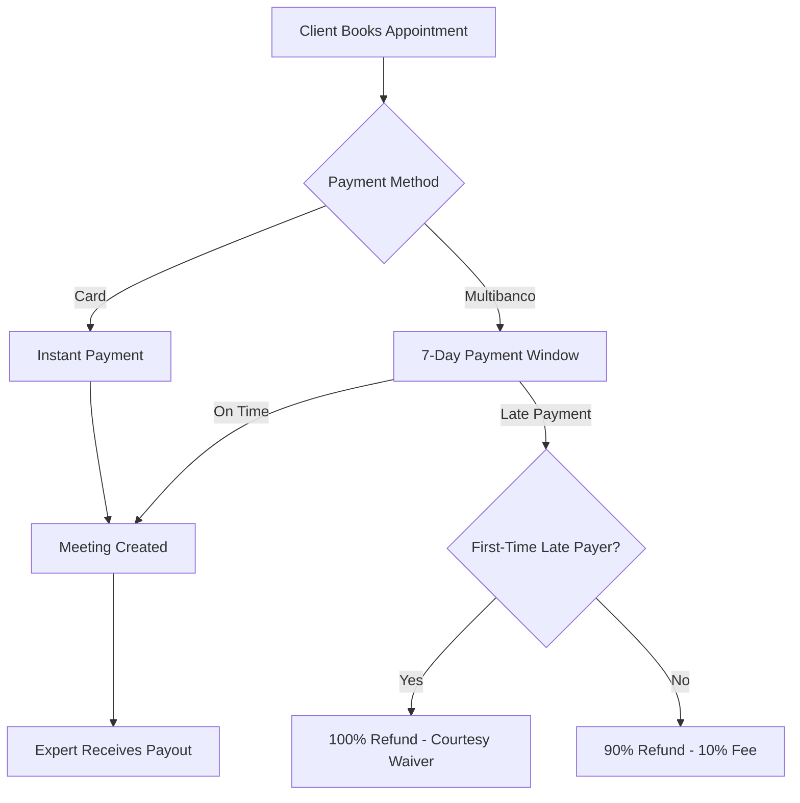

# Payment System Documentation

This directory contains comprehensive documentation for Eleva Care's payment system, including Stripe integration, Multibanco support, and refund policies.

---

## 📚 Documentation Index

### Core Payment Flow

1. **[Payment Flow Analysis](./01-payment-flow-analysis.md)**
   - Current vs. proposed implementation
   - Card payment flow
   - Multibanco payment flow
   - Slot reservation system

2. **[Stripe Integration](./02-stripe-integration.md)**
   - Stripe Connect setup
   - Payment Intent API
   - Webhook handling
   - Error handling and retries

3. **[Payment Processing](./03-payment-processing.md)**
   - Payment lifecycle
   - Transaction states
   - Refund handling
   - Failed payment recovery

### Payment Methods

4. **[Stripe Payouts](./04-stripe-payouts.md)**
   - Expert payout system
   - Transfer scheduling
   - Country-specific delays
   - Payout failure handling

5. **[Multibanco Integration](./05-multibanco-integration.md)**
   - Multibanco payment flow
   - 7-day payment window
   - Voucher generation
   - Late payment handling

### Refund Policies

6. **[First-Time Waiver Implementation](./06-first-time-waiver-implementation.md)** ⭐ NEW
   - Complete implementation guide
   - Database schema changes
   - Refund logic (100% vs 90%)
   - Email notifications
   - Analytics & monitoring
   - Testing strategy

7. **[First-Time Waiver Linear Issues](./07-first-time-waiver-linear-issues.md)** ⭐ NEW
   - Copy-paste Linear issue templates
   - 7 discrete implementation tasks
   - Sprint planning
   - Dependencies & estimates

---

## 🚀 Quick Start

### For Product Managers

- Read: [First-Time Waiver Linear Issues](./07-first-time-waiver-linear-issues.md)
- Action: Copy issues into Linear
- Timeline: 2-3 week implementation

### For Engineers

- Read: [First-Time Waiver Implementation Guide](./06-first-time-waiver-implementation.md)
- Start with: Step 1 (Database Schema)
- Reference: Full code examples and tests

### For QA

- Read: Testing sections in [Implementation Guide](./06-first-time-waiver-implementation.md#testing-strategy)
- Focus: Unit tests, integration tests, E2E tests
- Verify: All 4 languages (EN, ES, PT, BR)

---

## 💡 Key Features

### Payment Methods

- ✅ Credit/Debit Cards (Visa, Mastercard, Amex)
- ✅ Multibanco (Portugal)
- ✅ 3D Secure (3DS) authentication
- ✅ Stripe Connect for expert payouts

### Refund Policies

- ✅ **First-time courtesy waiver**: 100% refund for first late payment
- ✅ **Subsequent late payments**: 90% refund (10% processing fee)
- ✅ Expert-initiated refunds
- ✅ Platform-initiated refunds (conflicts, violations)

### Security & Compliance

- ✅ PCI DSS Level 1 (via Stripe)
- ✅ 3DS authentication for fraud prevention
- ✅ Chargeback dispute handling
- ✅ Fraud detection and prevention

---

## 🔄 Payment Flow Overview

---

## 📊 Refund Policy Summary

| Scenario                           | First-Time              | Repeat                  | Fee    |
| ---------------------------------- | ----------------------- | ----------------------- | ------ |
| **Late Multibanco (after 7 days)** | 100% refund             | 90% refund              | 10%    |
| **Slot unavailable**               | 100% refund             | 90% refund              | 10%    |
| **Expert rule violation**          | 100% refund             | 90% refund              | 10%    |
| **Card payment cancellation**      | Per cancellation policy | Per cancellation policy | Varies |

**Note**: First-time courtesy applies only to Multibanco late payments, not regular cancellations.

---

## 🎯 First-Time Waiver Quick Reference

### For Users (Customer-Facing)

- **What**: First late Multibanco payment? Get 100% refund (no fee)
- **Why**: We understand mistakes happen
- **When**: Applies only to first late payment (subsequent: 10% fee)
- **How**: Automatic (no action needed)

### For Engineers

- **Database**: 3 new fields in `UserTable` (see Step 1)
- **Logic**: `isFirstTimeLatePayment()` checks history
- **Refund**: `processPartialRefund()` calculates 100% or 90%
- **Tracking**: PostHog analytics + Stripe metadata

### For Support

- **First-time**: "You received 100% refund as a courtesy"
- **Repeat**: "10% processing fee applies per our policies"
- **Check status**: User dashboard shows waiver eligibility

---

## 🔧 Technical Stack

- **Payment Processor**: Stripe
- **Database**: PostgreSQL (via Neon.tech)
- **ORM**: Drizzle
- **Webhooks**: Stripe webhooks + Svix
- **Email**: Novu (multi-language)
- **Analytics**: PostHog
- **i18n**: next-intl (EN, ES, PT, BR)

---

## 📈 Key Metrics

### Payment Success Rate

- **Target**: >95%
- **Current**: Track via Stripe Dashboard

### Chargeback Rate

- **Target**: <1%
- **Baseline**: 2-5% (before first-time waiver)
- **Expected**: 30-50% reduction

### Customer Satisfaction

- **Target**: >4.0/5.0 for late payment refunds
- **Measurement**: Post-refund survey

### Late Payment Frequency

- **Target**: <5% of Multibanco payments
- **Measurement**: PostHog analytics

---

## 🧪 Testing Resources

### Unit Tests

- `tests/lib/payment-refund.test.ts` - Refund logic tests
- `tests/api/webhooks/stripe.test.ts` - Webhook handler tests

### Integration Tests

- `tests/api/webhooks/stripe-refund-integration.test.ts` - Full flow tests
- `tests/integration/multibanco-late-payment.test.ts` - Late payment scenarios

### E2E Tests

- `tests/e2e/late-payment-dashboard.spec.ts` - UI tests

---

## 📞 Support & Escalation

### During Implementation

- **Technical Issues**: #engineering Slack channel
- **Product Questions**: Product team
- **Legal Review**: Legal team (for policy changes)

### In Production

- **Payment Failures**: On-call engineer
- **Refund Disputes**: Customer support → Finance team
- **Stripe Issues**: Stripe support + on-call engineer

---

## 🔗 External Resources

- [Stripe Documentation](https://stripe.com/docs)
- [Multibanco Documentation](https://stripe.com/docs/payments/multibanco)
- [Stripe Webhooks Guide](https://stripe.com/docs/webhooks)
- [Stripe Refunds API](https://stripe.com/docs/api/refunds)

---

## 📝 Changelog

### 2025-01-17

- ✨ Added First-Time Waiver Implementation Guide
- ✨ Added Linear Issue Templates
- 📚 Updated documentation index

### 2024-12-XX

- 📚 Initial payment system documentation
- 📚 Stripe integration guide
- 📚 Multibanco integration guide

---

## 🤝 Contributing

When adding new payment features:

1. **Document first**: Create implementation guide
2. **Break into tasks**: Use Linear issue templates
3. **Test thoroughly**: Unit + integration + E2E tests
4. **Update docs**: Keep this README current
5. **Monitor metrics**: Track impact via PostHog

---

**Last Updated**: January 2025  
**Maintained By**: Engineering Team  
**Questions?** Post in #engineering Slack channel
