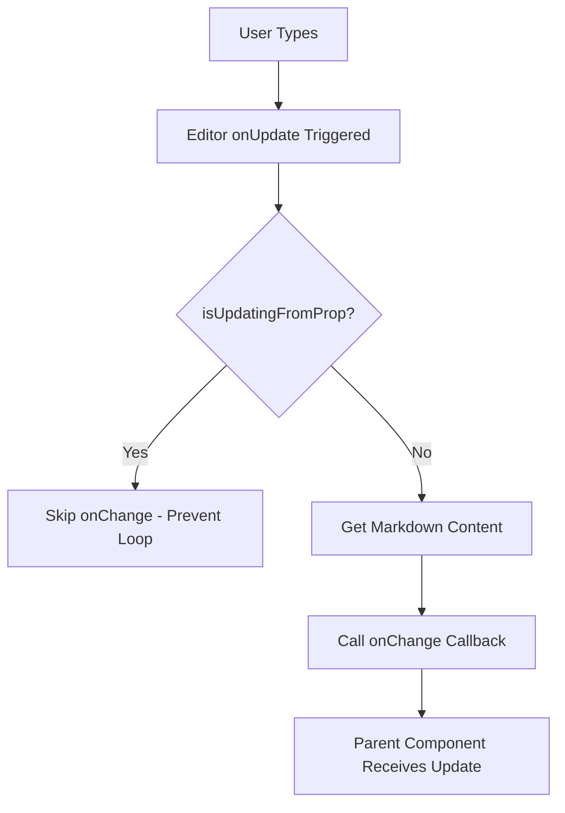

# TipTap Autosave Cursor Focus Fix

## Problem Description

The original RichTextEditor component had a critical user experience issue where **autosave operations would cause the cursor to lose focus and jump back to the beginning of the text**. This made it extremely difficult for users to work with the rich text editor, as their typing position would be constantly interrupted.

## Root Cause Analysis

The issue was caused by several problems in the original implementation:

1. **Unnecessary Content Updates**: The editor was calling `setContent()` on every value prop change, even when the content hadn't actually changed
2. **No Cursor Position Preservation**: When content was updated, the cursor position was completely lost
3. **Poor Event Handling**: Using separate `useEffect` with event listeners instead of TipTap's built-in `onUpdate` callback
4. **Update Loop Issues**: No mechanism to prevent recursive updates between external changes and editor changes

## TipTap Best Practices Applied

Based on TipTap's official documentation, the solution implements several key patterns:

### 1. Content Comparison Before Updates

```typescript
// Only update if content is actually different
if (currentMarkdown === value) {
  return;
}
```

### 2. Cursor Position Preservation

```typescript
// Store current selection/cursor position
const { from, to } = editor.state.selection;
const wasFocused = editor.isFocused;

// Update content without emitting update event
editor.commands.setContent(value, false);

// Restore cursor position if the editor was focused
if (wasFocused) {
  requestAnimationFrame(() => {
    const newDocSize = editor.state.doc.content.size;
    const safeFrom = Math.min(from, newDocSize);
    const safeTo = Math.min(to, newDocSize);

    editor.commands.setTextSelection({ from: safeFrom, to: safeTo });
    editor.commands.focus();
  });
}
```

### 3. Update Loop Prevention

```typescript
const isUpdatingFromProp = useRef(false);

// Flag external updates
isUpdatingFromProp.current = true;

// Don't emit changes during external updates
if (isUpdatingFromProp.current) {
  return;
}
```

### 4. Proper Event Handling

```typescript
// Use onUpdate callback instead of event listeners
onUpdate: ({ editor }) => {
  if (isUpdatingFromProp.current) return;

  const markdownContent = editor.storage.markdown.getMarkdown();
  onChangeRef.current(markdownContent);
},
```

## Key Improvements

### ✅ **Smooth Autosave Experience**

- Users can now type continuously without cursor interruptions
- Autosave operations happen seamlessly in the background
- No more jumping to the beginning of the text

### ✅ **Performance Optimization**

- Eliminated unnecessary content updates
- Reduced re-renders through proper ref usage
- Optimized event handling with built-in callbacks

### ✅ **Robust Error Handling**

- Safe cursor position restoration with boundary checks
- Graceful fallback to end position if restoration fails
- Proper cleanup on component unmount

### ✅ **Memory Leak Prevention**

- Proper event listener cleanup
- Ref-based onChange to avoid stale closures
- Editor destruction on unmount

## Technical Implementation Details

### Content Synchronization Flow

```mermaid
graph TD
    A[External Value Change] --> B{Content Different?}
    B -->|No| C[Skip Update]
    B -->|Yes| D[Store Cursor Position]
    D --> E[Set Flag: isUpdatingFromProp = true]
    E --> F[Update Content with setContent(value, false)]
    F --> G{Was Editor Focused?}
    G -->|Yes| H[Restore Cursor Position via requestAnimationFrame]
    G -->|No| I[Skip Focus Restoration]
    H --> J[Reset Flag: isUpdatingFromProp = false]
    I --> J
```

### User Input Flow



## Usage Example

The improved RichTextEditor maintains the same API while providing a much better user experience:

```tsx
<RichTextEditor
  value={noteValue}
  onChange={(newValue) => {
    // This will now work smoothly with autosave
    setNoteValue(newValue);
    // Autosave logic here
    debounceAutosave(newValue);
  }}
/>
```

## TipTap Documentation References

This implementation follows TipTap's official recommendations:

- **Content Updates**: [Using setContent with emitUpdate: false](https://tiptap.dev/api/commands/content/set-content)
- **Cursor Management**: [Focus and Selection Commands](https://tiptap.dev/api/commands/selection/focus)
- **Event Handling**: [onUpdate Callback](https://tiptap.dev/api/editor#onupdate)
- **Performance**: [Avoiding Unnecessary Re-renders](https://tiptap.dev/guide/performance)

## Migration Notes

✅ **Zero Breaking Changes**: The component maintains the same props interface
✅ **Automatic Improvement**: Existing implementations get the fix automatically
✅ **Backward Compatible**: Works with all existing autosave implementations

This solution transforms the RichTextEditor from a frustrating user experience into a smooth, professional-grade text editing interface that works seamlessly with autosave functionality.
