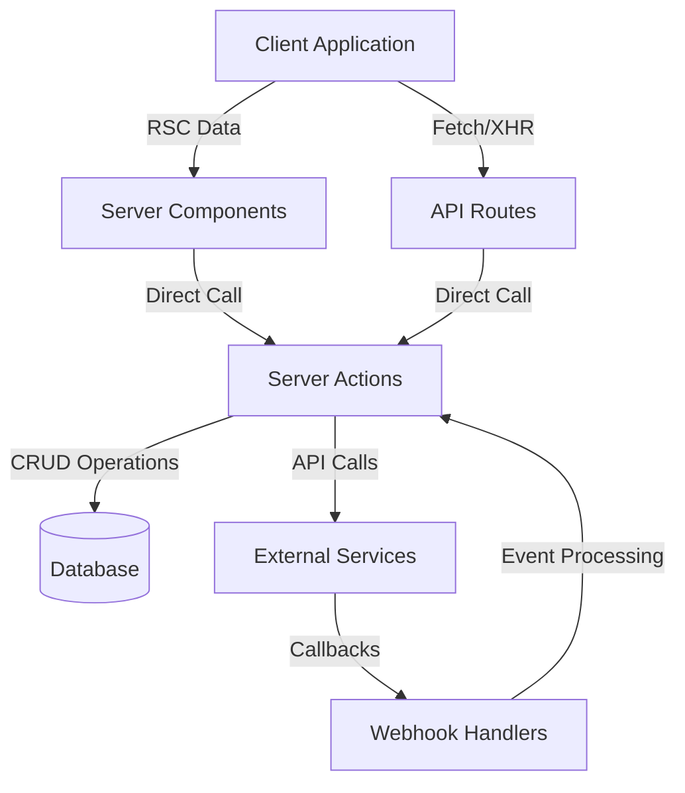

# Eleva Care API: Technical Deep Dive

## Overview

This document provides a comprehensive analysis of the Eleva Care platform's API architecture, implementation details, and usage patterns. The API layer serves as the foundation for data exchange between the client-side application and server-side resources, facilitating expert profile management, booking operations, payment processing, and user authentication.

## 1. API Architecture

### 1.1 Architectural Overview

The Eleva Care platform implements a hybrid API architecture combining:

1. **Next.js API Routes**: Traditional REST endpoints for client-initiated requests
2. **Next.js Server Actions**: Direct server function invocation for server-rendered components
3. **Webhook Handlers**: Endpoints for third-party service communication

This architecture enables a flexible, secure approach to data operations while maintaining type safety across the stack.

**High-Level Architecture Diagram:**



### 1.2 API Layer Composition

The API implementation spans multiple organizational components:

**Directory Structure:**

```
app/
├── api/                           # API Routes
│   ├── admin/                     # Admin-specific APIs
│   ├── auth/                      # Authentication routes
│   ├── profile/                   # Profile management
│   ├── stripe/                    # Payment integration
│   └── webhooks/                  # External service callbacks
└── server/
    ├── actions/                   # Server Actions
    │   ├── expert-profile.ts      # Expert profile operations
    │   ├── expert-setup.ts        # Expert onboarding
    │   ├── events.ts              # Service management
    │   ├── meetings.ts            # Appointment operations
    │   └── stripe.ts              # Stripe integrations
    ├── api/                       # Shared API utilities
    └── db/                        # Database access layer
```

## 2. Authentication and Authorization

### 2.1 Authentication Implementation

The platform uses Clerk for authentication with several integration points:

**Authentication Flow:**

1. Client initiates auth via Clerk components
2. Clerk manages session and token issuance
3. Session token is included in subsequent requests
4. API middleware validates token authenticity
5. User identity is passed to handlers via `auth()` function

**Code Analysis: Auth Middleware**

```typescript
// middleware.ts
import { authMiddleware } from '@clerk/nextjs';

export default authMiddleware({
  publicRoutes: [
    '/',
    '/api/webhooks(.*)',
    '/experts',
    '/experts/(.*)',
    '/about',
    '/legal/(.*)',
    '/api/keep-alive',
  ],
  ignoredRoutes: ['/api/webhooks(.*)'],
});

export const config = {
  matcher: ['/((?!.*\\..*|_next).*)', '/', '/(api|trpc)(.*)'],
};
```

### 2.2 Role-Based Authorization

API routes implement role-based access control (RBAC) using a multi-layered approach:

**Authorization Layers:**

1. **Route-Level**: Middleware checks for authenticated sessions
2. **Handler-Level**: Role verification using `hasRole()` utility
3. **Data-Level**: Query filtering based on user permissions
4. **Field-Level**: Response sanitization removing unauthorized data

**Authorization Implementation Example:**

```typescript
// API Route with role verification
export async function GET(request: Request) {
  const { userId } = await auth();

  // Authentication check
  if (!userId) {
    return NextResponse.json({ error: 'Unauthorized access' }, { status: 401 });
  }

  // Role verification
  const hasAdminRole = await hasRole('admin');
  if (!hasAdminRole) {
    return NextResponse.json({ error: 'Insufficient permissions' }, { status: 403 });
  }

  // Proceed with authorized operation
  const users = await db.query.userTable.findMany({
    with: {
      profile: true,
      roles: true,
    },
  });

  return NextResponse.json({ users });
}
```

## 3. Server Actions Implementation

### 3.1 Server Action Architecture

Server Actions provide a secure method for server-side data mutations with several advantages:

**Key Characteristics:**

- Direct server function invocation from client components
- Form-based and programmatic invocation patterns
- Progressive enhancement with fallback to traditional forms
- CSRF protection via Next.js built-in mechanisms
- Type safety across client-server boundary

**Implementation Pattern:**

```typescript
'use server';

import { db } from '@/server/db';
import { auth } from '@clerk/nextjs/server';
import { revalidatePath } from 'next/cache';
import { z } from 'zod';

// Input validation schema
const inputSchema = z.object({
  // schema definition
});

// Server action implementation
export async function serverActionName(formData: FormData) {
  // 1. Authentication check
  const { userId } = await auth();
  if (!userId) {
    return { success: false, message: 'Authentication required' };
  }

  // 2. Authorization check
  const hasPermission = await checkPermission(userId, 'required_permission');
  if (!hasPermission) {
    return { success: false, message: 'Insufficient permissions' };
  }

  // 3. Input parsing and validation
  const parseResult = inputSchema.safeParse(Object.fromEntries(formData));
  if (!parseResult.success) {
    return {
      success: false,
      message: 'Validation error',
      errors: parseResult.error.format(),
    };
  }

  // 4. Business logic
  try {
    // Database operations
    const result = await performDatabaseOperation(parseResult.data);

    // 5. Cache invalidation
    revalidatePath('/affected/path');

    // 6. Success response
    return {
      success: true,
      message: 'Operation completed successfully',
      data: result,
    };
  } catch (error) {
    // 7. Error handling
    console.error('Server action error:', error);
    return {
      success: false,
      message: 'Operation failed',
      error: error instanceof Error ? error.message : 'Unknown error',
    };
  }
}
```

### 3.2 Server Action Use Cases

The platform implements server actions for several key operational areas:

**Profile Management Actions:**

- `updateProfile`: Updates expert profile information
- `toggleProfilePublication`: Controls profile visibility
- `updateProfileImage`: Handles image upload and processing

**Booking System Actions:**

- `createMeeting`: Creates new appointments with validation
- `cancelMeeting`: Handles appointment cancellations
- `rescheduleAppointment`: Changes appointment timing

**Payment Processing Actions:**

- `handleConnectStripe`: Initiates Stripe Connect onboarding
- `createPaymentIntent`: Creates payment intents for bookings
- `processRefund`: Handles appointment refunds

## 4. API Routes Analysis

### 4.1 REST API Endpoints

Traditional API routes follow REST conventions with specific responsibilities:

**User Management Endpoints:**

- `GET /api/users`: Retrieves users with pagination
- `GET /api/users/:id`: Gets details for a specific user
- `GET /api/users/me`: Returns authenticated user details

**Expert Profile Endpoints:**

- `GET /api/experts`: Lists experts with filtering
- `GET /api/experts/:id`: Retrieves expert profile
- `GET /api/experts/:id/availability`: Gets expert schedule

**Booking Endpoints:**

- `GET /api/appointments`: Lists user appointments
- `GET /api/appointments/:id`: Gets appointment details
- `POST /api/appointments`: Creates new appointments

**Implementation Pattern Example:**

```typescript
// app/api/users/[id]/route.ts
import { db } from '@/server/db';
import { userTable } from '@/server/db/schema';
import { auth } from '@clerk/nextjs/server';
import { eq } from 'drizzle-orm';
import { NextRequest, NextResponse } from 'next/server';

export async function GET(request: NextRequest, { params }: { params: { id: string } }) {
  const { userId } = await auth();

  // Authentication check
  if (!userId) {
    return NextResponse.json({ error: 'Authentication required' }, { status: 401 });
  }

  // Parameter validation
  const targetUserId = params.id;
  if (!targetUserId) {
    return NextResponse.json({ error: 'User ID is required' }, { status: 400 });
  }

  try {
    // Database query
    const user = await db.query.userTable.findFirst({
      where: eq(userTable.id, targetUserId),
      with: {
        profile: true,
        roles: {
          with: {
            role: true,
          },
        },
      },
    });

    // Not found handling
    if (!user) {
      return NextResponse.json({ error: 'User not found' }, { status: 404 });
    }

    // Response transformation for privacy
    const sanitizedUser = sanitizeUserData(user, userId === targetUserId);

    return NextResponse.json({ user: sanitizedUser });
  } catch (error) {
    console.error('API error:', error);
    return NextResponse.json({ error: 'An error occurred' }, { status: 500 });
  }
}
```

### 4.2 Webhook Implementation

The platform implements webhook handlers for external service integration:

**Webhook Endpoints:**

- `/api/webhooks/clerk`: User management events
- `/api/webhooks/stripe`: Payment events
- `/api/webhooks/calendar`: Calendar synchronization

**Security Considerations:**

- Signature verification for all webhooks
- IP filtering for additional security
- Event idempotency handling
- Asynchronous processing for long-running tasks

**Webhook Handler Example:**

```typescript
// app/api/webhooks/stripe/route.ts
import { env } from '@/env.mjs';
import { headers } from 'next/headers';
import { NextRequest, NextResponse } from 'next/server';
import Stripe from 'stripe';

const stripe = new Stripe(env.STRIPE_SECRET_KEY);
const webhookSecret = env.STRIPE_WEBHOOK_SECRET;

export async function POST(request: NextRequest) {
  const body = await request.text();
  const signature = headers().get('stripe-signature') as string;

  // Signature verification
  try {
    const event = stripe.webhooks.constructEvent(body, signature, webhookSecret);

    // Event handling based on type
    switch (event.type) {
      case 'payment_intent.succeeded':
        await handlePaymentSuccess(event.data.object);
        break;

      case 'account.updated':
        await handleAccountUpdate(event.data.object);
        break;

      case 'checkout.session.completed':
        await handleCheckoutComplete(event.data.object);
        break;

      // Additional event handlers
    }

    return NextResponse.json({ received: true });
  } catch (error) {
    console.error('Webhook error:', error);
    return new NextResponse(JSON.stringify({ error: 'Webhook signature verification failed' }), {
      status: 400,
    });
  }
}

// Event handlers
async function handlePaymentSuccess(paymentIntent: Stripe.PaymentIntent) {
  // Update booking status
  // Send notifications
  // Create audit log
}
```

## 5. Data Validation and Error Handling

### 5.1 Request Validation

The API implements consistent request validation:

**Validation Approaches:**

- Schema-based validation using Zod
- Input sanitization to prevent injection
- Type checking with TypeScript
- Constraint enforcement with database schema

**Zod Schema Example:**

```typescript
import { z } from 'zod';

// Expert profile schema
export const profileSchema = z.object({
  displayName: z.string().min(2).max(50),
  title: z.string().max(100).optional(),
  bio: z.string().min(100).max(1000),
  categories: z.array(z.string().uuid()).min(1).max(5),
  yearsOfExperience: z.number().int().min(0).max(70).optional(),
  languages: z.array(z.string()).max(10).optional(),
  location: z
    .object({
      country: z.string().optional(),
      state: z.string().optional(),
      city: z.string().optional(),
    })
    .optional(),
  socialLinks: z
    .array(
      z.object({
        platform: z.enum(['instagram', 'twitter', 'linkedin', 'website']),
        url: z.string().url(),
      }),
    )
    .optional(),
});
```

### 5.2 Error Handling Patterns

API endpoints implement a consistent error handling pattern:

**Error Response Structure:**

```typescript
interface ErrorResponse {
  success: false;
  error: string;
  code?: string;
  details?: Record<string, any>;
  validationErrors?: Record<string, string[]>;
}
```

**Common Error Types:**

- Authentication errors (401)
- Authorization errors (403)
- Validation errors (400)
- Not found errors (404)
- Conflict errors (409)
- Server errors (500)

**Error Handling Implementation:**

```typescript
try {
  // Operation that might fail
} catch (error) {
  console.error('Operation failed:', error);

  // Determine error type and response
  if (error instanceof ValidationError) {
    return NextResponse.json({
      success: false,
      error: 'Validation failed',
      validationErrors: error.errors,
    }, { status: 400 });
  }

  if (error instanceof NotFoundError) {
    return NextResponse.json({
      success: false,
      error: 'Resource not found',
      code: 'RESOURCE_NOT_FOUND',
    }, { status: 404 });
  }

  if (error instanceof ConflictError) {
    return NextResponse.json({
      success: false,
      error: 'Conflict detected',
      code: 'RESOURCE_CONFLICT',
      details: error.details,
    }, { status: 409 });
  }

  // Default server error
  return NextResponse.json({
    success: false,
    error: 'An unexpected error occurred',
    code: 'SERVER_ERROR',
  }, { status: 500 });
}
```

## 6. Database Interaction

### 6.1 Data Access Layer

API endpoints interact with the database through a structured layer:

**Database Access Patterns:**

- Drizzle ORM for type-safe queries
- Prepared statements to prevent SQL injection
- Connection pooling for performance
- Query optimization with selective joins

**Query Example:**

```typescript
import { db } from '@/server/db';
import { bookingTable, eventTable, userTable } from '@/server/db/schema';
import { and, desc, eq, gte } from 'drizzle-orm';

// Query with joins and filtering
const appointments = await db.query.bookingTable.findMany({
  where: and(eq(bookingTable.expertId, expertId), gte(bookingTable.startTime, new Date())),
  with: {
    client: {
      columns: {
        id: true,
        name: true,
        email: true,
      },
    },
    event: true,
  },
  orderBy: [desc(bookingTable.startTime)],
  limit: 20,
  offset: page * 20,
});
```

### 6.2 Transaction Management

Complex operations utilize transactions for data integrity:

**Transaction Pattern:**

```typescript
const result = await db.transaction(async (tx) => {
  // Step 1: Create meeting record
  const [meeting] = await tx.insert(meetingTable).values(meetingData).returning();

  // Step 2: Update expert availability
  await tx
    .update(availabilityTable)
    .set({ isBooked: true })
    .where(eq(availabilityTable.id, availabilityId));

  // Step 3: Create payment record
  const [payment] = await tx.insert(paymentTable).values(paymentData).returning();

  // Return composite result
  return { meeting, payment };
});
```

## 7. External Service Integration

### 7.1 Stripe Integration

Payment processing utilizes Stripe's API:

**Integration Components:**

- Customer management
- Payment processing
- Connect account handling
- Subscription management
- Refund processing

**Stripe Service Example:**

```typescript
import { env } from '@/env.mjs';
import Stripe from 'stripe';

const stripe = new Stripe(env.STRIPE_SECRET_KEY);

export async function createPaymentIntent({
  amount,
  currency,
  customerId,
  metadata,
}: PaymentIntentParams) {
  try {
    const paymentIntent = await stripe.paymentIntents.create({
      amount: amount * 100, // Convert to cents
      currency,
      customer: customerId,
      metadata,
      automatic_payment_methods: {
        enabled: true,
      },
    });

    return {
      success: true,
      clientSecret: paymentIntent.client_secret,
      paymentIntentId: paymentIntent.id,
    };
  } catch (error) {
    console.error('Stripe payment intent creation error:', error);
    return {
      success: false,
      error: getStripeErrorMessage(error),
    };
  }
}
```

### 7.2 Google Calendar Integration

Appointment management integrates with Google Calendar:

**Integration Features:**

- Event creation
- Availability synchronization
- Meeting link generation
- Notification management

**Calendar Integration Example:**

```typescript
import { OAuth2Client } from 'google-auth-library';
import { google } from 'googleapis';

async function createCalendarEvent(appointment, expertToken) {
  // Initialize OAuth client
  const oauth2Client = new OAuth2Client({
    clientId: env.GOOGLE_CLIENT_ID,
    clientSecret: env.GOOGLE_CLIENT_SECRET,
  });

  oauth2Client.setCredentials({
    refresh_token: expertToken.refreshToken,
  });

  // Initialize calendar API
  const calendar = google.calendar({ version: 'v3', auth: oauth2Client });

  // Create event
  const event = {
    summary: appointment.title,
    description: appointment.description,
    start: {
      dateTime: appointment.startTime.toISOString(),
      timeZone: appointment.timezone,
    },
    end: {
      dateTime: appointment.endTime.toISOString(),
      timeZone: appointment.timezone,
    },
    attendees: [{ email: appointment.expertEmail }, { email: appointment.clientEmail }],
    conferenceData: {
      createRequest: {
        requestId: appointment.id,
        conferenceSolutionKey: { type: 'hangoutsMeet' },
      },
    },
  };

  try {
    const response = await calendar.events.insert({
      calendarId: 'primary',
      conferenceDataVersion: 1,
      requestBody: event,
    });

    return {
      success: true,
      eventId: response.data.id,
      meetLink: response.data.hangoutLink,
    };
  } catch (error) {
    console.error('Google Calendar event creation error:', error);
    return {
      success: false,
      error: error.message,
    };
  }
}
```

## 8. Security Considerations

### 8.1 Data Protection

The API implements multiple layers of data protection:

**Security Measures:**

- HTTPS enforcement for all requests
- CORS configuration with allowed origins
- Content-Security-Policy implementation
- Rate limiting for abuse prevention
- Sensitive data encryption

**CORS Configuration Example:**

```typescript
// app/api/[[...route]]/route.ts (middleware or wrapper)
import { env } from '@/env.mjs';
import { NextRequest, NextResponse } from 'next/server';

export function corsMiddleware(handler: (req: NextRequest) => Promise<NextResponse>) {
  return async function (request: NextRequest) {
    // Get origin from environment or default to production URL
    const allowedOrigins = env.ALLOWED_ORIGINS.split(',');
    const origin = request.headers.get('origin') || '';

    // Check if origin is allowed
    const isAllowedOrigin = allowedOrigins.includes(origin) || allowedOrigins.includes('*');

    // Handle preflight requests
    if (request.method === 'OPTIONS') {
      return new NextResponse(null, {
        status: 204,
        headers: {
          'Access-Control-Allow-Origin': isAllowedOrigin ? origin : allowedOrigins[0],
          'Access-Control-Allow-Methods': 'GET, POST, PUT, DELETE, OPTIONS',
          'Access-Control-Allow-Headers': 'Content-Type, Authorization',
          'Access-Control-Max-Age': '86400',
        },
      });
    }

    // Process the request with the handler
    const response = await handler(request);

    // Add CORS headers to response
    if (isAllowedOrigin) {
      response.headers.set('Access-Control-Allow-Origin', origin);
    }

    return response;
  };
}
```

### 8.2 Rate Limiting

API endpoints implement rate limiting to prevent abuse:

**Rate Limiting Strategy:**

- IP-based limiting for anonymous requests
- User-based limiting for authenticated requests
- Endpoint-specific limits based on resource cost
- Graduated response (warning, blocking, temporary ban)

**Implementation Example:**

```typescript
import { auth } from '@clerk/nextjs/server';
import { Ratelimit } from '@upstash/ratelimit';
import { Redis } from '@upstash/redis';
import { NextRequest, NextResponse } from 'next/server';

// Initialize Redis client
const redis = new Redis({
  url: env.UPSTASH_REDIS_URL,
  token: env.UPSTASH_REDIS_TOKEN,
});

// Create rate limiter instances
const anonymousLimiter = new Ratelimit({
  redis,
  limiter: Ratelimit.slidingWindow(20, '1m'), // 20 requests per minute
  prefix: 'ratelimit:anonymous',
});

const authenticatedLimiter = new Ratelimit({
  redis,
  limiter: Ratelimit.slidingWindow(100, '1m'), // 100 requests per minute
  prefix: 'ratelimit:authenticated',
});

export async function rateLimitMiddleware(
  request: NextRequest,
  handler: (req: NextRequest) => Promise<NextResponse>,
) {
  // Get IP address or identifier
  const ip = request.ip || 'anonymous';

  // Get authentication status
  const { userId } = await auth();

  // Select appropriate limiter
  const limiter = userId ? authenticatedLimiter : anonymousLimiter;
  const identifier = userId || ip;

  // Check rate limit
  const { success, limit, reset, remaining } = await limiter.limit(identifier);

  // If rate limit exceeded
  if (!success) {
    return NextResponse.json(
      {
        error: 'Rate limit exceeded',
        limit,
        remaining: 0,
        reset: new Date(reset).toISOString(),
      },
      {
        status: 429,
        headers: {
          'X-RateLimit-Limit': limit.toString(),
          'X-RateLimit-Remaining': '0',
          'X-RateLimit-Reset': reset.toString(),
          'Retry-After': Math.ceil((reset - Date.now()) / 1000).toString(),
        },
      },
    );
  }

  // Process request normally
  const response = await handler(request);

  // Add rate limit headers
  response.headers.set('X-RateLimit-Limit', limit.toString());
  response.headers.set('X-RateLimit-Remaining', remaining.toString());
  response.headers.set('X-RateLimit-Reset', reset.toString());

  return response;
}
```

## 9. Performance Optimization

### 9.1 Caching Strategy

The API implements a multi-layered caching approach:

**Caching Techniques:**

- Server-side caching with Redis
- Edge caching for static responses
- Cache invalidation via revalidation paths
- Conditional caching based on user roles

**Caching Implementation Example:**

```typescript
import { Redis } from '@upstash/redis';
import { NextRequest, NextResponse } from 'next/server';

const redis = new Redis({
  url: env.UPSTASH_REDIS_URL,
  token: env.UPSTASH_REDIS_TOKEN,
});

export async function GET(request: NextRequest) {
  const path = request.nextUrl.pathname;
  const queryParams = Object.fromEntries(request.nextUrl.searchParams);

  // Create cache key from path and query parameters
  const cacheKey = `api:${path}:${JSON.stringify(queryParams)}`;

  // Try to get from cache
  const cachedResponse = await redis.get(cacheKey);
  if (cachedResponse) {
    return NextResponse.json(JSON.parse(cachedResponse as string), {
      headers: {
        'X-Cache': 'HIT',
        'Cache-Control': 'public, max-age=60',
      },
    });
  }

  // Get fresh data
  const data = await fetchData(queryParams);

  // Store in cache with expiration
  await redis.set(cacheKey, JSON.stringify(data), { ex: 60 });

  return NextResponse.json(data, {
    headers: {
      'X-Cache': 'MISS',
      'Cache-Control': 'public, max-age=60',
    },
  });
}
```

### 9.2 Query Optimization

API endpoints implement optimized database queries:

**Optimization Techniques:**

- Selective column fetching
- Pagination for large result sets
- Index utilization for common queries
- Query result caching

**Optimized Query Example:**

```typescript
// Inefficient approach
const experts = await db.query.profileTable.findMany({
  with: {
    user: true,
    categories: true,
    services: true,
    reviews: true,
    availability: true
  }
});

// Optimized approach
const experts = await db.query.profileTable.findMany({
  where: eq(profileTable.published, true),
  columns: {
    id: true,
    displayName: true,
    title: true,
    bio: true,
    profileImage: true,
    averageRating: true
  },
  with: {
    categories: {
      columns: {
        id: true,
        name: true
      }
    }
  },
  limit: 20,
  offset: (page - 1) * 20
});
```

## 10. Testing and Monitoring

### 10.1 API Testing

The platform implements comprehensive API testing:

**Testing Approaches:**

- Unit tests for individual functions
- Integration tests for API endpoints
- End-to-end tests for complete workflows
- Load testing for performance validation

**Test Example:**

```typescript
import { db } from '@/server/db';
import { afterAll, beforeAll, describe, expect, it } from 'vitest';

import { mockEvent, mockSchedule, mockUser } from '../__mocks__/data';
import { createMeeting } from './meetings';

describe('createMeeting server action', () => {
  beforeAll(async () => {
    // Set up test database
    await db.insert(userTable).values(mockUser);
    await db.insert(eventTable).values(mockEvent);
    await db.insert(scheduleTable).values(mockSchedule);
  });

  afterAll(async () => {
    // Clean up test database
    await db.delete(meetingTable);
    await db.delete(scheduleTable);
    await db.delete(eventTable);
    await db.delete(userTable);
  });

  it('should create a meeting successfully', async () => {
    const meetingData = {
      eventId: mockEvent.id,
      startTime: new Date('2023-12-01T10:00:00Z'),
      endTime: new Date('2023-12-01T11:00:00Z'),
      clientName: 'Test Client',
      clientEmail: 'client@example.com',
      clientPhone: '+1234567890',
    };

    const result = await createMeeting(meetingData);

    expect(result.success).toBe(true);
    expect(result.meeting).toBeDefined();
    expect(result.meeting.eventId).toBe(mockEvent.id);
    expect(result.meeting.clientEmail).toBe(meetingData.clientEmail);
  });

  it('should reject overlapping meetings', async () => {
    // Create first meeting
    const firstMeeting = {
      eventId: mockEvent.id,
      startTime: new Date('2023-12-02T10:00:00Z'),
      endTime: new Date('2023-12-02T11:00:00Z'),
      clientName: 'First Client',
      clientEmail: 'first@example.com',
    };

    await createMeeting(firstMeeting);

    // Attempt to create overlapping meeting
    const overlappingMeeting = {
      eventId: mockEvent.id,
      startTime: new Date('2023-12-02T10:30:00Z'),
      endTime: new Date('2023-12-02T11:30:00Z'),
      clientName: 'Second Client',
      clientEmail: 'second@example.com',
    };

    const result = await createMeeting(overlappingMeeting);

    expect(result.success).toBe(false);
    expect(result.code).toBe('SCHEDULE_CONFLICT');
  });
});
```

### 10.2 API Monitoring

The platform implements real-time API monitoring:

**Monitoring Aspects:**

- Error rate tracking
- Response time measurement
- Request volume analysis
- Endpoint usage patterns
- Error logging and alerting

**Monitoring Implementation:**

```typescript
import { Sentry } from '@sentry/nextjs';
import { randomUUID } from 'crypto';
import { NextRequest, NextResponse } from 'next/server';

export async function apiMonitoringMiddleware(
  request: NextRequest,
  handler: (req: NextRequest) => Promise<NextResponse>,
) {
  const requestId = randomUUID();
  const startTime = Date.now();
  const path = request.nextUrl.pathname;
  const method = request.method;

  // Add request ID to headers
  request.headers.set('X-Request-ID', requestId);

  try {
    // Process the request
    const response = await handler(request);

    // Calculate response time
    const responseTime = Date.now() - startTime;

    // Add monitoring headers
    response.headers.set('X-Request-ID', requestId);
    response.headers.set('X-Response-Time', responseTime.toString());

    // Log successful request
    console.info({
      requestId,
      path,
      method,
      statusCode: response.status,
      responseTime,
    });

    return response;
  } catch (error) {
    // Calculate error response time
    const errorTime = Date.now() - startTime;

    // Track error in Sentry
    Sentry.captureException(error, {
      tags: {
        path,
        method,
        requestId,
      },
      extra: {
        responseTime: errorTime,
      },
    });

    // Log error
    console.error({
      requestId,
      path,
      method,
      error: error instanceof Error ? error.message : 'Unknown error',
      errorTime,
    });

    // Return error response
    return NextResponse.json(
      {
        error: 'An unexpected error occurred',
        requestId,
      },
      { status: 500 },
    );
  }
}
```

## 11. API Versioning and Evolution

### 11.1 Versioning Strategy

The platform implements a versioning approach for API stability:

**Versioning Mechanisms:**

- URL path versioning (`/api/v1/...`)
- Accept header versioning
- Gradual deprecation of old endpoints
- Feature flagging for new capabilities

**Implementation Example:**

```typescript
// app/api/v1/users/route.ts
export async function GET() {
  // V1 implementation
}

// app/api/v2/users/route.ts
export async function GET() {
  // V2 implementation with enhanced features
}

// Version compatibility layer
export async function determineApiVersion(request: NextRequest) {
  // Check for explicit version in Accept header
  const acceptHeader = request.headers.get('Accept');
  if (acceptHeader?.includes('application/vnd.eleva.v2+json')) {
    return 'v2';
  }

  // Check for version in URL
  const urlVersion = request.nextUrl.pathname.split('/')[2];
  if (urlVersion === 'v2') {
    return 'v2';
  }

  // Default to latest stable version
  return 'v1';
}
```

### 11.2 API Documentation

The platform maintains up-to-date API documentation:

**Documentation Components:**

- OpenAPI/Swagger specifications
- Interactive API explorer
- Code samples for common operations
- Change logs for version transitions

## 12. API Best Practices

### 12.1 Response Formatting

API responses follow consistent formatting:

**Success Response Format:**

```json
{
  "success": true,
  "data": {
    // Response data
  },
  "meta": {
    "pagination": {
      "page": 1,
      "limit": 20,
      "total": 157,
      "pages": 8
    }
  }
}
```

**Error Response Format:**

```json
{
  "success": false,
  "error": "Descriptive error message",
  "code": "ERROR_CODE",
  "details": {
    // Additional error details
  }
}
```

### 12.2 API Principles

The API implementation follows key principles:

1. **RESTful Design**: Resources are noun-based with appropriate HTTP methods
2. **Statelessness**: No client session state is stored on the server
3. **Idempotency**: Multiple identical requests have the same effect as a single request
4. **Secure by Default**: All endpoints apply appropriate authorization
5. **Self-Documenting**: Clear naming and consistent patterns
6. **Performance-Conscious**: Optimized for both bandwidth and processing resources

## Conclusion

This comprehensive analysis of the Eleva Care API architecture provides a deep understanding of the implementation patterns, security considerations, and technical details that power the platform's data exchange capabilities. The hybrid approach combining traditional API routes with modern server actions creates a flexible, type-safe foundation for the platform's features while maintaining high standards for security, performance, and developer experience.
