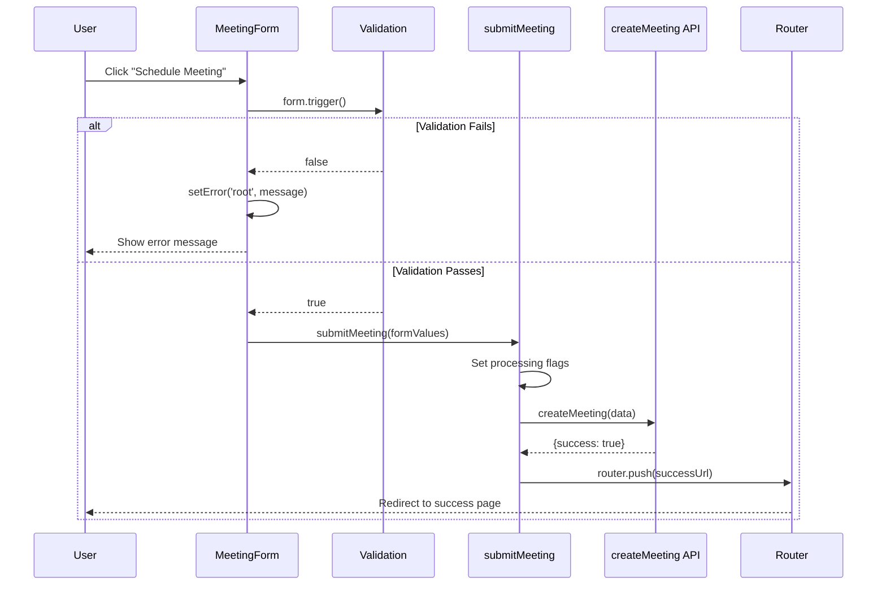
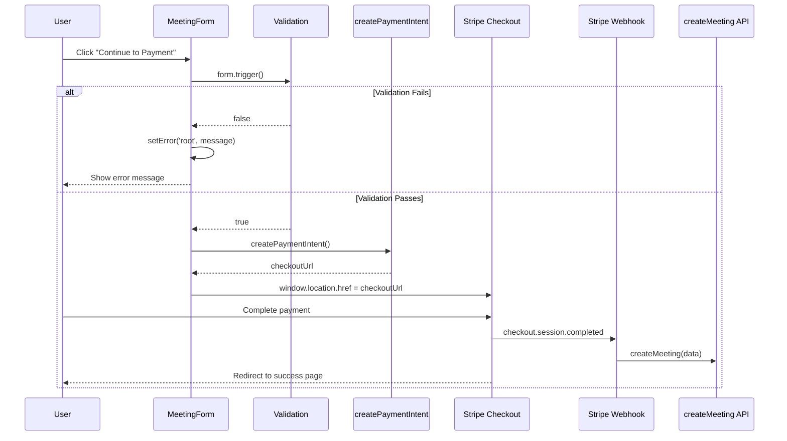

# Meeting Form Free Event Submission Fix

**Date:** December 10, 2025  
**Component:** `components/features/forms/MeetingForm.tsx`  
**Severity:** Critical (Production Bug)

## Problem Description

Free event bookings (price = 0) were not working. When users clicked the "Schedule Meeting" button on Step 2, nothing happened - the form appeared to be unresponsive.

### Symptoms

- Clicking "Schedule Meeting" button did nothing
- No error messages displayed
- No network requests made to create the meeting
- Button appeared clickable but had no effect

## Root Cause Analysis

Two bugs were identified in the `handleNextStep` function:

### Bug 1: Silent Validation Failure

When form validation failed, the function returned early without showing any error message to the user:

```typescript
// BEFORE (broken)
const isValid = await form.trigger();
if (!isValid) {
  console.log('❌ Form validation failed for paid session');
  return; // Silent return - no user feedback!
}
```

The `form.trigger()` method validates all fields and updates `form.formState.errors`, but since we returned immediately, the component never re-rendered to show those errors.

### Bug 2: Race Condition in Processing Flags

For free sessions, the code set processing flags BEFORE calling `submitMeeting`, but `submitMeeting` checked those same flags and returned early:

```typescript
// BEFORE (broken) - in handleNextStep
if (price === 0) {
  isProcessingRef.current = true;  // Set flag BEFORE calling
  setIsProcessing(true);
  flushSync(() => { setIsSubmitting(true); });

  const formValues = form.getValues();
  await submitMeeting(formValues); // submitMeeting sees flag and exits!
}

// In submitMeeting
if (isSubmitting || isProcessingRef.current) {
  return; // Always returns early for free events!
}
```

This created a deadlock where `handleNextStep` set the processing flag, then called `submitMeeting`, which immediately checked that flag and returned without doing anything.

## Solution

### Fix 1: Show Validation Errors

```typescript
// AFTER (fixed)
const isValid = await form.trigger();
if (!isValid) {
  console.log('❌ Form validation failed:', form.formState.errors);
  form.setError('root', {
    message: 'Please fill in all required fields correctly.',
  });
  return;
}
```

Now when validation fails:

1. Field-level errors are displayed via `FormMessage` components
2. A root-level error message guides the user
3. Detailed errors are logged for debugging

### Fix 2: Let submitMeeting Manage Its Own State

```typescript
// AFTER (fixed) - in handleNextStep
if (price === 0) {
  try {
    const formValues = form.getValues();
    await submitMeeting(formValues); // submitMeeting handles its own state
  } catch (error) {
    console.error('Error submitting free meeting:', error);
    form.setError('root', {
      message: 'Failed to schedule meeting. Please try again.',
    });
  }
  return;
}
```

The `submitMeeting` function already has its own processing state management, so we let it handle that internally instead of duplicating the logic.

## Flow Diagrams

### Free Event Flow (price = 0)



### Paid Event Flow (price > 0)



## Testing

Updated tests in `tests/components/MeetingForm.test.tsx` cover:

- **Free Event Submission**: Verifies free events submit directly without payment step
- **Paid Event Submission**: Verifies paid events go through payment step
- **Form Validation**: Tests validation error display for missing/invalid fields
- **Loading States**: Tests button disable and loading text
- **Double Submit Prevention**: Verifies rapid clicks only trigger one submission
- **Error Handling**: Tests error message display on submission failure

## Files Changed

1. `components/features/forms/MeetingForm.tsx`
   - Lines 891-901: Added validation error feedback
   - Lines 903-916: Fixed race condition for free events

2. `tests/components/MeetingForm.test.tsx`
   - Complete rewrite with comprehensive test coverage

## Related Cron Jobs

The following cron jobs support the meeting/payment flow:

| Cron Job                       | Purpose                            | Schedule  |
| ------------------------------ | ---------------------------------- | --------- |
| `appointment-reminders`        | Send 24h reminders to experts      | Hourly    |
| `appointment-reminders-1hr`    | Send 1h reminders                  | Hourly    |
| `send-payment-reminders`       | Multibanco payment reminders       | Every 6h  |
| `cleanup-expired-reservations` | Clean up expired slot reservations | Every 15m |
| `process-expert-transfers`     | Process expert payouts             | Every 2h  |
| `process-pending-payouts`      | Process pending payouts            | Every 2h  |

## E2E Testing with Playwright

Visual regression and E2E tests are now available to verify the booking flow:

### Running E2E Tests

```bash
# Run all E2E tests
pnpm test:e2e

# Run with UI mode (interactive)
pnpm test:e2e:ui

# Run in headed mode (see browser)
pnpm test:e2e:headed

# Run with debug mode
pnpm test:e2e:debug

# Update visual snapshots
pnpm test:e2e:update-snapshots

# Run only on Chromium
pnpm test:e2e:chromium

# Run mobile tests
pnpm test:e2e:mobile
```

### Test Coverage

The E2E tests in `tests/e2e/booking-flow.spec.ts` cover:

- **Free Event Flow**: Complete booking without payment
- **Paid Event Flow**: Checkout redirect verification
- **Form Validation**: Error display for missing fields
- **Step Navigation**: Back button functionality
- **Mobile Responsiveness**: iPhone and Pixel viewports
- **Visual Regression**: Screenshot comparisons
- **Double Submit Prevention**: Button disable verification
- **Form Persistence**: URL parameter handling

### Page Object Model

A `BookingPage` fixture is available in `tests/e2e/fixtures/booking.fixture.ts` for reusable test actions:

```typescript
import { expect, test } from './fixtures/booking.fixture';

test('custom booking test', async ({ freeBookingPage }) => {
  await freeBookingPage.goto();
  await freeBookingPage.selectFirstAvailableTimeSlot();
  await freeBookingPage.fillGuestInfo({
    name: 'Test User',
    email: 'test@example.com',
  });
  await freeBookingPage.clickSubmit(true);
});
```

## Manual Verification

After deploying, verify the fix by:

1. Navigate to a free event booking page (e.g., `/patimota/chat`)
2. Select a date and time
3. Fill in name and email
4. Click "Schedule Meeting"
5. Verify redirect to success page
6. Check Vercel logs for successful `createMeeting` call
