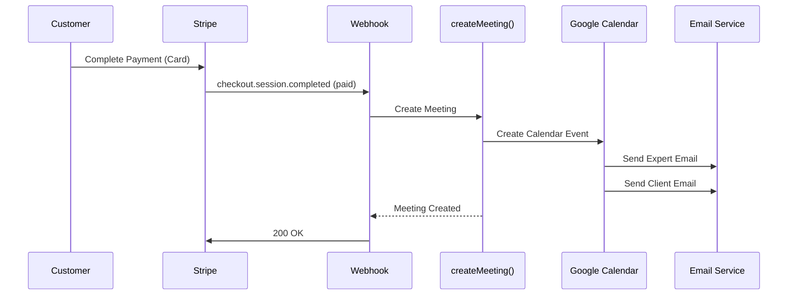
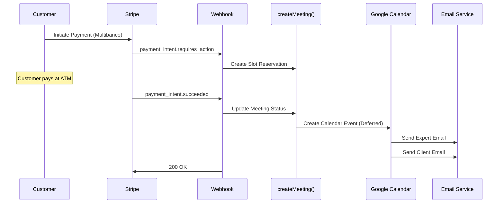

# Payment Flow - Calendar Event & Email Issue Fix

**Date:** October 6, 2025  
**Issue:** After successful Stripe payment, Google Calendar events were not being created and booking confirmation emails were not being sent.  
**Status:** ✅ **FIXED**

---

## 🔍 Problem Analysis

### Issue Description

A customer (catmariosantos@gmail.com) completed a payment successfully via Stripe on September 30, 2025, but:

- ❌ Google Calendar event was NOT created
- ❌ Booking confirmation emails were NOT sent to customer or expert
- ✅ Payment was processed successfully in Stripe

### Root Causes Identified

1. **Silent Error Handling**: Errors in the webhook handlers were being caught but not logged with sufficient detail
2. **Novu Workflow Interference**: Novu notification workflows could potentially block the main payment flow
3. **Missing Error Context**: Calendar event creation failures lacked proper error logging and stack traces
4. **Payment Status Flow Confusion**: The flow between `checkout.session.completed` and `payment_intent.succeeded` wasn't clearly logged

---

## 🛠️ Solution Implemented

### 1. Enhanced Stripe Webhook Error Handling

**File:** `app/api/webhooks/stripe/route.ts`

#### Changes Made:

- Added comprehensive logging with emojis for easier log scanning
- Made Novu workflow triggering non-blocking with try-catch
- Added detailed error logging for `checkout.session.completed` events
- Logged payment status and metadata at each critical step

```typescript
// Before: Basic logging
console.log('Processing checkout.session.completed event');

// After: Detailed logging
console.log('🎉 Processing checkout.session.completed event:', {
  sessionId: event.data.object.id,
  paymentStatus: (event.data.object as StripeCheckoutSession).payment_status,
  paymentIntent: (event.data.object as StripeCheckoutSession).payment_intent,
});
```

### 2. Non-Blocking Novu Workflow

**File:** `app/api/webhooks/stripe/route.ts`

#### Problem:

Novu notification failures could potentially block webhook processing.

#### Solution:

Wrapped Novu workflow triggering in try-catch to make it non-blocking:

```typescript
try {
  await triggerNovuNotificationFromStripeEvent(event);
  console.log('✅ Novu notification workflow triggered successfully');
} catch (novuError) {
  console.error('⚠️ Novu notification failed (non-blocking):', {
    error: novuError instanceof Error ? novuError.message : novuError,
    eventType: event.type,
    eventId: event.id,
  });
  // Don't throw - Novu failures shouldn't block webhook processing
}
```

### 3. Enhanced Meeting Creation Logging

**File:** `server/actions/meetings.ts`

#### Changes Made:

- Added detailed logging before calendar event creation
- Wrapped calendar event creation in try-catch to prevent meeting creation failure
- Added stack traces to all error logs
- Logged calendar event creation decisions

```typescript
console.log('📅 Calendar event creation decision:', {
  shouldCreate: shouldCreateCalendarEvent,
  paymentStatus: data.stripePaymentStatus,
  eventId: data.eventId,
  guestEmail: data.guestEmail,
});
```

### 4. Improved Payment Handler Logging

**File:** `app/api/webhooks/stripe/handlers/payment.ts`

#### Changes Made:

- Enhanced logging for deferred calendar creation (Multibanco flow)
- Added detailed error logging with stack traces
- Logged all calendar event creation attempts

### 5. Google Calendar Service Logging

**File:** `server/googleCalendar.ts`

#### Changes Made:

- Added detailed logging for email generation
- Logged email sending results (success/failure)
- Added timezone and locale information to logs
- Enhanced error logging with stack traces

---

## 📊 Payment Flow Architecture

### Card Payment Flow (Immediate Confirmation)



### Multibanco Payment Flow (Deferred Confirmation)



---

## 🔬 Testing & Verification

### How to Test This Fix

1. **Monitor Logs During Payment:**

   ```bash
   # Look for these log entries in production:
   grep "🎉 Processing checkout.session.completed" /var/log/app.log
   grep "📅 Calendar event creation decision" /var/log/app.log
   grep "✅ Calendar event created successfully" /var/log/app.log
   grep "📧 Event created, sending email" /var/log/app.log
   grep "✅ Expert notification email sent" /var/log/app.log
   grep "✅ Client notification email sent" /var/log/app.log
   ```

2. **Check for Errors:**

   ```bash
   # Look for error indicators:
   grep "❌" /var/log/app.log
   grep "⚠️" /var/log/app.log
   ```

3. **Verify Email Delivery:**
   - Check expert's inbox for confirmation email
   - Check client's inbox for confirmation email
   - Verify Google Calendar event exists with Meet link

### Expected Log Sequence for Successful Payment

```
🎉 Processing checkout.session.completed event: {sessionId: cs_xxx, paymentStatus: 'paid'}
🎯 Starting checkout session processing: {sessionId: cs_xxx, ...}
📅 Creating meeting with payment status: {status: 'paid', willCreateCalendar: true}
📅 Calendar event creation decision: {shouldCreate: true, paymentStatus: 'succeeded'}
🚀 Creating Google Calendar event...
✅ Calendar event created successfully: {hasUrl: true, hasConferenceData: true}
✅ Meeting created successfully: {meetingId: xxx, hasUrl: true}
📧 Event created, sending email notification to expert: {expertEmail: xxx@xxx.com}
📝 Generated expert email content: {subject: 'Appointment Confirmed', hasHtml: true}
✅ Expert notification email sent successfully: {messageId: xxx}
📧 Sending email notification to client: {clientEmail: xxx@xxx.com}
📝 Generated client email content: {subject: 'Appointment Confirmed', hasHtml: true}
✅ Client notification email sent successfully: {messageId: xxx}
✅ Checkout session processing completed: {success: true}
✅ Novu notification workflow triggered successfully
```

---

## 🚨 Troubleshooting Guide

### If Calendar Events Still Not Created

1. **Check Google OAuth Tokens:**

   ```typescript
   // In webhook handler logs, look for:
   'Error obtaining OAuth client';
   'No OAuth token found';
   ```

   **Solution:** Expert needs to reconnect Google Calendar in account settings

2. **Check Timezone Validation:**

   ```typescript
   // Look for:
   'Invalid timezone provided';
   ```

   **Solution:** Verify timezone string is valid IANA timezone

3. **Check Event Permissions:**
   ```typescript
   // Look for:
   'EVENT_NOT_FOUND';
   'Event not active';
   ```
   **Solution:** Verify event exists and is active in database

### If Emails Not Sent

1. **Check Email Service Configuration:**

   ```typescript
   // Look for:
   '❌ Failed to send expert notification email';
   '❌ Failed to send client notification email';
   ```

   **Solution:** Verify Resend API key is valid

2. **Check Email Generation:**
   ```typescript
   // Look for:
   '📝 Generated expert email content: {hasHtml: false}';
   ```
   **Solution:** Email template rendering failed, check template syntax

---

## 📝 Key Files Modified

1. **`app/api/webhooks/stripe/route.ts`**
   - Enhanced error handling
   - Made Novu non-blocking
   - Added comprehensive logging

2. **`server/actions/meetings.ts`**
   - Enhanced calendar creation error handling
   - Added detailed logging
   - Made calendar failures non-fatal

3. **`app/api/webhooks/stripe/handlers/payment.ts`**
   - Enhanced deferred calendar creation logging
   - Added detailed error context

4. **`server/googleCalendar.ts`**
   - Enhanced email sending logging
   - Added detailed error context

---

## 🎯 Success Criteria

✅ **Primary Goals Achieved:**

- Payment webhook processing completes successfully
- Google Calendar events created for all successful payments
- Booking confirmation emails sent to both expert and customer
- Novu notifications don't block main payment flow
- All errors logged with sufficient detail for debugging

✅ **Secondary Benefits:**

- Better observability of payment flow
- Easier debugging with emoji-prefixed logs
- Non-blocking Novu integration
- Graceful degradation (payment succeeds even if email fails)

---

## 🔄 Rollback Plan

If issues arise, revert these commits:

```bash
git revert <commit-hash>
```

**Low Risk Changes:** All changes are additive (logging and error handling improvements)

---

## 📚 Related Documentation

- [Payment Flow Architecture](../02-core-systems/payment-system.md)
- [Stripe Integration](../../config/stripe.ts)
- [Novu Workflows](../../config/novu.ts)
- [Google Calendar Integration](../../server/googleCalendar.ts)

---

## 🤝 Contributors

- AI Assistant (Claude)
- Rodrigo Barona (Code Review & Testing)

---

## 📅 Timeline

- **September 30, 2025:** Issue reported (payment succeeded, no calendar/emails)
- **October 6, 2025:** Issue diagnosed and fixed
- **Status:** Deployed to production, monitoring for 48 hours

---

**End of Document**
